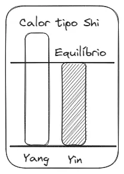
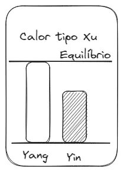
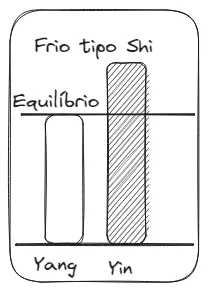
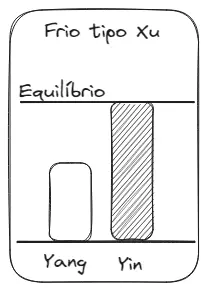
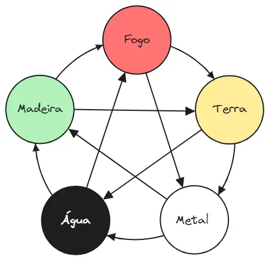

---
{"publish":true,"title":"02 - Fisiologia Energética","NAula":"Aula 02","tags":["conhecimento/acupuntura/aula"],"autor":"Professora Simone Tano","date":"2023-07-15","NivelAcesso":"ibrate","Conteudo":"acupuntura","allDay":false,"DiaSemana":"Sáb","start":{"dateTime":"2023-07-15T08:25-03:00"},"end":{"dateTime":"2023-07-15T12:40-03:00"},"location":"R. Prof. João Cândido, n° 344 - 2° andar - Centro, Londrina - PR, 86010-901","PassFrontmatter":true}
---

## O Qi (energia)
 
Só há uma energia que é a matéria fundamental que constitui o universo, e tudo no mundo é o resultado de seus movimentos e transformações. O Qi designa energia, que é uma concepção chinesa; a energia e a matéria são as manifestações contínuas de aspecto, as composições do universo, por isso o Qi tem atributos tanto energéticos quanto materiais. Esse Qi se apresenta de dois modos:
### Yin yang

| yin               | yang              |
| ----------------- | ----------------- |
| baixar            | subir             |
| inferior          | superior          |
| obscuridade       | claridade         |
| tranquilidade     | agitação          |
| inibição          | atividade         |
| quietude          | movimento         |
| astenia           | rapidez           |
| lassidão          | dinamismo         |
| terra             | céu               |
| lua               | sol               |
| salgado           | doce              |
| amargo            | suave             |
| azedo             | picante           |
| mulher            | homem             |
| oeste             | leste             |
| crônico           | agudo             |
| abdome (anterior) | dorso (posterior) |
| interior          | exterior          |
| inferior          | superior          |
| medial            | lateral           |
| órgãos sólidos    | órgãos ocos       |
| c p f bp R cs     | Id IG VB e b ta   |
| zang              | fu                |
| sangue            | energia           |
| emocional         | racional          |
| 12 a 0 horas      | 0 a 12 horas      |

#### Teoria
As propriedades básicas de Yin e Yang são: — Pertencem a Yang todas as coisas com tendência a fluir para cima e para fora, bem como claridade, mobilidade, excitação, vitalidade, calor, insubstancialidade, atividades funcionais rápidas e claras. — Pertencem a Yin todas as coisas com tendência a fluir para baixo, para dentro, obscuridade, tranqüilidade, inibição, astenia, esfriamento, coisas substanciais e pesadas. 

Coração, Fígado, Baço/Pâncreas, Pulmão, Rins são Yin. — As seis Vísceras (Intestino Delgado, Vesícula Biliar, Estômago, Intestino Grosso, Bexiga e Triplo Aquecedor) são Yang. 

Crianças são yang até 7 anos 
Meridianos se formam até 7 anos 
## Caráter
Shao yang
Colérico 

Jue yin
Nervoso

Tai yang
Apaixonado 

Shao yin
Sentimental 

Yang ming metal
Fleumatico

Tai yin metal
Apatico

Yang ming terra
Sanguíneo 

Tai yin terra
Amorfo 

## [[Conhecimento/Acupuntura/Anotaçoes/Síndromes\|Síndromes]]
### Síndrome do calor Shi
Excesso de Yang consome Yin

## Síndrome do calor Xu
Deficiência de Yin causa preponderância de Yang

### Síndrome do frio Shi
Excesso de Yin consome Yang

### Síndrome do frio Xu
Deficiência de Yang causa preponderância de Yin

## Cinco movimentos
### Saudável: 
Ciclo de geração (mãe filha) - sheng
Ciclo de dominação (avó neta) - ke

### Desequilíbrio:
Ciclo de agressão (cheng): avó controla demais o neto
Ciclo de contradominação (wu): neto ofende a avó (problemas fisiológicos de longa duração)
Mu-Zi: mãe atinge o filho
Zi-Mu: Filho atinge a mãe (gerando estancamento Yü)

## Natureza dos 5 movimentos 
- [[Conhecimento/Acupuntura/Anotaçoes/Cinco movimentos/Madeira\|Madeira]]
Desenvolver-se e estender-se livremente 

-  [[Conhecimento/Acupuntura/Anotaçoes/Cinco movimentos/Fogo\|Fogo]]
Quente flui para cima
Calor Yang

- [[Conhecimento/Acupuntura/Anotaçoes/Cinco movimentos/Terra\|Terra]]
Produzir e transformar

- [[Conhecimento/Acupuntura/Anotaçoes/Cinco movimentos/Metal\|Metal]]
Purificar e ser sólido e forte

- [[Conhecimento/Acupuntura/Anotaçoes/Cinco movimentos/Água\|Água]]
Fria e úmida flui para baixo
Yin

### Características dos cinco movimentos

|            | Madeira  | Fogo              | Terra         | Metal            | Água          |
| ---------- | -------- | ----------------- | ------------- | ---------------- | ------------- |
| Emoções    | ira      | alegria           | preocupação   | tristeza         | pânico e medo |
| Tecidos    | tendão   | vasos             | músculos      | pele e pelos     | ossos         |
| sentidos   | olhos    | língua            | boca          | nariz            | ouvido        |
| vísceras   | vesícula | intestino Delgado | estômago      | intestino grosso | bexiga        |
| órgãos     | fígado   | coração           | baço pâncreas | pulmão           | rins          |
| orientação | leste    | sul               | centro        | oeste            | norte         |

| Estação            | primavera  | verão          | verão tardio  | outono      | inverno                    |
| ------------------ | ---------- | -------------- | ------------- | ----------- | -------------------------- |
| crescimento        | germinação | crescimento    | transformação | purificação | armazenamento / eliminação |
| fatores ambientais | vento      | calor de verão | umidade       | seca        | frio                       |
| cores              | verde      | vermelho       | amarelo       | branco      | preto                      |
| sabores            | acido      | amargo         | doce          | picante     | salgado                    |

O princípio da geração dos Cinco Movimentos estabelece que:
- Madeira gera Fogo
- Fogo gera Terra
- Terra gera Metal
- Metal gera Água
- Água gera Madeira

Em um círculo contínuo e constante. O princípio da dominância estabelece que

- Madeira domina Terra
- Terra domina Água
- Água domina Fogo
- Fogo domina Metal
- Metal domina Madeira.

Nas relações de geração, cada um dos Cinco Movimentos sempre é gerado e gerador ao mesmo tempo.
A Madeira sendo a que gera, é mãe, e o gerado, que é o Fogo, é o filho; por isso essas relações de geração também são chamadas de relações mãe-filho. 
Exemplo: Madeira gera Fogo e Fogo gera Terra, pois Madeira é mãe do Fogo e Terra é filha do Fogo.
Na relação de dominância, cada um dos Cinco Movimentos é, ao mesmo tempo, dominante e dominado. O que é dominado é vencido e o dominante é o vencedor; por isso, essa relação também é chamada vencido-vencedor.
Exemplo: Madeira domina Terra e Terra domina Água; entre Madeira
e Terra, Madeira é vencedora e Terra é a parte vencida. Entre Terra e Água, Terra é vencedora e Água é a parte vencida. 
Portanto, de acordo com a Teoria dos Cinco Movimentos há relações de ser gerador-gerado e dominante-dominado.

O **Fígado** tem a natureza de subir, estender-se livremente e controlar a drenagem, natureza similar às propriedades da **Madeira**. 
No **Coração** situa-se a Energia Mental e esta é a manifestação central da essência de todo corpo; o Coração controla os vasos sangüíneos, fazendo com que o sangue aqueça e nutra todo o corpo, natureza esta similar às propriedades do **Fogo**. 
O **Baço** encarrega-se de transportar e transformar o alimento e a água, fontes dos nutrientes; como têm a natureza da **Terra**, que produz todo ser, são atribuídos a ela.
O **Pulmão** purifica o ar, fazendo descer, por isso está associado ao **Metal**.
No **Rim** está armazenada a essência, que nutre o Yin de todo corpo; o Rim também controla a circulação da água, equilibrando os líquidos orgânicos. Por apresentar propriedades similares às da **Água**, que é fria, úmida e flui para baixo, os Rins estão associados ela.

As relações de geração entre os Cinco Órgãos estão refletidas assim:
- A essência do Rim que nutre o Sangue do Fígado e o mantém cheio (Água gera Madeira)
- O Sangue armazenado no Fígado proporciona ao Coração e completa o Sangue deste (Madeira gera Fogo).
- Yang do Coração aquece o Baço, fazendo funcionar normalmente no transporte (Fogo gera Terra).
- O Baço transforma Água e alimento em nutrientes para a Energia do Pulmão (Terra gera Metal).
- O Pulmão se encarrega de purificar e fazer descender, de normalizar as vias da Água e ajuda os Rins no controle da Água (Metal gera Água).

Em relação à dominância:
- A descida e a purificação do Pulmão inibem o possível excesso de ascensão do Fígado (Metal domina Madeira).
- A função de drenagem e dispersão do Fígado evita a estagnação da função do Baço no transporte e na transformação (Madeira domina Terra).
- O transporte e a transformação dos líquidos do Baço controla o transbordamento da Água do Rim (Terra domina Água).
- A Água do Rim proporciona o Sangue do Coração, prevenindo a hiperatividade de Yang do Coração (Água domina Fogo).
- O Calor de Yang do Coração inibe as purificações excessivas do Pulmão (Fogo domina Metal).

## Classificação dos Qi
### [[Conhecimento/Acupuntura/Anotaçoes/Substancias/Qi/Yuan Qi\|Yuan Qi]] 
Qi original ou verdadeiro
### [[Conhecimento/Acupuntura/Anotaçoes/Substancias/Qi/Zhong Qi\|Zhong Qi]]
Qi grande ou principal, composto de matérias essenciais (água, alimentos, ar)
## [[Conhecimento/Acupuntura/Anotaçoes/Substancias/Sangue\|Sangue]] 

## [[Conhecimento/Acupuntura/Anotaçoes/Substancias/Jinye\|Jinye]] (líquidos orgânicos)

## Shen (essência psíquica)
Shen do coração é mente
sintomas yang do shen:
	agitação, falta de ligação das idéias, falar rápido, tropeçar nas palavras, insonia, casos extremos demencia
sintomas yin do shen:
	introspecção, olhar sem vida, tristeza, depressao, morosidade

Shen do rim = essência = [[Conhecimento/Acupuntura/Anotaçoes/Substancias/Jing\|Jing]]

## Sangue (Xue)
### Formação
É o fruto da transformação da essência dos alimentos (Jing Qi) pelo Baço e Estômago.

Baço produz sangue
Fígado armazena (80% das vezes problema é aqui)
Coração conduz 

Essa formação é realizada pela combinação de três fatores:
A essência dos elementos (Jing Qi)
Ying Qi - secreta os líquidos do corpo
Jing da medula

O sangue nutre o corpo e suporta a atividade mental

## Jinye
São todos os líquidos orgânicos.
Diferentes secreções, como saliva, bile, lágrima e urina.

_Jin_
Elemento claro, leve e fino; mais _Yang_; circula principalmente na superfície do corpo; mantém a pele, o cabelo, as orelhas, os olhos, a boca, o nariz, as genitais e outros orifícios, e os músculos úmidos.

_Ye_
Elemento turvo, pesado e denso; mais _Yin_; umedece e nutre o cérebro, a medula óssea e lubrifica as articulações. Presentes no suor, lágrimas e saliva.

É formado pelas bebidas que entram no estômago. A essência que sobrenada é conduzida ao Baço.
O Qi do Baço emite para o alto uma essência que se junta ao pulmão e toma a via das águas, que leva para baixo à Bexiga.
A essência dos líquidos se espalha e aflui aos meridianos.
A ação do Baço no Estômago e Pulmão deve ser completada pelo Rim. Os rins são os órgãos da Água, regem os líquidos pela ação do Triplo Aquecedor. Este é considerado a via de passagem das águas.

### Relação entre o Sangue e o Jinye
O Sangue e os Líquidos tem origem em comum na essência dos alimentos.

O Qi é o comandante do Sangue, porque o impulsiona.
- O Qi tem a capacidade de produzir Sangue
- O Qi tem a capacidade de fazer circular o Sangue
- O Qi tem a capacidade de reter o Sangue nos vasos

O sangue é a mãe do Qi 
Significa que o sangue é o suporte da energia. Se o Qi não fosse ligado à substância sangue, ele se dispersaria.
### Relação entre o Qi e o Jinye
A Energia e o s Líquidos Orgânicos
Ambos são provenientes da essência dos alimentos.
O Qi é Yang, os líquidos orgânicos são Yin.

O Qi pode produzir a água, a água estagnada pode bloquear o Qi. O Qi vigoroso produz os líquidos; O Qi se perde com os líquidos.

### Relação entre o Sangue e o Jinye
O sangue (Xue) e os líquidos orgânicos (Jinye) provêm ambos da essência os alimentos (Jing Qi adquirido). Sendo os dois de natureza Yin, sua função principal é umedecer e nutrir.

