---
{"title":"05 - Meridianos 1 - 2. Bexiga","tags":["conhecimento/acupuntura/aula"],"autor":"Doren Sayuri Kato","date":"2023-10-14","publish":true,"NivelAcesso":"ibrate","Conteudo":"acupuntura","allDay":false,"DiaSemana":"Sáb","start":{"dateTime":"2023-10-14T08:25-03:00"},"end":{"dateTime":"2023-10-14T12:40-03:00"},"location":"R. Prof. João Cândido, n° 344 - 2° andar - Centro, Londrina - PR, 86010-901","PassFrontmatter":true}
---

# Meridiano da bexiga 
Bexiga = Pang guan (pronúncia: pa gua) 
Taiyang do pé = meridiano da bexiga
Total de 67 pontos, começa na face e desce ao pé. 
## Indicações gerais 
Cefaleia, cervicalgia, lombociatalgia, e dores ao longo trajeto do meridiano. 

## Trajeto do meridiano 

## Cabeça 

### [[Conhecimento/Acupuntura/Canais/Bexiga/B01\|B01]] 
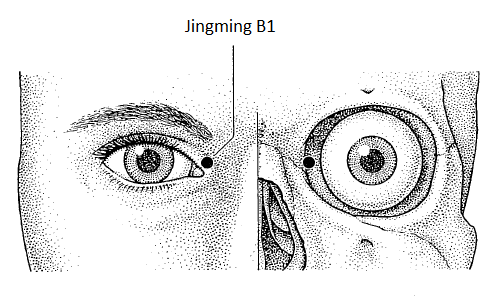

Muito perigoso, canto interno do olho 

### [[Conhecimento/Acupuntura/Canais/Bexiga/B02\|B02]] 
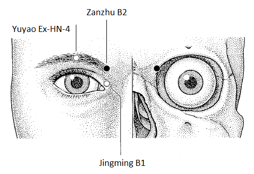
ângulo interno do olho, sobe até encontrar a sobrancelha. Excelente diurético (junto com [[Conhecimento/Acupuntura/Canais/Bexiga/B67\|B67]]). Sangria: [[Conhecimento/Alterações/cefaleia\|cefaleia]] frontal, [[Conhecimento/Alterações/sinusite\|sinusite]] , [[Conhecimento/Alterações/rinite\|rinite]], [[Conhecimento/Alterações/paralisia facial\|paralisia facial]]. 

### [[Conhecimento/Acupuntura/Canais/Bexiga/B10\|B10]]
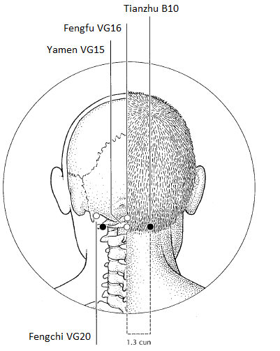
1,5 tsun na base do occipital. A agulha deve parar na parte óssea. [[Conhecimento/Alterações/cefaleia\|cefaleia]] occipital. [[Conhecimento/Alterações/obstrução nasal\|Obstrução nasal]]. [[Conhecimento/Alterações/vertigem\|vertigem]]. Relaxa musculatura cervical. Relaxa musculatura do trapézio. Acalma mente. Melhora circulação do Xue na cabeça. 
## Tronco 

### [[Conhecimento/Acupuntura/Canais/Bexiga/B11\|B11]]
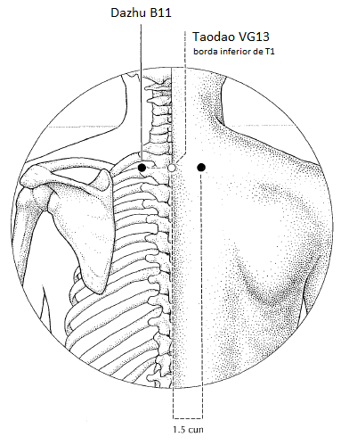
Mestre dos ossos. Localizada na depressão inferior ao processo espinhoso (apofise) de T1, a 1,5 tsun lateralmente do centro da coluna. [[Fratura\|Fratura]]. [[Conhecimento/Alterações/artrose\|Artrose]]. [[Conhecimento/Alterações/Osteoporose\|Osteoporose]]. [[Osteopenia\|Osteopenia]]. [[Conhecimento/Alterações/cervicalgia\|cervicalgia]]. Dores no ombro. Contratura muscular. Musculatura do trapézio. 

### [[Conhecimento/Acupuntura/Canais/Bexiga/B12\|B12]] 
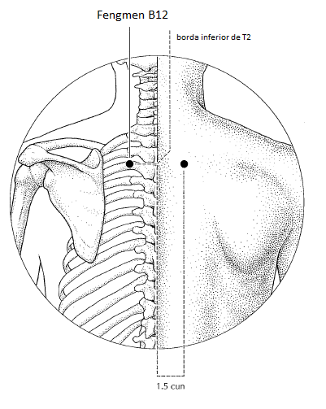
porta do vento. Feng men. Localizada na depressão inferior ao processo espinhoso (apofise) de T2, a 1,5 tsun lateralmente do centro da coluna. Indicado para quem toma vento. Regulariza o [[Conhecimento/Acupuntura/Anotaçoes/Substancias/Qi/Wei Qi\|wei qi]] (Qi Defensivo). [[Conhecimento/Alterações/obstrução nasal\|Obstrução nasal]], [[Conhecimento/Alterações/fatores patogênicos/espirro\|espirro]], [[Conhecimento/Alterações/calafrio\|calafrio]], [[Conhecimento/Alterações/aversão ao frio\|Conhecimento/Alterações/aversão ao frio]]. 

### [[Conhecimento/Acupuntura/Canais/Bexiga/B13\|B13]] 
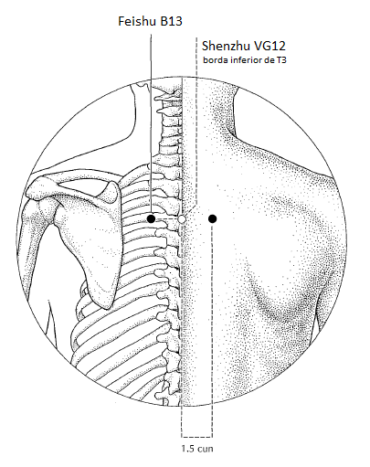
ponto assentimento do Pulmão. Fei shu. Localizada na depressão inferior ao processo espinhoso (apofise) de T3, a 1,5 tsun lateralmente do centro da coluna. Patologias de Pulmão. Regulariza e tonifica Qi do Pulmão. Estimula função dispersora e de descendência do Pulmão. Patologia respiratória. [[Conhecimento/Alterações/sudorese noturna\|sudorese noturna]]. Dor torácica alta. Quando dolorido, alguma patologia do Pulmão. 

### [[Conhecimento/Acupuntura/Canais/Bexiga/B14\|B14]] 
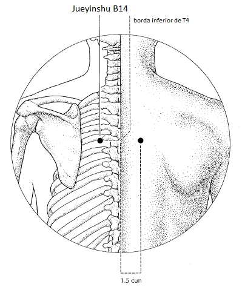
assentimento do pericárdio. jus yin shu. Localizada na depressão inferior ao processo espinhoso (apofise) de T4, a 1,5 tsun lateralmente do centro da coluna. Regulariza é harmoniza o Qi do coração. [[Conhecimento/Alterações/arritimia\|arritimia]], [[Conhecimento/Alterações/Taquicardia\|taquicardia]], [[angina\|angina]], [[Conhecimento/Alterações/opressão torácica\|opressão torácica]], [[Conhecimento/Alterações/ansiedade\|ansiedade]]. Ponto calmante. 

### [[Conhecimento/Acupuntura/Canais/Bexiga/B15\|B15]] 
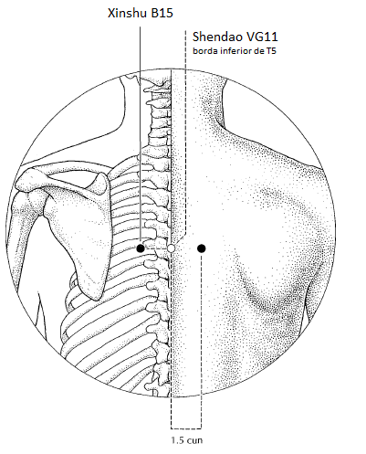
assentimento do coração. Xin shu. Localizada na depressão inferior ao processo espinhoso (apofise) de T5, a 1,5 tsun lateralmente do centro da coluna. Harmoniza Qi e Xue. Dissolve estagnação energética de Xue. Estimula capacidade intelectual e fala em crianças. Acalma a mente(agulha). Controla a [[Conhecimento/Alterações/ansiedade\|ansiedade]]. [[Conhecimento/Alterações/insônia\|insônia]]. Estimula o cérebro, pode usar com moxa. 

### [[Conhecimento/Acupuntura/Canais/Bexiga/B16\|B16]] 
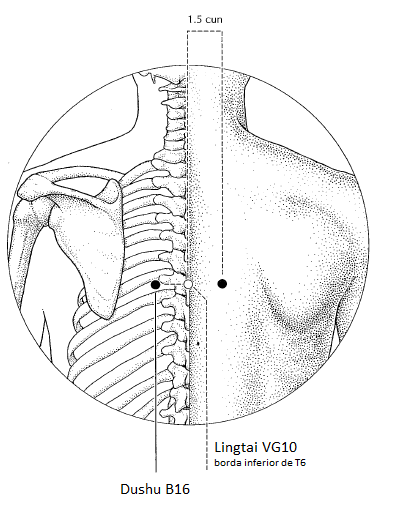
assentimento do vaso governador. Du shu. Localizada na depressão inferior ao processo espinhoso (apofise) de T6, a 1,5 tsun lateralmente do centro da coluna. Harmoniza Qi do tórax. Fortalece diafragma. [[Conhecimento/Alterações/palpitação\|palpitação]]. [[Conhecimento/Alterações/soluço\|soluço]]. 

### [[Conhecimento/Acupuntura/Canais/Bexiga/B17\|B17]] 
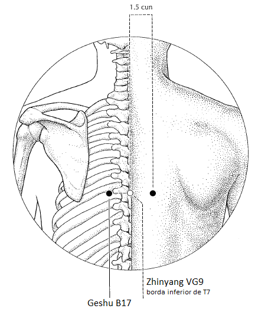
ponto mestre do sangue. Localizada na depressão inferior ao processo espinhoso (apofise) de T7, a 1,5 tsun lateralmente do centro da coluna. Eliminar estagnação do Xue. Eliminar calor do Xue. [[Conhecimento/Alterações/alergia\|alergia]] de pele. [[Conhecimento/Alterações/alergia\|alergia]] respiratória. Cicatrização de [[Fratura\|Fratura]]. Faz circular o Xue. [[Conhecimento/Alterações/varizes\|varizes]], [[pernas cansadas\|pernas cansadas]], extremidades frias. [[Conhecimento/Alterações/Cãibra\|Cãibra]], fadiga muscular junto com b57. Edema de membros inferiores junto com [[Conhecimento/Acupuntura/Canais/Baço/BP09\|BP09]]. 
[[Conhecimento/Alterações/soluço\|soluço]], [[Conhecimento/Alterações/Náusea\|Náusea]], [[Conhecimento/Alterações/eructação\|eructação]] e [[Conhecimento/Alterações/vômito\|vômito]]. 

### [[Conhecimento/Acupuntura/Canais/Bexiga/B18\|B18]] 
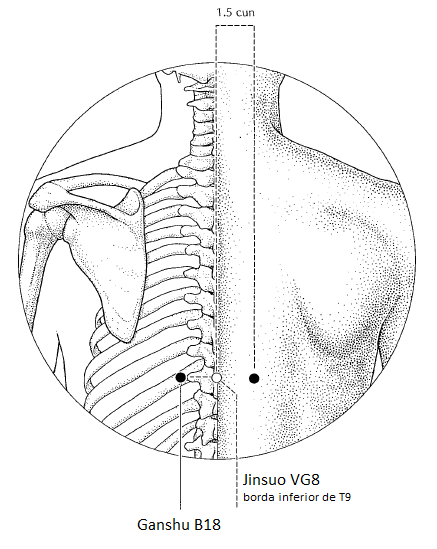
assentimento do Fígado. Gan Shu. Localizada na depressão inferior ao processo espinhoso (apofise) de T9, a 1,5 tsun lateralmente do centro da coluna. Beneficia fígado e Vesícula biliar. Movimenta Qi estagnado. Beneficia os olhos. Visão noturna deficiente ([[Conhecimento/Alterações/nictalopia\|nictalopia]]), olhos vermelhos, [[diplopia\|diplopia]], [[hepatite\|hepatite]], [[Conhecimento/Alterações/regurgitação ácida\|regurgitação ácida]], [[icterícia\|icterícia]], [[Conhecimento/Alterações/distensão epigástrica\|distensão epigástrica]] (estufamento), domina [[Conhecimento/Acupuntura/Luiz/Etiopatogenia/vento interno\|vento interno]]. 

### [[Conhecimento/Acupuntura/Canais/Bexiga/B19\|B19]] 
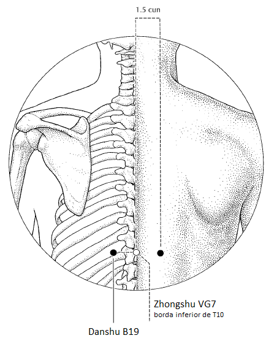
assentimento da vesícula biliar. dan shu. Localizada na depressão inferior ao processo espinhoso (apofise) de T10, a 1,5 tsun lateralmente do centro da coluna. Umidade e calor da vesícula biliar(calor subindo da região visceral). [[colecistite\|colecistite]], [[cálculo biliar\|cálculo biliar]], [[má digestão\|má digestão]], [[boca amarga\|boca amarga]], [[Conhecimento/Condições/hiperemese gravidica\|vômito durante a gravidez]]. 

### [[Conhecimento/Acupuntura/Canais/Bexiga/B20\|B20]] 
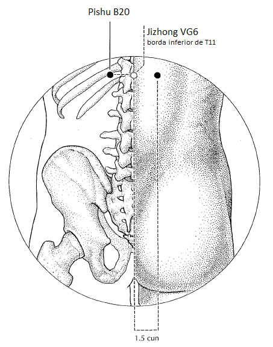
assentimento do Baço. Pi shu. Localizada na depressão inferior ao processo espinhoso (apofise) de T11, a 1,5 tsun lateralmente do centro da coluna. Harmonizar e tonificar baço e estômago. Resolve umidade e calor. Ativa o metabolismo das gorduras. Empachamento, dor de estômago, falta de apetite, estômago pesado, tosse de estômago, [[Conhecimento/Alterações/refluxo\|refluxo]], tosse por deficiência de baço. [[Conhecimento/Alterações/diabetes\|diabetes]], [[Conhecimento/Alterações/obesidade\|obesidade]], [[Conhecimento/Alterações/Edema\|edema]] de abdome, [[Conhecimento/Alterações/diarreia\|diarreia]] (logo após comer = deficiência de baço). [[Conhecimento/Alterações/preocupação\|preocupação]], [[Conhecimento/Alterações/distúrbios da menstruação\|distúrbios da menstruação]], distúrbio circulatório. [[Conhecimento/Alterações/cansaço\|cansaço]], [[Conhecimento/Alterações/cansaço mental\|cansaço mental]], [[Conhecimento/Alterações/cansaço físico\|cansaço físico]] com moxa. 

### [[Conhecimento/Acupuntura/Canais/Bexiga/B21\|B21]] 
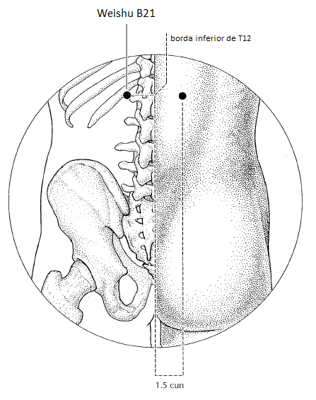
assentimento do estômago. Wei shu. Localizada na depressão inferior ao processo espinhoso (apofise) de T12, a 1,5 tsun lateralmente do centro da coluna. Alivia retenção de alimentos. Estimula descendência do estômago. [[Conhecimento/Alterações/vômito\|vômito]], [[Conhecimento/Alterações/refluxo\|refluxo]], [[Conhecimento/Alterações/gastrite\|gastrite]], [[Conhecimento/Alterações/dor abdominal\|dor abdominal]], [[Conhecimento/Alterações/esofagite\|esofagite]], [[Conhecimento/Alterações/soluço\|soluço]], [[Conhecimento/Alterações/diarreia\|diarreia]], [[Conhecimento/Alterações/constipação\|constipação]], [[distúrbio do apetite\|distúrbio do apetite]], [[Conhecimento/Alterações/lombalgia\|lombalgia]]. 

### [[Conhecimento/Acupuntura/Canais/Bexiga/B22\|B22]]
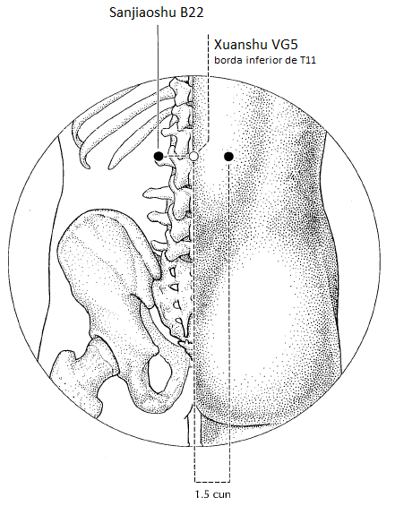
assentimento do triplo Aquecedor. San jiao shu. Localizada na depressão inferior ao processo espinhoso (apofise) de L1, a 1,5 tsun lateralmente do centro da coluna. Envolvido com água e temperatura. Abre a via das águas no Aquecedor inferior. Estimula transformação e eliminação dos fluidos impuros. [[Conhecimento/Alterações/Edema\|Edema]]. [[distúrbio do sistema urinária\|distúrbio do sistema urinária]]. [[micção dolorosa\|micção dolorosa]], [[Conhecimento/Alterações/incontinência urinária\|incontinência urinária]], [[Conhecimento/Alterações/enurese noturna\|enurese noturna]], [[Conhecimento/Alterações/enurese\|enurese]]. 

### [[Conhecimento/Acupuntura/Canais/Bexiga/B23\|B23]]
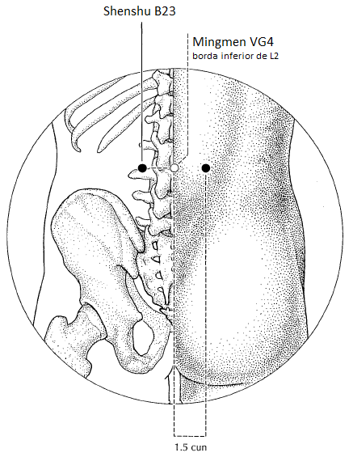
assentimento do rim. Shen shu. Localizada na depressão inferior ao processo espinhoso (apofise) de L2 (linha do umbigo entre L2 e L3) , a 1,5 tsun lateralmente do centro da coluna. Tonifica o Rim, nutre a essência, nutre o Xue, beneficia ossos e medula, aumenta leucócitos, [[leucopenia\|leucopenia]], [[Conhecimento/Alterações/lombalgia\|lombalgia]], [[Conhecimento/Alterações/lombociatalgia\|lombociatalgia]] com outros, tonifica yang do rim (moxa), [[impotência\|impotência]], [[Conhecimento/Alterações/infertilidade\|infertilidade]], [[espermatorreia\|espermatorreia]], [[Conhecimento/Alterações/baixa libido\|baixa libido]], [[Conhecimento/Alterações/zumbido\|zumbido]], [[Conhecimento/Alterações/surdez\|surdez]], [[Conhecimento/Alterações/labirintite\|labirintite]], [[patologia óssea\|patologia óssea]] (junto com mestre dos ossos [[Conhecimento/Acupuntura/Canais/Bexiga/B11\|B11]])
Cálculo renal combinar com [[Conhecimento/Acupuntura/Canais/Bexiga/B28\|B28]] e [[Conhecimento/Acupuntura/Canais/Baço/BP09\|BP09]] 

### [[Conhecimento/Acupuntura/Canais/Bexiga/B24\|B24]] 
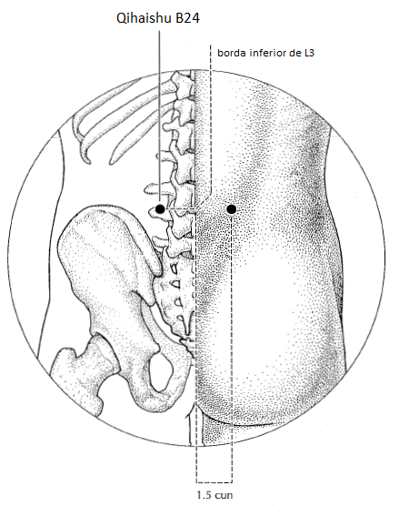
assentimento do caso da concepção. Qi Hai shu. Localizada na depressão inferior ao processo espinhoso (apofise) de L3, a 1,5 tsun lateralmente do centro da coluna. Um pouco abaixo da linha do umbigo. Harmoniza Qi e Xue. [[Conhecimento/Alterações/lombalgia\|lombalgia]], [[irregularidade menstrual\|irregularidade menstrual]]

### [[Conhecimento/Acupuntura/Canais/Bexiga/B25\|B25]] 
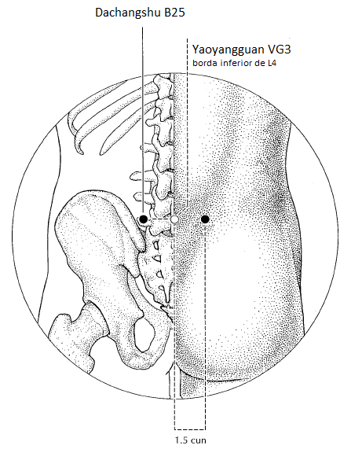
assentimento do intestino grosso. Da Chang Shu. Localizada na depressão inferior ao processo espinhoso (apofise) de L4, a 1,5 tsun lateralmente do centro da coluna. [[Conhecimento/Alterações/constipação\|constipação]], [[Conhecimento/Alterações/diarreia\|diarreia]], [[espasmo intestinal\|espasmo intestinal]], [[Conhecimento/Alterações/prolapso do reto\|prolapso do reto]], dor da evacuação, dificuldade de evacuação, [[síndrome do intestino irritável\|síndrome do intestino irritável]], [[colite\|colite]], [[gases\|gases]], [[Conhecimento/Alterações/hemorroida\|hemorroida]]. Massagear entre 5:00 e 7:00. Harmoniza e umidifica intestinos. Alivia plenitude. Fortalece região lombar baixa. 

### [[Conhecimento/Acupuntura/Canais/Bexiga/B26\|B26]] 
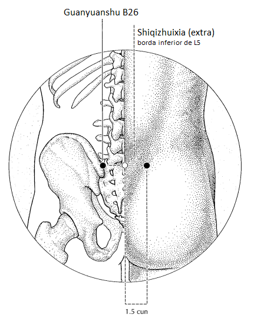
correspondente ao ponto [[Conhecimento/Acupuntura/Canais/Vaso da Concepção/VC04\|VC04]] L5 [[irregularidade intestinal\|irregularidade intestinal]],patologias de trompas e ovário. Moxa para [[distúrbio sexual\|distúrbio sexual]]. [[Conhecimento/Alterações/lombalgia\|lombalgia]]

### [[Conhecimento/Acupuntura/Canais/Bexiga/B27\|B27]] 
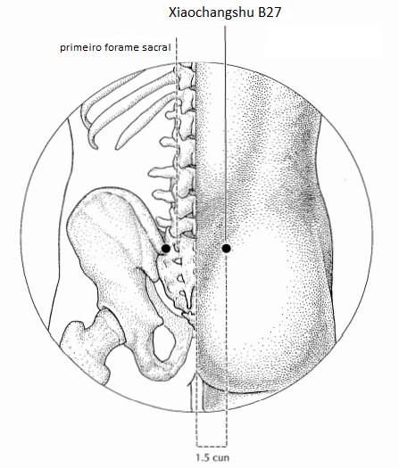
assentimento do intestino delgado. Melhora movimento da água. Xiao Chang Shu. Primeiro forame sacral nível s1 e s2. Harmoniza via das águas. [[Conhecimento/Alterações/constipação\|constipação]], [[hernia inguinal\|hernia inguinal]], beneficia a micção. 

### [[Conhecimento/Acupuntura/Canais/Bexiga/B28\|B28]] 
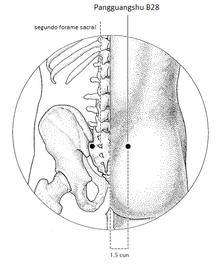
assentimento da bexiga. Pang Guang shu. Segundo forame sacral. Regulariza bexiga. Abre via das águas. Fortalece região lombar. [[Conhecimento/Alterações/retenção urinária\|retenção urinária]], [[Conhecimento/Alterações/dificuldade urinária\|dificuldade urinária]], [[queimação na micção\|queimação na micção]], [[dor na micção\|dor na micção]], [[Conhecimento/Alterações/Diurético\|diurético]], [[Conhecimento/Alterações/lombalgia\|lombalgia]] baixa, dor sacral. 
[[Conhecimento/Acupuntura/Canais/Bexiga/B28\|B28]] + [[Conhecimento/Acupuntura/Canais/Bexiga/B23\|B23]] + [[Conhecimento/Acupuntura/Canais/Baço/BP09\|BP09]] expele pequenas pedras nos Rins. 

**2ª linha da Bexiga - pontos locais ou emocionais**

## Perna

### [[Conhecimento/Acupuntura/Canais/Bexiga/B40\|B40]] 
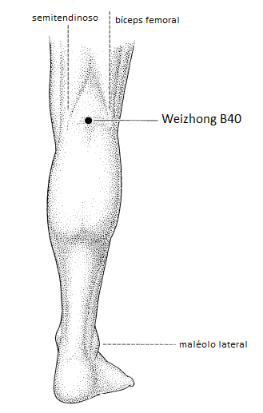
wheizong. No centro da fossa poplítea. Usado como ponto local, equilíbrio para dor e sangria (veia visível no mau jeito para [[Conhecimento/Alterações/lombalgia\|lombalgia]]). Elimina excesso e calor na bexiga. Queimação na micção. Relaxa músculos e tendões no meridiano. [[hérnia de disco\|hérnia de disco]], acalma o feto ([[gravidez\|gravidez]]). 

### [[Conhecimento/Acupuntura/Canais/Bexiga/B57\|B57]]
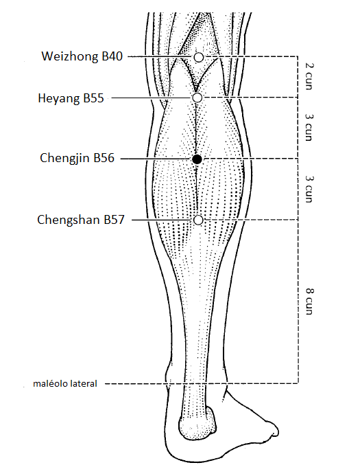
pilastra suprema. Chengshan. No final do tendão de Aquiles, antes do músculo. 
Agulha em sedação - sustentação emocional. 
Perpendicular - relaxa tendões [[Conhecimento/Alterações/Cãibra\|Cãibra]] com [[Conhecimento/Acupuntura/Canais/Bexiga/B17\|B17]]. Pernas cansadas, para quem trabalha muito em pé ou caminhando. [[Conhecimento/Alterações/lombalgia\|lombalgia]], [[Conhecimento/Alterações/lombociatalgia\|lombociatalgia]], [[Conhecimento/Alterações/trombose\|trombose]], [[Conhecimento/Alterações/Sequela neurológica\|Sequela neurológica]]

### [[Conhecimento/Acupuntura/Canais/Bexiga/B60\|B60]]
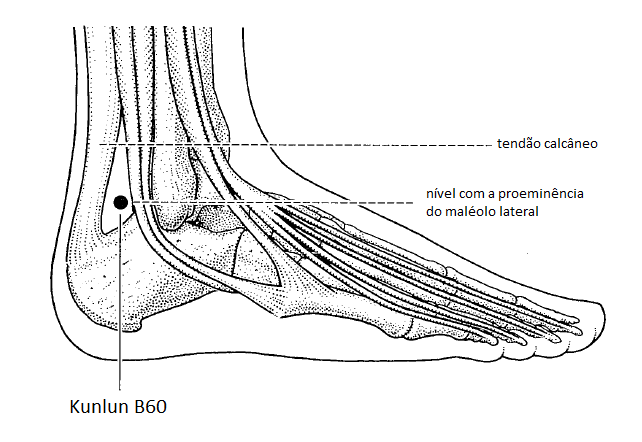
libera endorfinas ao longo do trajeto, causando analgesia. Na metade da distância entre a crista do maleolo lateral e o tendão de Aquiles. [[Raiz/fascite plantar\|fascite plantar]], [[Conhecimento/Alterações/esporão calcâneo\|esporão calcâneo]], [[Conhecimento/Alterações/lombalgia\|lombalgia]], [[Conhecimento/Alterações/lombociatalgia\|lombociatalgia]], [[entorse\|entorse]], [[Conhecimento/Alterações/cefaleia\|cefaleia]] frontal ou occipital, [[Conhecimento/Alterações/incontinência urinária\|incontinência urinária]], queimação na micção, harmoniza Xue, revigora Xue, menstruação com coágulo escuro, [[Conhecimento/Alterações/hemiplegia\|hemiplegia]], [[Conhecimento/Alterações/Sequela neurológica\|Sequela neurológica]], estimula trabalho de parto ([[gravidez\|gravidez]]), [[retenção placentaria\|retenção placentaria]]. 

> [!NOTE] endrofinas e analgesia 
> [[Conhecimento/Acupuntura/Canais/Estomago/E36\|E36]] endorfinas cintura para baixo 
> [[Conhecimento/Acupuntura/Canais/Intestino Grosso/IG04\|IG04]] endrofinas cintura para cima 
> [[Conhecimento/Acupuntura/Canais/Bexiga/B60\|B60]] endorfinas trajeto do meridiano do Baço 
## Pé 
### [[Conhecimento/Acupuntura/Canais/Bexiga/B62\|B62]] 
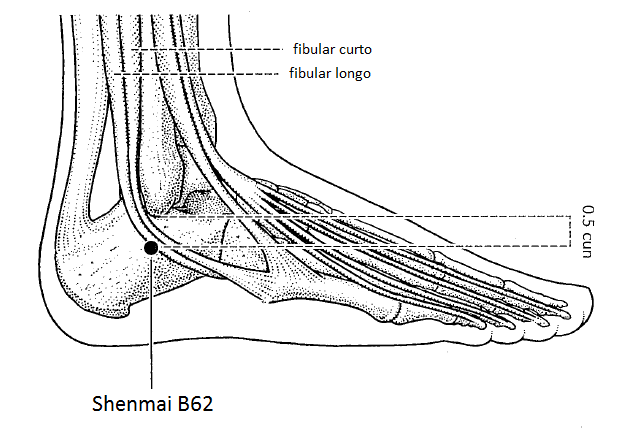
na depressão inferior da crista do maleolo lateral. Relaxa tendões e músculos na parte externa da perna. fascite plantar, 
Com [[Conhecimento/Acupuntura/Canais/Intestino Delgado/ID03\|ID03]] relaxa pescoço, trapézio e ombros. 
Com [[Conhecimento/Acupuntura/Canais/Rim/R06\|R06]] [[Conhecimento/Alterações/insônia\|insônia]]. 

### [[Conhecimento/Acupuntura/Canais/Bexiga/B64\|B64]] 
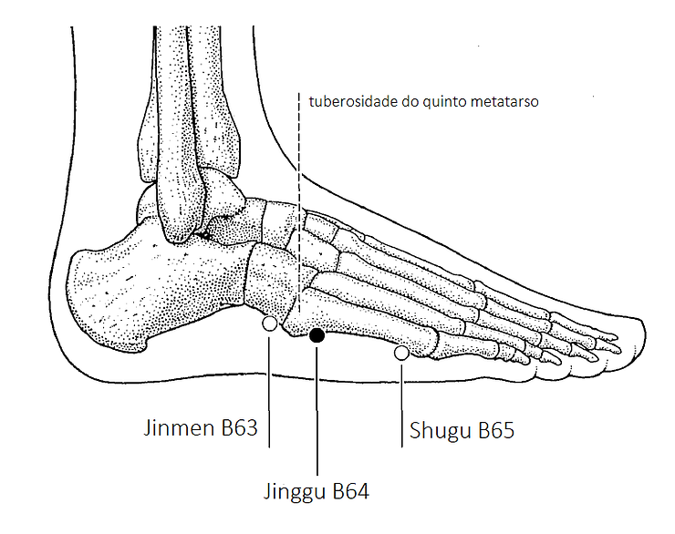
ao longo do meridiano, na região anterior a região do quinto metatarso. Ponto fonte. Usar em tonificação por falta de músculo para sustentar a agulha. 

### [[Conhecimento/Acupuntura/Canais/Bexiga/B65\|B65]] 
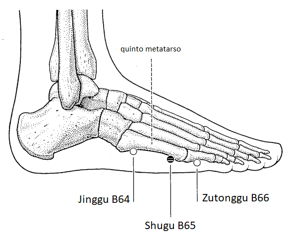
ponto de sedação. Ao longo do meridiano anterior a região metatarso-falangiana do quinto dedo. [[Raiz/fascite plantar\|fascite plantar]], [[Conhecimento/Alterações/cistite\|cistite]] aguda

### [[Conhecimento/Acupuntura/Canais/Bexiga/B67\|B67]] 
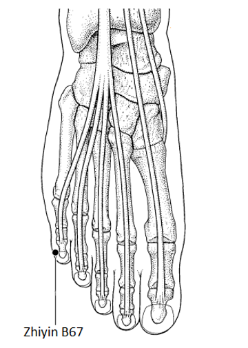
ponto de tonificação. Na face lateral leito ungueal do quinto dedo. Acalma o feto. Moxa junto agulha em [[Conhecimento/Acupuntura/Canais/Intestino Grosso/IG04\|IG04]] e em [[Conhecimento/Acupuntura/Canais/Baço/BP06\|BP06]] indução do parto. Sangria desobstruir o meridiano, dor ao longo do trajeto. 

