---
{"title":"05 - Meridianos 1 - 3. Vesícula Biliar","tags":["conhecimento/acupuntura/aula"],"autor":"Doren Sayuri Kato","date":"2023-10-14","publish":true,"NivelAcesso":"ibrate","Conteudo":"acupuntura","allDay":false,"DiaSemana":"Sáb","start":{"dateTime":"2023-10-14T08:25-03:00"},"end":{"dateTime":"2023-10-14T12:40-03:00"},"location":"R. Prof. João Cândido, n° 344 - 2° andar - Centro, Londrina - PR, 86010-901","PassFrontmatter":true}
---

# Meridiano da vesícula biliar 
[[Conhecimento/Acupuntura/Anotaçoes/Zang Fu/visceras/Vesícula biliar\|Vesícula biliar]] = dan
Shao yang do pé 
44 pontos descendentes 

## Indicações gerais
cefaleias laterais, patologia dos olhos, ouvidos, síndromes de Calor, dores em regiões do trajeto do meridiano. 

## Trajeto do meridiano 

## Cabeça 

### [[Conhecimento/Acupuntura/Canais/Vesicula Biliar/VB01\|VB01]] 
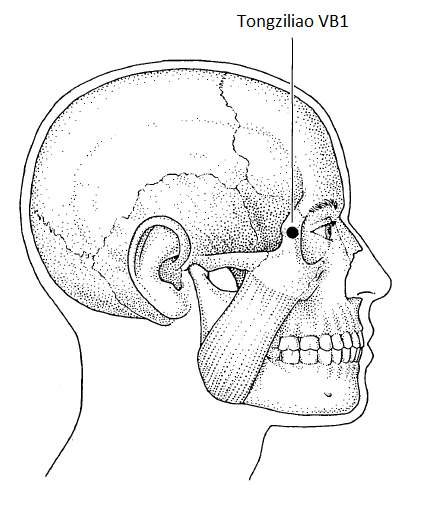
Ângulo externo do olho, 0.5 tsun da prega. Localizar com o olho do paciente fechado. Pode ser substituído ao associar [[Conhecimento/Acupuntura/Canais/Vesicula Biliar/VB20\|VB20]] e [[Conhecimento/Acupuntura/Canais/Figado/F03\|F03]] para fogo do fígado.

### [[Conhecimento/Acupuntura/Canais/Vesicula Biliar/VB02\|VB02]] 
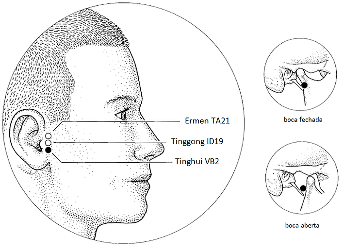
próximo a [[Conhecimento/Acupuntura/Canais/Triplo Aquecedor/TA21\|TA21]] e [[Conhecimento/Acupuntura/Canais/Intestino Delgado/ID19\|ID19]]. Punturar com a boca aberta para criar o espaço. 
Beneficia ouvido e fortalece a audição. [[Conhecimento/Alterações/Bruxismo\|bruxismo]], [[Conhecimento/Alterações/ATM\|ATM]], [[alteração auditiva\|alteração auditiva]], [[dor de dente\|dor de dente]], [[salivação excessiva\|salivação excessiva]]

### [[Conhecimento/Acupuntura/Canais/Vesicula Biliar/VB14\|VB14]] 
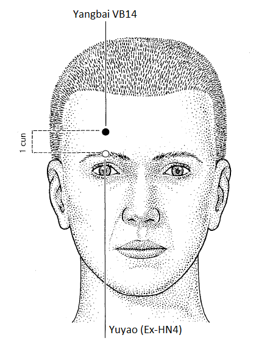
na linha média da pupila, 1 tsun acima da sobrancelha, usado para cefaléia frontal. Clareia a visão, [[Conhecimento/Alterações/paralisia facial\|paralisia facial]] (punturar para baixo para favorecer o fechamento do olho)

### [[Conhecimento/Acupuntura/Canais/Vesicula Biliar/VB20\|VB20]] 
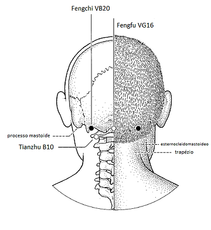
Feng chi. Casa do vento. 20 minutos mínimo. Aguardar o vento assentar. 
~~na reentrância óssea entre inserção superior do esternocleidomastoideo e o trapézio.~~ risco de atingir SNC. 
Na base do occipital, mais lateral. Agulhas oblíquas em direção ao centro da cabeça 
Ponto obrigatório para eliminar vento perverso, especial para [[Cefaléia digestiva\|Cefaléia digestiva]]  e [[Conhecimento/Alterações/hemiplegia\|hemiplegia]]. 
[[Convulsão\|Convulsão]], [[Conhecimento/Alterações/acidente vascular cerebral\|AVE]], [[Conhecimento/Alterações/tontura\|tontura]], [[Conhecimento/Alterações/vertigem\|vertigem]], [[Conhecimento/Alterações/cefaleia\|cefaleia]], rigidez no pescoço, dor na base do occipital, [[Conhecimento/Alterações/zumbido\|zumbido]], [[Conhecimento/Alterações/surdez\|surdez]], [[Conhecimento/Alterações/Falta de memória\|Falta de memória]], [[Conhecimento/Alterações/déficit de memória\|déficit de memória]], [[Conhecimento/Condições/memória fraca\|memória fraca]], [[torcicolo\|torcicolo]], [[Conhecimento/Alterações/paralisia facial\|paralisia facial]], [[estimula contração uterina\|estimula contração uterina]]. NÃO USAR EM GESTANTE ANTES DA MATURIDADE DO FETO
NÃO USAR VB20 E VB21 SIMULTANEAMENTE. Efeitos opostos. Pode causar mal estar e desmaio. 
## Tronco
### [[Conhecimento/Acupuntura/Canais/Vesicula Biliar/VB21\|VB21]] 
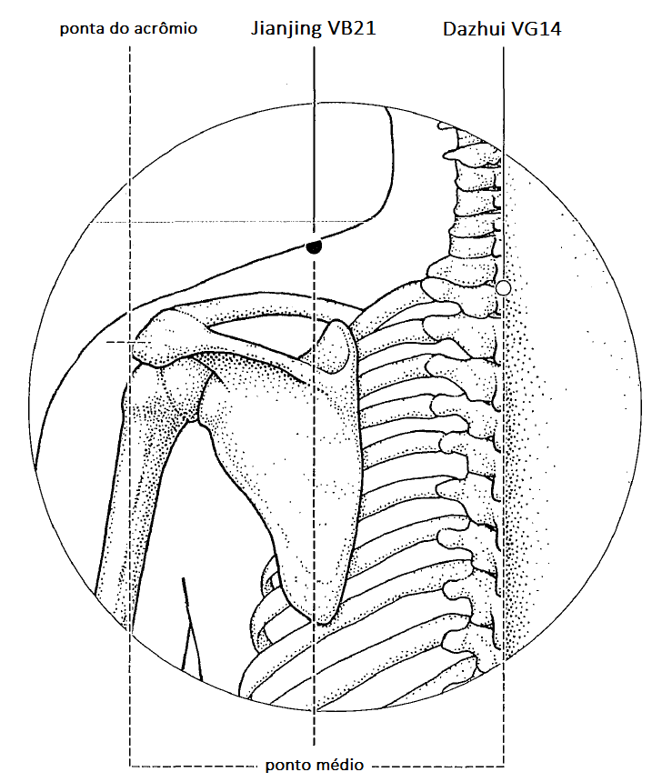
metade da distância do centro da coluna e ombro, na crista do trapézio. Puntura vertical. Principal relaxante de trapézio e escápula. Relaxa cervical, [[Conhecimento/Alterações/hemiplegia\|hemiplegia]], [[Conhecimento/Alterações/paralisia\|paralisia]], promove [[Conhecimento/Alterações/lactação\|lactação]] e o [[Conhecimento/Alterações/parto\|parto]]. 
NÃO USAR VB20 E VB21 SIMULTANEAMENTE. Efeitos opostos. Pode causar mal estar e desmaio.

### [[Conhecimento/Acupuntura/Canais/Vesicula Biliar/VB24\|VB24]]
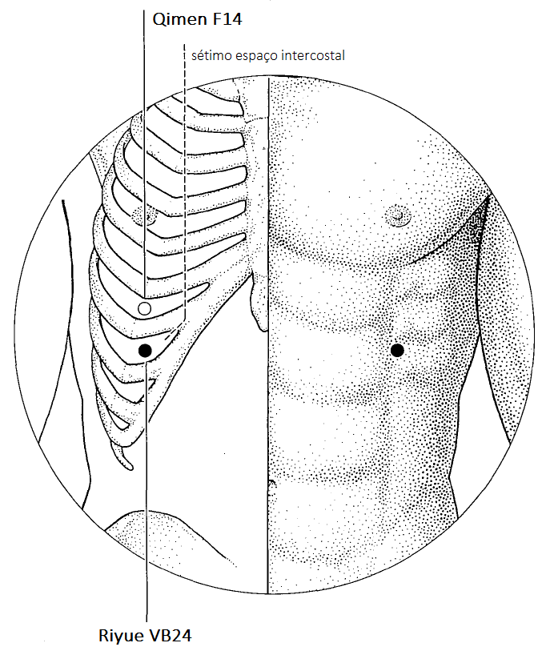
ponto alarme da vesícula biliar 
Na linha do mamilo, na borda inferior da sétima costela, no espaço intercostal. [[Icterícia\|Icterícia]], [[Conhecimento/Condições/dor no hipocondrio\|dor no hipocondrio]]

### [[Conhecimento/Acupuntura/Canais/Vesicula Biliar/VB25\|VB25]] 
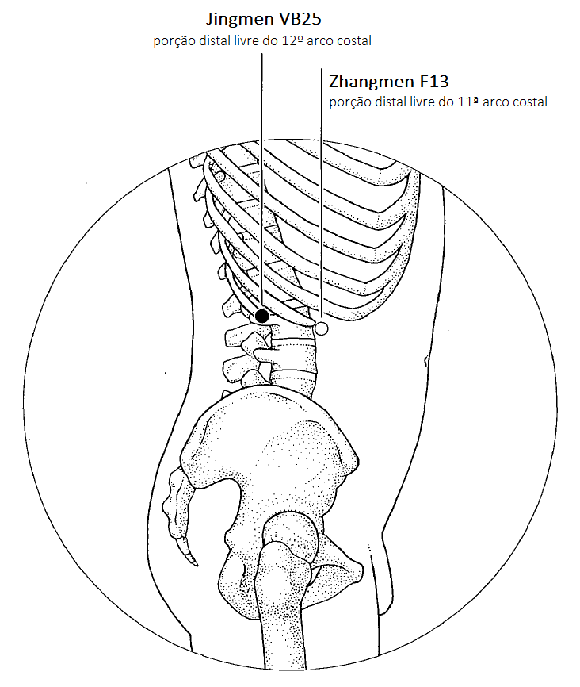
ponto alarme do rim (órgão, não energético). Abaixo da borda posterior da axila, na borda anterior e inferior da 12ª costela. [[insuficiência renal\|insuficiência renal]]

### [[Conhecimento/Acupuntura/Canais/Vesicula Biliar/VB30\|VB30]]
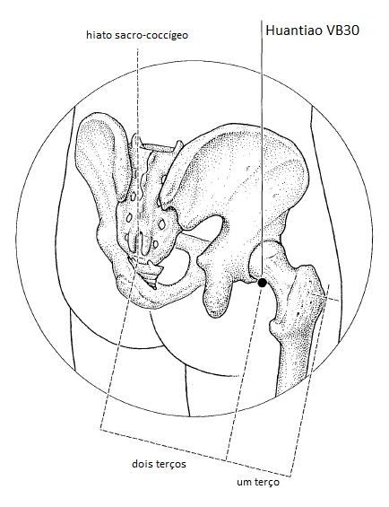
inserção profunda 2 a 2.25 tsun (5,5cm), face posterior do. Quadril, entre trocanter maior do fêmur e osso da bacia 
Atenção ao comprimento da agulha. Ponto local. [[Conhecimento/Condições/bursite trocanterica\|bursite trocanterica]], [[Conhecimento/Alterações/ciatalgia\|ciatalgia]], [[Conhecimento/Alterações/Sequela neurológica\|Sequela neurológica]] por estimular a circulação do Qi e do Xue, evitando atrofia. [[Conhecimento/Alterações/prurido\|prurido]] no anus e virilha 

## Perna
### [[Conhecimento/Acupuntura/Canais/Vesicula Biliar/VB31\|VB31]]
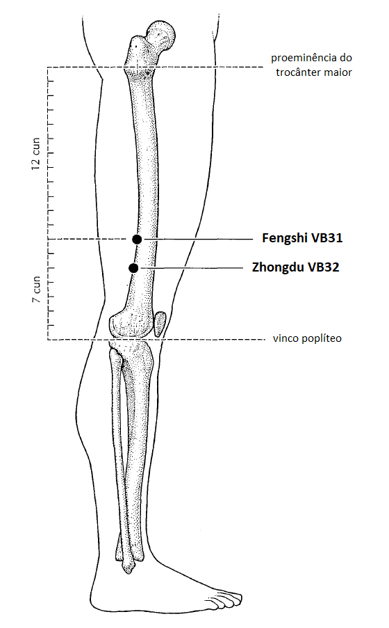
mãos espalmadas ao longo do corpo.com a mão aberta onde apontar o dedo médio. Espanta vento perverso, [[Conhecimento/Alterações/Sequela neurológica\|Sequela neurológica]], dor no joelho que sobe para coxa, paralisias dos membros inferiores e [[Conhecimento/Alterações/ciatalgia\|ciatalgia]]. Para hemiplegia associar com [[Conhecimento/Acupuntura/Canais/Vesicula Biliar/VB34\|VB34]].
[[Conhecimento/Acupuntura/Canais/Triplo Aquecedor/TA06\|TA06]] com [[Conhecimento/Acupuntura/Canais/Vesicula Biliar/VB31\|VB31]] [[Conhecimento/Alterações/herpes zoster\|herpes zoster]] 

### [[Conhecimento/Acupuntura/Canais/Vesicula Biliar/VB34\|VB34]] 
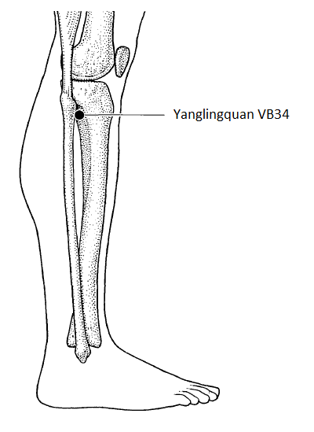
Ponto mestre dos tendões. Anterior e inferior a cabeça da fibula. Usado em casos de [[Conhecimento/Alterações/tendinite\|tendinite]], acalma calor na vesícula biliar e relaxamento muscular. [[Entorse\|Entorse]]. Qualquer ferimento no tendão. Relaxa o tendão. [[Conhecimento/Alterações/Cãibra\|Cãibra]], [[espasmo muscular\|espasmo muscular]], tendinite, [[sequela neurológicas\|sequela neurológicas]], especialmente nas pernas. Retira calor na vesícula biliar, vômito 

### [[Conhecimento/Acupuntura/Canais/Vesicula Biliar/VB37\|VB37]]
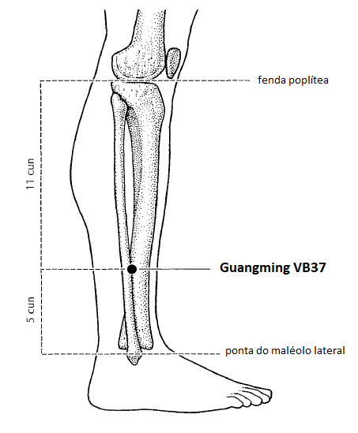
Olhos brilhantes
Ponto Luo da vesícula biliar, 5 tsun acima do maléolo externo,usado para dores e paralisia de membros inferiores. importante ponto para os olhos.
[[Conhecimento/Acupuntura/Canais/Vesicula Biliar/VB37\|VB37]] +[[Conhecimento/Acupuntura/Canais/Figado/F03\|F03]] secura nos olhos 

### [[Conhecimento/Acupuntura/Canais/Vesicula Biliar/VB38\|VB38]] 
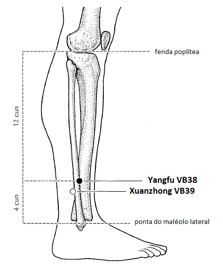
4 tsun acima da crista do maleolo. [[Conhecimento/Alterações/enxaqueca\|enxaqueca]], [[Conhecimento/Alterações/hemiplegia\|hemiplegia]], dor local, [[Conhecimento/Alterações/parestesia\|parestesia]], gosto amargo com suspiro 

### [[Conhecimento/Acupuntura/Canais/Vesicula Biliar/VB39\|VB39]] 
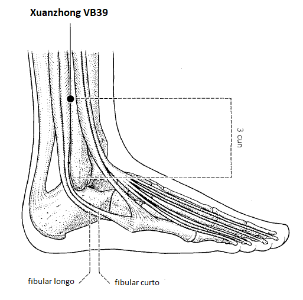
3 tsun acima da crista do maleolo lateral. Ponto mestre da medula óssea. [[Conhecimento/Alterações/anemia\|anemia]], [[Conhecimento/Alterações/leucemia\|leucemia]]. Ponto a distância para [[Conhecimento/Alterações/cefaleia\|cefaleia]] temporal. Tratamento pós quimioterapia e pós rádioterapia . Revigorar o Xue. 

### [[Conhecimento/Acupuntura/Canais/Vesicula Biliar/VB40\|VB40]]
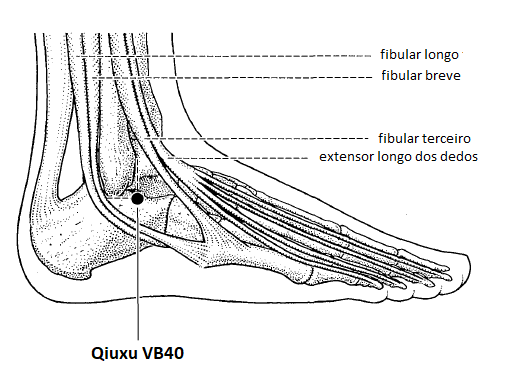
inferior e anterior a crista do maléolo lateral. Ponto fonte da vesícula biliar. artrose e qualquer forma. Em pessoas idosas, moxa. 

### [[Conhecimento/Acupuntura/Canais/Vesicula Biliar/VB41\|VB41]] 
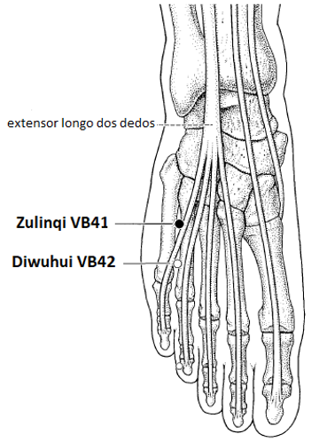
anterior ao metatarso, entre 4º e 5º dedo. Retira umiidade e calor da região genital. Coceira, secreção, inflamação na uretra, ponto a distancia para mastite, retenção do feto([[gravidez\|gravidez]]), promove [[Conhecimento/Alterações/lactação\|lactação]]

### [[Conhecimento/Acupuntura/Canais/Vesicula Biliar/VB42\|VB42]] 
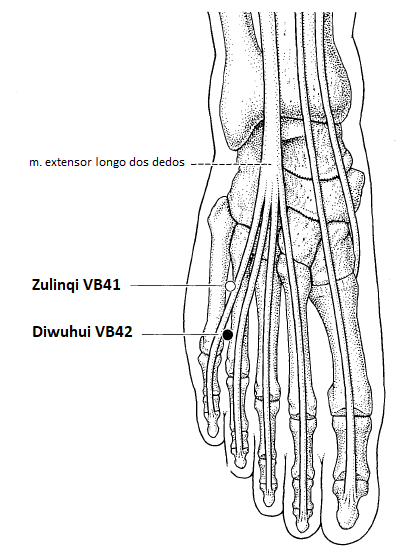
entre VB41 e VB42

### [[Conhecimento/Acupuntura/Canais/Vesicula Biliar/VB43\|VB43]] 
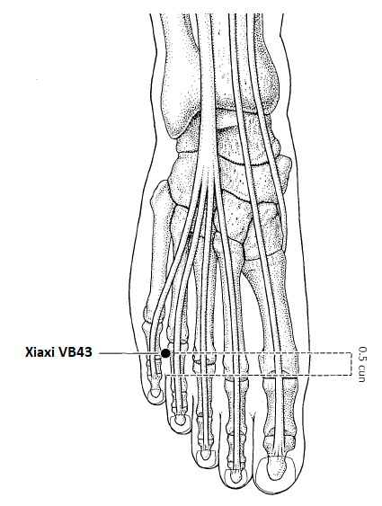
ponto de tonificação da vesícula biliar. Bom para gases. Alivia plenitude da vesícula e do fígado. [[gases\|gases]] ponto a distancia do ouvido. 

### [[Conhecimento/Acupuntura/Canais/Vesicula Biliar/VB44\|VB44]] 
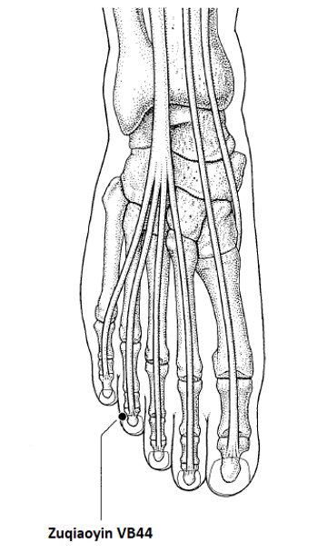
leito ungueal lateral do quarto dedo. Sangria para dor ao longo do trajeto. 

