---
{"title":"06 - Meridianos 2 - 4. Estômago","tags":["conhecimento/acupuntura/aula"],"autor":"Doren Sayuri Kato","date":"2023-11-18","publish":true,"NivelAcesso":"ibrate","Conteudo":"acupuntura","allDay":false,"DiaSemana":"Sáb","start":{"dateTime":"2023-11-18T08:22-03:00"},"end":{"dateTime":"2023-11-18T12:40-03:00"},"location":"R. Prof. João Cândido, n° 344 - 2° andar - Centro, Londrina - PR, 86010-901","PassFrontmatter":true}
---

# Meridiano do estômago 

## Informações
Estômago (wei)
Meridiano Yangming do pé 
45 pontos descendentes 

## Indicações gerais
Distúrbios gastrointestinais, paralisias faciais, sinusite,cansaços, parestesias e dor músculo-esquelético ao longo do meridiano e psicoses.

> [!NOTE] Psicose
> Chineses acreditam que psicoses podem ser causadas por fleugma ascender a cabeça 
## Trajeto do meridiano

 

## Cabeça
### [[Conhecimento/Acupuntura/Canais/Estomago/E01\|E01]]
**Localização**
Entre globo ocular e borda infra orbital (perigoso)
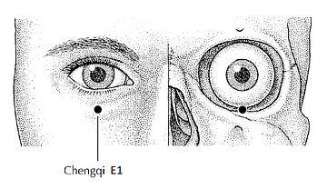

### [[Conhecimento/Acupuntura/Canais/Estomago/E02\|E02]]
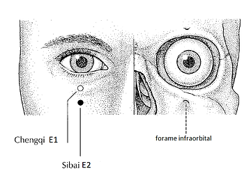
**Localização**
Localizado na depressão do forame infra orbital acima do osso zigomatico. Agulha oblíqua. Não fazer sangria. 
**Indicação**
Ilumina os olhos, relaxa músculos faciais, ativa circulação de Xue na face, limpa calor e expele vento. Paralisia facial (pode usar so o lado comprometido), nevralgia do trigêmeo, sinusite, rinite, edema facial, patologias oculares 

### [[Conhecimento/Acupuntura/Canais/Estomago/E03\|E03]] 

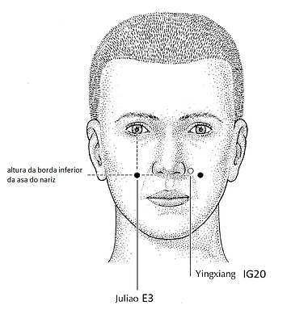
**Localização**
No ponto de encontro entre a linha vertical da pupila e a linha horizontal da borda inferior do nariz. 
**Indicação**
Limpa calor 
Atua sobre olhos e nariz. Relaxa músculos faciais. Sinusite, rinite, sangramento nasal, coriza, paralisia facial, nevralgia do trigêmeo, afta (calor do estômago).

### [[Conhecimento/Acupuntura/Canais/Estomago/E04\|E04]]
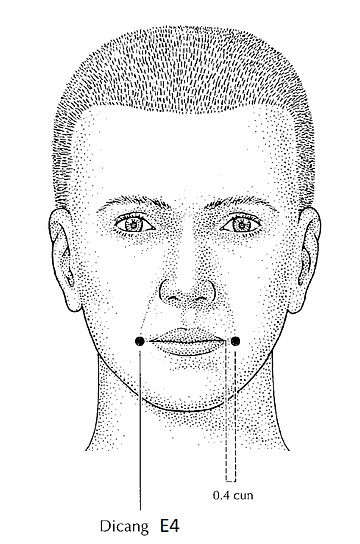
**Localização**
0.4 tsun do canto da boca. Diretamente abaixo da pupila na rima da boca. 
**Indicação**
Expele vento
Beneficia tendões e músculos. Afasia, dor nos dentes e salivação excessiva. 

### [[Conhecimento/Acupuntura/Canais/Estomago/E05\|E05]] 
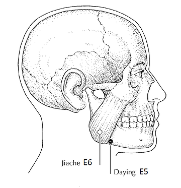
**Localização**
A frente do músculo masseter
**Indicação**
Elimina vento da face, elimina frio da face, Elimina calor da face. 
Rege mandíbula, fortalece os dentes.  Paralisia facial, bruxismo, nevralgia do trigêmeo, aftas, salivação excessiva, dificuldade na mastigação, caxumba, espasmo no músculo masseter. 
Para dor nos dentes +[[Conhecimento/Acupuntura/Canais/Intestino Grosso/IG04\|IG04]] que libera endorfinas para membros superiores e cabeça. 

### [[Conhecimento/Acupuntura/Canais/Estomago/E06\|E06]]
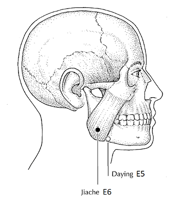
**Localização**
Atrás do músculo masseter 
**Indicação**
Elimina vento da face, elimina frio da face, elimina calor da face.
Rege mandíbula, fortalece os dentes.  Paralisia facial, bruxismo, nevralgia do trigêmeo, aftas, salivação excessiva, dificuldade na mastigação, caxumba, espasmo no músculo masseter. 
Para dor nos dentes +[[Conhecimento/Acupuntura/Canais/Intestino Grosso/IG04\|IG04]] que libera endorfinas para membros superiores e cabeça. 

### [[Conhecimento/Acupuntura/Canais/Estomago/E07\|E07]] 
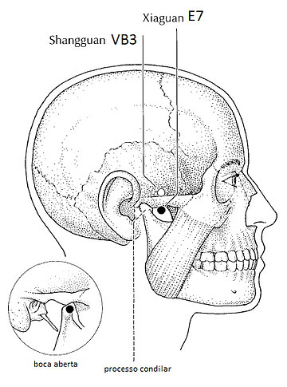
**Localização**
Situado inferior a borda do arco zigomático e anterior ao côndilo mandibular, localizar com a boca fechada.
**Indicação**
Relaxa musculatura facial, beneficia ouvido, paralisia facial, neuralgia do trigêmeo, disfunção da ATM, otite, zumbido, surdez. 

### [[Conhecimento/Acupuntura/Canais/Estomago/E08\|E08]]
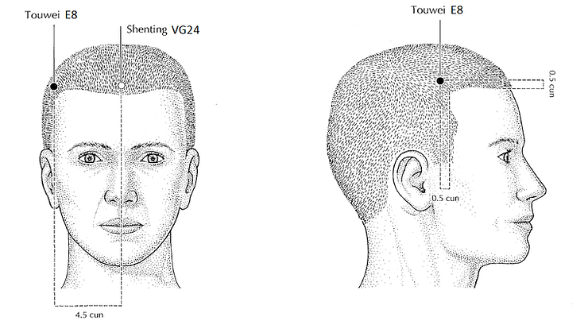
**Localização**
0.5 tsun acima da linha do cabelo, no canto superior lateral do cabelo (limite 3 tsun)
**Indicação**
Trata tontura decorrente de umidade e fleugma (cabeça pesada, cheia, vista escura, sensação de inchaço na cabeça), cefaleia, lacrimejamento excessivo 

### [[Conhecimento/Acupuntura/Canais/Estomago/E09\|E09]]
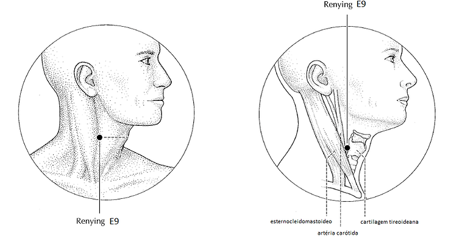
**Localização**
1.5 tsun da cartilagem cricoide, antes do músculo esternocleidomastoideo
- Necessário manter o pescoço em leve extensão. Causa um pouco de desconforto e pode ser problemático para algumas pessoas. 
**Indicação**
Alterações na tireóide e cordas vocais, amigdalite, faringite. Existe uma opção mais confortável.
## Tronco
### E12 a E16
Somente ventosa. Risco de pneumotórax. 

### [[Conhecimento/Acupuntura/Canais/Estomago/E17\|E17]]
![[E17.webp\|300]]
**Localização**
mamilo.
- Não usar agulha.
- Moxa permitido. 

### E19 ao E29
**Localização**
2 tsun da linha central. 

### [[Conhecimento/Acupuntura/Canais/Estomago/E21\|E21]] 
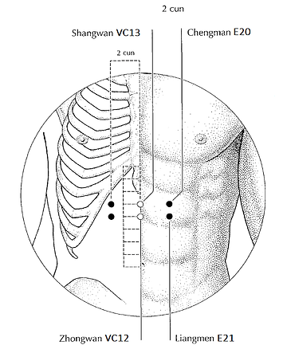
**Localização**
4 tsun acima da linha do umbigo, 2 tsun da linha lateral 
**Indicação**
Regulariza estomago e domina Qi rebelde, interrompe vômito e alivia retenção de alimentos. Excesso de estômago como gastrite com [[Conhecimento/Acupuntura/Canais/Estomago/E34\|E34]], úlcera. Sede em excesso e sensação de de queimação.  Compulsão alimentar. Muito bom com eletropuntura. 

### [[Conhecimento/Acupuntura/Canais/Estomago/E25\|E25]] 
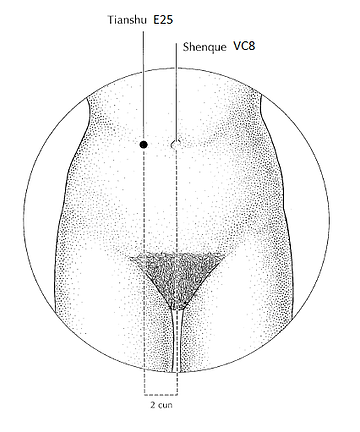
**Localização**
2 tsun lateral ao umbigo 
**Indicação**
Promove ação sobre os intestinos. Alivia retenção dos alimentos. Elimina calor. Usar em padrão de excesso de estômago (Pulso direito, ponto do meio). Dor, diarréia, sensação de queimação, sede, constipação, perda de fezes com forte odor.
Ajuda a aumentar imunidade **após** quimioterapia. 

## Perna 

### [[Conhecimento/Acupuntura/Canais/Estomago/E31\|E31]] 
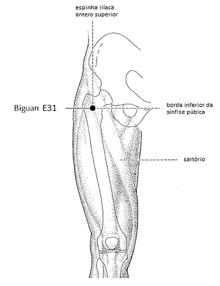
**Localização**
Muito próximo aos gânglios. Não usar agulha
**Indicação**
Ativa o canal e alivia a dor, dissipa a umidade do vento

### [[Conhecimento/Acupuntura/Canais/Estomago/E34\|E34]]
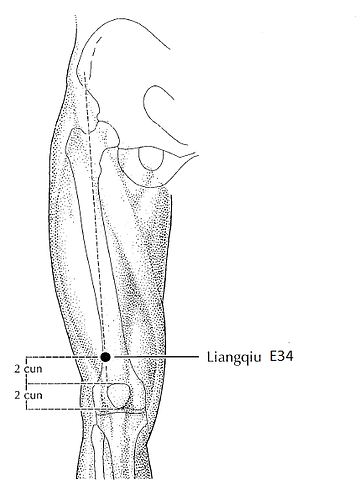
**Localização**
2 tsun acima da patela, 2 tsun lateral ao meio da coxa. 
Ponto Xi do estômago.
**Indicação**
Bom para gastrite e úlcera na fase aguda. Domina rebelião do Qi do Estômago. Dor abdominal súbita, soluço náusea Vômito arroto.

### [[Conhecimento/Acupuntura/Canais/Estomago/E35\|E35]]
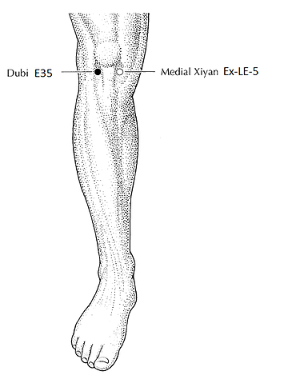
**Localização**
Na borda lateral do tendão patelar, lateral e inferior a patela 
**Indicação**
Dor no joelho na face lateral. 
Parte dos [[Conhecimento/Acupuntura/Canais - Outros/Pontos extras/Ex-MI05 Xiyan\|Ex-MI05 Xiyan]]. 

### [[Conhecimento/Acupuntura/Canais/Estomago/E36\|E36]] Zusanli (milhas a mais)
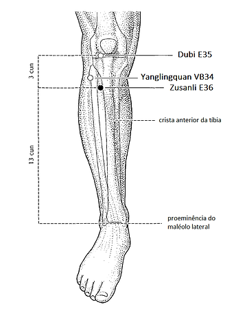
**Localização**
3 tsun abaixo da patela e 1 tsun lateral da crista da tibia. 
**Indicação**
- Aumenta Energia Yang. 
- Ponto para fortalecimento geral do corpo, grande liberador de endorfinas, analgesia da cintura para baixo.
- Aumenta imunidade. Regulariza Qi Defensivo. 
- Ponto mais importante para tonificar Qi e Xue de baço e estômago, aumentando a vitalidade. Cansaço físico e mental. 
- Não usar moxa em excesso de Calor no estômago. 
- Equilibra a circulação de Qi e Xue. Leucemia. 
- Nutre o útero. Menstruação irregular.
- Nausea, vômito e vertigem da gravidez. Preparação para o parto caso o bebê esteja na posição correta. Sequelas neurológicas para membros inferiores. Alterações emocionais. Depressão, mania, tique. Ilumina os olhos. Regular intestinos. Prolapsos (necessita de energia yang para subir) moxa. Junto com [[Conhecimento/Acupuntura/Canais/Vaso da Concepção/VC06\|VC06]], [[Conhecimento/Acupuntura/Canais/Vaso Governador/VG20\|VG20]]
- Prolapsos de útero. Prolapso de bexiga.
- Se usar moxa, observar se calor está chegando a cabeça. Rosto ou olhos vermelhos. 

> [!NOTE] endrofinas e analgesia 
> [[Conhecimento/Acupuntura/Canais/Estomago/E36\|E36]] endorfinas cintura para baixo 
> [[Conhecimento/Acupuntura/Canais/Intestino Grosso/IG04\|IG04]] endrofinas cintura para cima 
> [[Conhecimento/Acupuntura/Canais/Bexiga/B60\|B60]] endorfinas trajeto do meridiano do Baço 

### [[Conhecimento/Acupuntura/Canais/Estomago/E38\|E38]] 
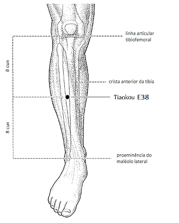
**Localização**
8 tsun abaixo da patela, 1 tsun lateral a crista da tíbia ou metade da distância da patela ao maleolo (16 tsun) ao lado de [[Conhecimento/Acupuntura/Canais/Estomago/E37\|E37]]
**Indicação**
- Dor no ombro (articulação e deltoide)
- Manda Qi e Xue para o Baço.
- Equilibra o meridiano acoplado ao estômago, o baço-pâncreas.
- Ponto mais importante para retirar fleugma (de forma geral -  usar sedando); auxilia nos quadros emocionais decorrentes de fleugma.
- Náusea e vômitos na gravidez, varizes.
- Dor no joelho
### [[Conhecimento/Acupuntura/Canais/Estomago/E40\|E40]]
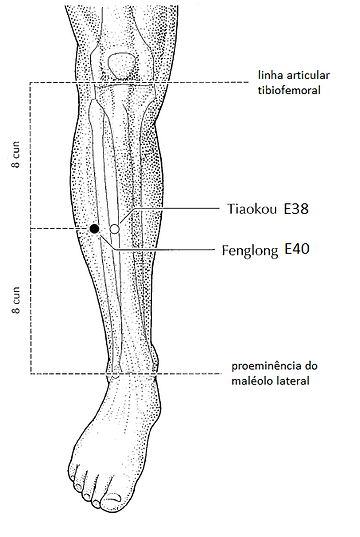
Ponto Lo do estômago
**Localização**
8 tsun abaixo da patela, 2 tsun lateral a crista da tíbia. Ou metade da distância da patela ao maleolo (16 tsun). Ao lado de [[Conhecimento/Acupuntura/Canais/Estomago/E38\|E38]]
**Indicação**
- Emoções decorrentes de fleugma. Loucura, depressão, manias, demência, angústia (bola no estômago ou na garganta), náuseas e vômitos na gravidez. Varizes com [[Conhecimento/Acupuntura/Canais/Baço/BP06\|BP06]] e [[Conhecimento/Acupuntura/Canais/Baço/BP09\|BP09]]. 
- Ponto mais importante para retirar fleugma do corpo. Usar em sedação. 

### [[Conhecimento/Acupuntura/Canais/Estomago/E41\|E41]]
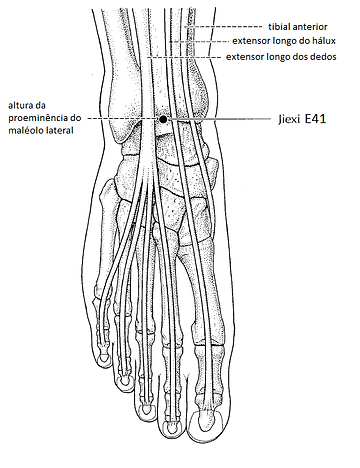
**Localização**
Prega do tornozelo, no meio. 
**Indicação**
Ponto de tonificação, no centro da prega transversal do tornozelo. Usado para edema no rosto (com [[Conhecimento/Acupuntura/Canais/Pulmao/P07\|P07]] + [[Conhecimento/Acupuntura/Canais/Baço/BP09\|BP09]]), depressão e ponto de efeito local. 

### [[Conhecimento/Acupuntura/Canais/Estomago/E42\|E42]]
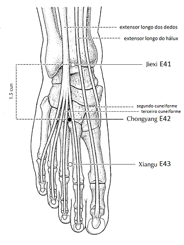
- ponto fonte do estômago. 
**Localização**
1.5 tsun do [[Conhecimento/Acupuntura/Canais/Estomago/E41\|E41]], efeito local na face, bom para pós operatório de face. 
**Indicação**
Edema, fezes em bolinhas, fezes ressecadas, constipação 

### [[Conhecimento/Acupuntura/Canais/Estomago/E45\|E45]]
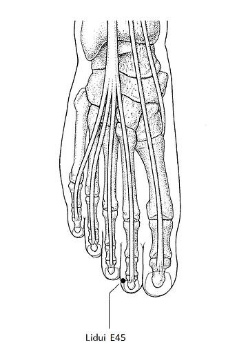
- Ponto de sedação.
**Localização**
No leito ungueal do segundo dedo na face lateral 
**Indicação**
Usado mais com sangria. Bom para gastrite nervosa. Dispersa secura do estômago. Dispersa calor do estômago. Compulsão alimentar (agulha). Dor no estômago. 
