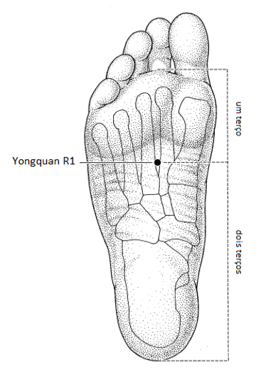
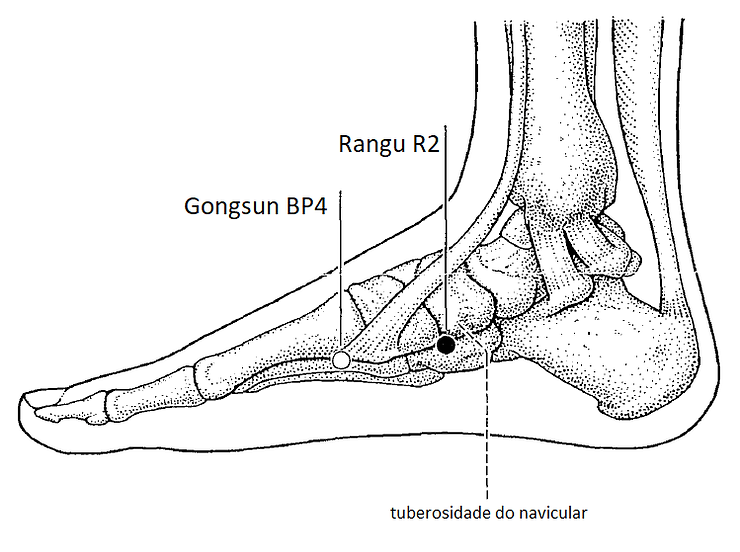
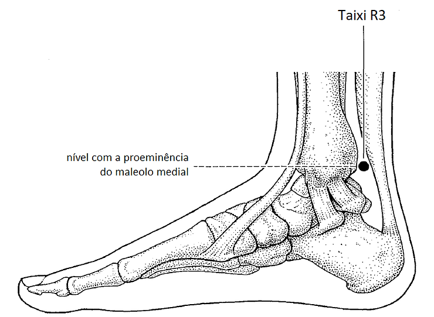
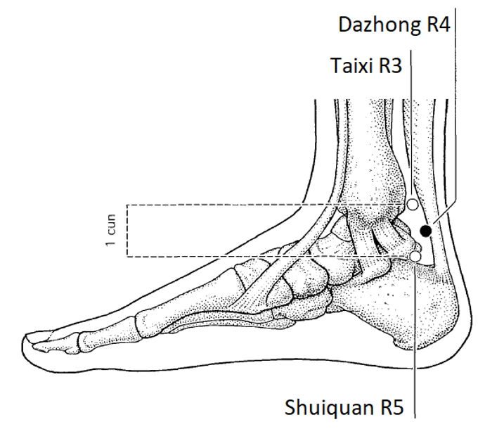
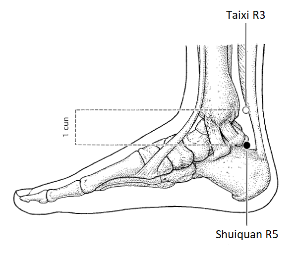
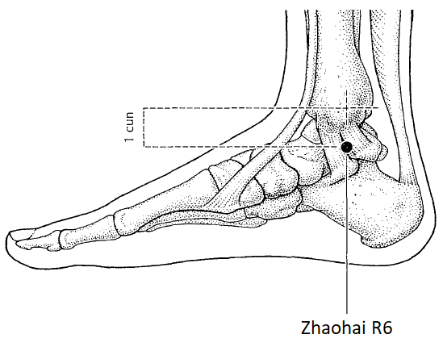
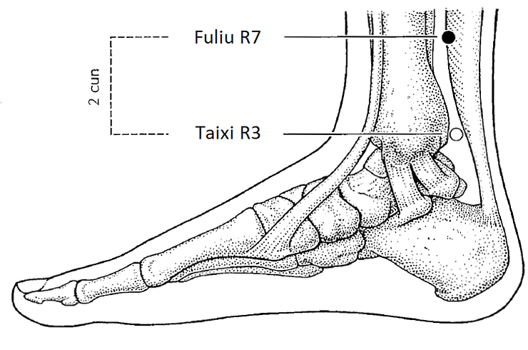
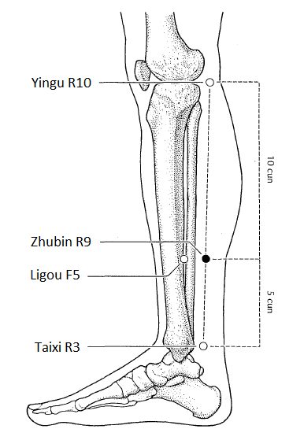
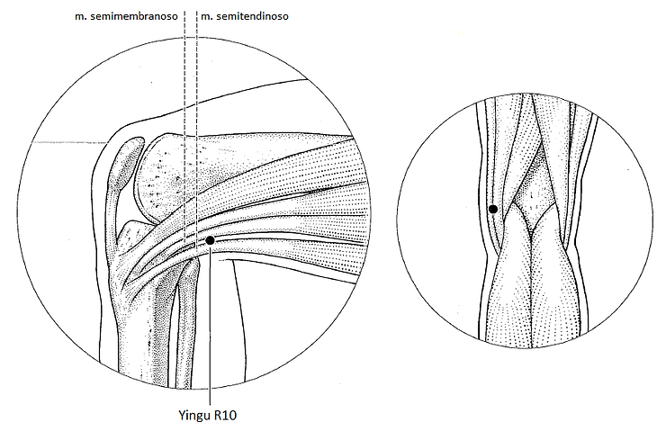
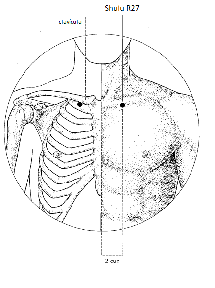

---
{"title":"06 - Meridianos 2 - 7. Rim","tags":["conhecimento/acupuntura/aula"],"autor":"Doren Sayuri Kato","date":"2023-11-18","publish":true,"NivelAcesso":"ibrate","Conteudo":"acupuntura","allDay":false,"DiaSemana":"Sáb","start":{"dateTime":"2023-11-18T08:22-03:00"},"end":{"dateTime":"2023-11-18T12:40-03:00"},"location":"R. Prof. João Cândido, n° 344 - 2° andar - Centro, Londrina - PR, 86010-901","PassFrontmatter":true}
---

# Rim 
## Informações
Shen 
Portão da vitalidade
Shaoyin do pé 
Filtragem, Armazena essência 
Yin do rim 
	responsável por nascimento, crescimento e reprodução 
Yang do rim
	Função fisiológica 
## Indicações gerais 

Cansaço, distúrbios da sexualidade, queda de cabelo, patologias de ouvido e patologias urogenitais. 

## Trajeto do meridiano

### [[Conhecimento/Acupuntura/Canais/Rim/R01\|R01]]

**Localização**
Flexiona os dedos do pé, na depressão entre o segundo dedo e terceiro dedos. 
Posterior e inferior a osso navicular
Ponto de sedação. 
**Indicação**
Usar em emergências. Acorda de desmaio. 
Nutre yin do rim. Tonifica yang em colapso. Limpa o cérebro e acalma a mente (pode ser moxa, aumenta a vitalidade). Puxa calor da Cabeça (elemento água domina fogo)
[[Conhecimento/Acupuntura/Canais/Rim/R01\|R01]] moxa + [[Conhecimento/Acupuntura/Canais/Estomago/E36\|E36]] agulha aumenta vitalidade. 
Com agulha fascite plantar. Espasmo plantar. Esterilidade, infertilidade. 
Usar em deficiência de Jing 

### [[Conhecimento/Acupuntura/Canais/Rim/R02\|R02]]

**Localização**
Posterior ao osso navicular, levemente inferior. Usar agulha oblíqua. 
Ponto de sedação 
**Indicação**
[[Impotência\|Impotência]], [[esterilidade\|esterilidade]], [[Conhecimento/Alterações/infertilidade\|infertilidade]]. Elimina [[calor vazio\|calor vazio]] (maçã do rosto vermelha, sensação de [[calor na cabeça\|calor na cabeça]] a noite, [[Conhecimento/Alterações/agitação mental\|agitação mental]], s[[ede sem desejo de beber água\|ede sem desejo de beber água]], [[Conhecimento/Alterações/garganta seca\|garganta seca]] e [[boca a seca\|boca a seca]] noite) e [[esfria o Xue\|esfria o Xue]] (febre ou calor do rim que subiu). 
Fascite plantar. 

> [!NOTE]
> Yang do rim em excesso 
> Fisiologicamente aumentando 
> Muita urina 
> Agitação no fim do dia 
> Suor a noite
> Moxa em R1 Vai aumentar o Yin que vai equilibrar yang 

### [[Conhecimento/Acupuntura/Canais/Rim/R03\|R03]]

ponto fonte do rim 
**Localização**
Ponto mais alto do maleolo medial, metade da distância do tendão. 
Ponto terra dentro da água. 
**Indicação**
Tonifica o Rim e beneficia a essência. 
Fortalece parte inferior das costas e Joelho. Regulariza útero. Nutre útero. [[Acalma o feto\|Acalma o feto]]. Distúrbios menstruais. [[Conhecimento/Alterações/amenorreia\|amenorreia]], [[Conhecimento/Alterações/metrorragia\|metrorragia]]. [[Conhecimento/Alterações/fogacho da menopausa\|fogacho da menopausa]]. 
Nutre a medula óssea. Nutre ossos. 
Sudorese. Melhora cansaço. Ponto a distância para [[Conhecimento/Alterações/lombalgia\|lombalgia]]. 

### [[Conhecimento/Acupuntura/Canais/Rim/R04\|R04]]

Ponto luo
Ponto energético. Levanta o ânimo. 
**Localização**
Entre [[Conhecimento/Acupuntura/Canais/Rim/R03\|R03]] e [[Conhecimento/Acupuntura/Canais/Rim/R05\|R05]], um ponto para trás. Ou meio tsun abaixo de [[Conhecimento/Acupuntura/Canais/Estomago/E03\|E03]], um pouco para trás. 
**Indicação**
Vontade de viver de rim. [[Exaustao\|Exaustao]], [[Conhecimento/Alterações/depressão\|depressão]] por falta do rim. [[Demência\|Demência]] precoce. Sensação de [[terror\|terror]] e [[Conhecimento/Alterações/Medo\|Medo]] (ultrapassa pânico). Sem vontade de se expressar. 
[[Conhecimento/Alterações/lombalgia\|Lombalgia]] crônica. 

### [[Conhecimento/Acupuntura/Canais/Rim/R05\|R05]]

ponto alarme do rim. 
**Localização**
1 tsun abaixo de [[Conhecimento/Acupuntura/Canais/Rim/R03\|R03]]
**Indicação**
Interrompe [[colica renal\|colica renal]]. 
[[Insuficiência renal\|Insuficiência renal]], [[Conhecimento/Alterações/cistite\|cistite]], [[uretrite\|uretrite]], [[pedra nos Rins\|pedra nos Rins]]. 
[[Conhecimento/Alterações/dor abdominal\|dor abdominal]] ao redor do umbigo. 
[[Conhecimento/Alterações/amenorreia\|amenorreia]]. 

### [[Conhecimento/Acupuntura/Canais/Rim/R06\|R06]]

**Localização**
Depressão inferior ao ponto mais alto do maleolo medial. 
**Indicação**
Tonifica [[yin do rim\|yin do rim]]. 
Nutre os fluidos e umedece a [[Conhecimento/Alterações/fatores patogênicos/secura\|secura]]. 
[[Conhecimento/Alterações/garganta seca\|garganta seca]]. [[Olhos secos\|Olhos secos]].
Influencia útero. [[Conhecimento/Alterações/amenorreia\|amenorreia]], [[Conhecimento/Alterações/prolapso uterino\|prolapso uterino]], [[Conhecimento/Alterações/menopausa\|menopausa]]. [[Conhecimento/Alterações/fogacho da menopausa\|fogacho da menopausa]]. Esfria o Xue. Patologias de pele. 
[[Conhecimento/Acupuntura/Efeitos da medicina chinesa/acalma a mente\|acalma a mente]]. [[Conhecimento/Alterações/ansiedade\|Ansiedade]] e agitação decorrente de [[deficiencia de Yin\|deficiencia de Yin]]. Trata [[Conhecimento/Alterações/insônia\|insônia]] para que os olhos se fechem a noite (deficiência de yin). 
Combinando com [[Conhecimento/Acupuntura/Canais/Estomago/E06\|E06]] e [[Conhecimento/Acupuntura/Canais/Pericardio/PC06\|PC06]], abre o tórax. Dor torácica. Falta de ar, opressão torácica. 

### [[Conhecimento/Acupuntura/Canais/Rim/R07\|R07]]

Ponto metal da água 
**Localização**
2 tsun acima de [[Conhecimento/Acupuntura/Canais/Rim/R03\|R03]]
Ponto de tonificação. 
**Indicação**
Tonifica yang do rim. 
Elimina edema de membros inferiores, sudorese excessiva a noite. 
Retenção hídrica. Harmoniza via das águas, resolve umidade. 
R07 com [[Conhecimento/Acupuntura/Canais/Vaso da Concepção/VC09\|VC09]] estimula diurese 
R07 com [[Conhecimento/Acupuntura/Canais/Intestino Grosso/IG04\|IG04]] regula sudorese nas mãos e nos pés. 
Ponto a distância para lombalgia 
Com moxa altamente energético. 

### [[Conhecimento/Acupuntura/Canais/Rim/R09\|R09]] 

Criança Feliz 
**Localização**
5 tsun acima de [[Conhecimento/Acupuntura/Canais/Rim/R03\|R03]]
**Indicação**
Pode utilizar em gestante. Trabalha [[qi ancestral\|qi ancestral]].
[[Conhecimento/Acupuntura/Efeitos da medicina chinesa/acalma a mente\|acalma a mente]], dá tranquilidade. 
Controla [[Conhecimento/Alterações/ansiedade\|ansiedade]]. Evita desmaio. 
### [[Conhecimento/Acupuntura/Canais/Rim/R10\|R10]] 

Ponto água da água. Seda coração. 
**Localização**
Face interna da cavidade poplitea. Entre os tendões dos músculos semitendinoso e semimembranoso. Localizar com joelho fletido. 
**Indicação**
Ponto água dentro da água. Nutre [[yin do rim\|yin do rim]]. [[Tonifica rim\|Tonifica rim]].
[[Conhecimento/Alterações/lombalgia\|Lombalgia]]. [[Raiz/fascite plantar\|fascite plantar]]. Dores de [[fraqueza no joelho\|fraqueza no joelho]]. 
Dor e dificuldade urinária com [[Conhecimento/Acupuntura/Canais/Figado/F08\|F08]] e [[Conhecimento/Acupuntura/Canais/Baço/BP09\|BP09]]
### R11 a R22
cuidar para não lesar vísceras 
**Localização**
0.5 tsun da linha central. 
Usar no máximo 1 tsun de profundidade.

### R22 a R27 
**Localização**
2 tsun da linha central 

### [[Conhecimento/Acupuntura/Canais/Rim/R27\|R27]]

**Localização**
2 tsun da linha central. Na depressão entre clavícula e primeira costela. 
**Indicação**
[[Sindrome do panico\|Sindrome do panico]], [[Conhecimento/Alterações/Medo\|Medo]], [[Conhecimento/Alterações/ansiedade\|ansiedade]], interrome a [[Conhecimento/Alterações/tosse\|Conhecimento/Alterações/tosse]]. Acalma [[Conhecimento/Alterações/asma\|asma]]. Estumula a descendência do Qi do Pulmão. [[DPOC\|DPOC]]. Dolorido à pressão nesses casos.

