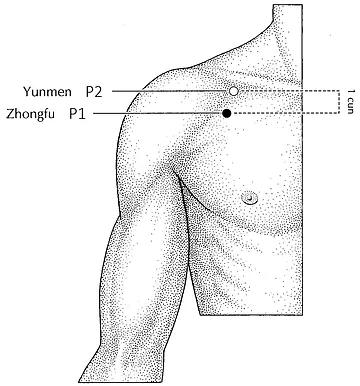
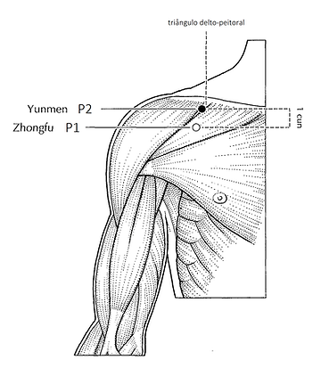
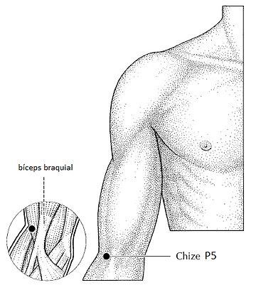
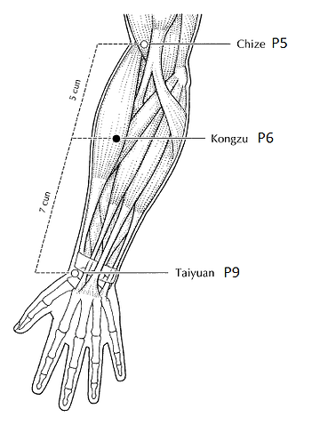
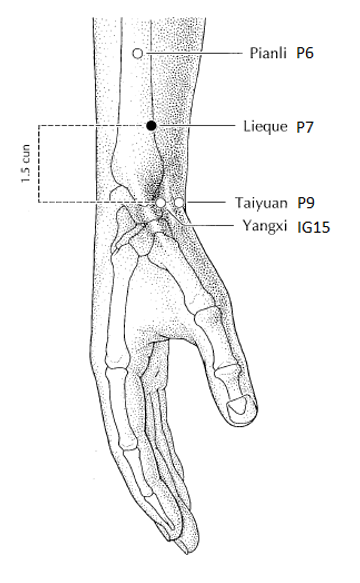
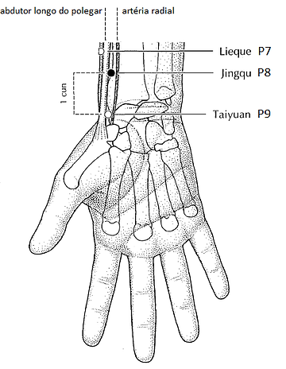
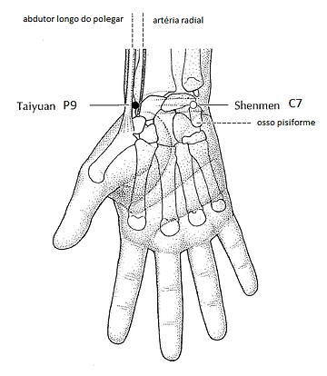
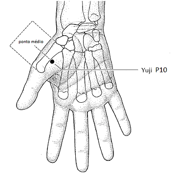
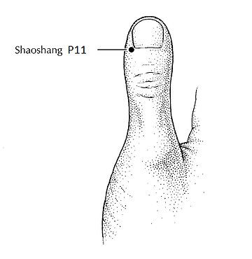

---
{"title":"06 - Meridianos 2 - 8. Pulmão","NAula":"Aula 06","tags":["conhecimento/acupuntura/aula"],"autor":"Doren Sayuri Kato","date":"2023-11-18","publish":true,"NivelAcesso":"ibrate","Conteudo":"acupuntura","allDay":false,"DiaSemana":"Sáb","start":{"dateTime":"2023-11-18T08:22-03:00"},"end":{"dateTime":"2023-11-18T12:40-03:00"},"location":"R. Prof. João Cândido, n° 344 - 2° andar - Centro, Londrina - PR, 86010-901","PassFrontmatter":true}
---

# Pulmão 
## Informações
Fei
Taiyin da mão 
Relação superior inferior com tai yin do pé baço pâncreas. 
Total 11 pontos descendentes (moderno)

Meridiano yin de membro superior 
Começa na caixa torácica e termina na mão. Literaturas antigas usava posição anatômica com braços para cima e meridiano subia. 

## Indicações gerais 
Distúrbios respiratórios, pele, pelos, tristeza, dores e parestesia no trajeto 
## Trajeto do meridiano

## Tronco
### [[Conhecimento/Acupuntura/Canais/Pulmao/P01\|P01]]

Ponto alarme 
**Localização**
6 tsun lateral da linha central no segundo espaço intercostal. 
**Indicação**
Estimula a descida do Qi do Pulmão. Pode ser usado em excesso de Pulmão. 

### [[Conhecimento/Acupuntura/Canais/Pulmao/P02\|P02]]

**Localização**
6 tsun da linha central, primeiro espaço intercostal, logo abaixo da clavícula. 
**Indicação**
Estimula descida do Qi do pulmão ([[Conhecimento/Acupuntura/Canais/Pulmao/P01\|P01]] geralmente melhor)

## Braço
### [[Conhecimento/Acupuntura/Canais/Pulmao/P05\|P05]]

Ponto de sedação retira calor.
Perpendicular da água ao Pulmão
Ponto água dentro do metal. 
**Localização**
Lateral ao tendão do bíceps. 
**Indicação**
Promove dispersão e descendência do Qi do Pulmão. 
Enfisema, plenitude torácica, acne, espinha, tabagismo (calor do Pulmão), alopecia areata (normalmente causada por stress, usar [[Conhecimento/Acupuntura/Canais/Pericardio/PC06\|PC06]] + [[Conhecimento/Acupuntura/Canais/Coraçao/C07\|C07]])
Fleugma grossa, amarelada combinar com [[Conhecimento/Acupuntura/Canais/Estomago/E40\|E40]]
Epicondilite 

### [[Conhecimento/Acupuntura/Canais/Pulmao/P06\|P06]]

**Localização**
5 tsun abaixo do [[Conhecimento/Acupuntura/Canais/Pulmao/P05\|P05]], um pouco acima da metade do Antebraço. 
**Indicação**
Ponto de emergência do Pulmão (dispneia) (ou [[Conhecimento/Acupuntura/Canais/Pulmao/P10\|P10]])
Regulariza Qi do Pulmão, faz o Qi descer. 
Região da garganta. 

### [[Conhecimento/Acupuntura/Canais/Pulmao/P07\|P07]]

lieque (sequência quebrada)
Ponto Luo e de Confluência 
**Localização**
1,5 tsun antes da prega do punho.
Ou superior ao processo estiloide. 
**Indicação**
Constipação 
Confluência com [[Conhecimento/Acupuntura/Canais/Rim/R06\|R06]] estimula garganta, nariz e olhos. (R06 manda umidade para regeneração)
Principal ponto do Pulmão. Estimula descida e dispersão do Qi e das aguas. 
Retira fleugma e elimina vento perverso do Pulmão. Coriza e catarro vão sair por tosse ou fezes. Pneumonia. 
Edema da face, combinar com [[Conhecimento/Acupuntura/Canais/Estomago/E40\|E40]] ou [[Conhecimento/Acupuntura/Canais/Estomago/E41\|E41]].
Cefaleia. Estimula circulação de Qi Defensivo. 
Com [[Conhecimento/Acupuntura/Canais/Intestino Grosso/IG20\|IG20]] melhora Coriza. Nariz trancado, sinusite. 
Tristeza, melancolia, extravasamento de emoções reprimidas. 

### [[Conhecimento/Acupuntura/Canais/Pulmao/P08\|P08]]

**Localização**
1 tsun depois da prega do punho. 
Não usar moxa. Ponto metal do metal. 
**Indicação**
Estimula secura. 
Sedando bom para tosse sem secreção. Tosse seca. Tosse não produtiva. Tosse alérgica. 
Tonificando, tosse produtiva.
Sudorese excessiva. 

## Mão
### [[Conhecimento/Acupuntura/Canais/Pulmao/P09\|P09]]

**Localização**
Prega do punho antes do início do polegar. 
Ponto de tonificação 
Ponto fonte. 
Ponto mestre dos vasos sangüíneos. 
**Indicação**
Deficiência de Pulmão. Dispneia, especialmente por esforço e voz fraca. 
Resolve fleugma. Melhorar circulação de Qi e Xue. 
Melhora retornos venoso. Varizes. Varicose. Flebite. 
Extremidades frias com [[Conhecimento/Acupuntura/Canais/Bexiga/B17\|B17]] e [[Conhecimento/Acupuntura/Canais/Baço/BP06\|BP06]]. 
Leucemia não. 
Luto com deficiência de Pulmão. 

### [[Conhecimento/Acupuntura/Canais/Pulmao/P10\|P10]]

**Localização**
No meio da região tenar. 
**Indicação**
Broncoespasmo. Dispneia. Elimina calor do Pulmão. 

### [[Conhecimento/Acupuntura/Canais/Pulmao/P11\|P11]]

**Localização**
Leito ungueal do polegar na face lateral (externa da mão)
**Indicação**
Febre com sangria, perda de consciência, transtornos mentais.
Retira calor. 
Estado inicial da entrada do fator patogênico. 
Sangria com [[Conhecimento/Acupuntura/Canais/Intestino Grosso/IG01\|IG01]] na dor de garganta. 
