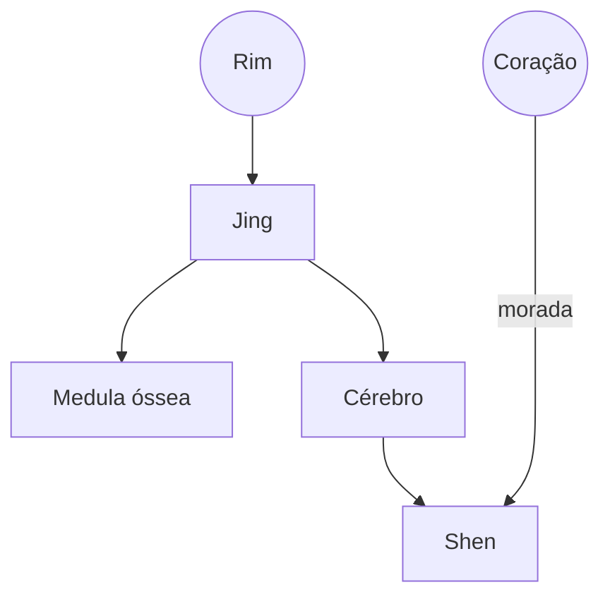

%%2024-05-25 10.40 [[Simone Tano]]%%

# 1. Inter-relacionamento entre os sistemas zang e fu

- O segredo da medicina chinesa baseia-se na compreensão do Inter-relacionamento dos sistemas Zang Fu

- Energia e matéria se interligam e formam um encantador sistema:

→ estrutura e função,
→ harmonia e desarmonia.

# 2. MTC (中药-Zhōng yào)

- Tem como principio o objetivo de perceber os padrões de desarmonia, sua classificação e o tratamento.

- A MTC entende a doença como desarmonia.

- Tem como fatores de desarmonia: fatores internos bloqueios, deficiências e excessos. externos (Liu Xie - 6 demônios) → vento, frio, calor, umidade, secura, calor de verão.

# 3. Inter-relacionamento entre os sistemas yin

## 3.1 Coração e Pulmão 
Controle e governo do sangue e dos órgãos

Governa o Qi e a respiração 

![[Fogo-Metal.excalidraw|100]]

Coração governa o sangue ↔ pulmão governa o Qi 

|                             |     |                              |
| --------------------------- | :-: | ---------------------------- |
| Coração é quem direciona    |     | Por outro lado o P depende   |
| o sangue mas depende do P   |  ↔  | do coração para sua nutrição |
| para fornecer esse trabalho |     |                              |
 

Ambos ficam no **aquecedor superior**
Sangue é a mãe do Qi.
O Qi é o comandante do Xue

O **Qi é yang** e **Xue é Yin**

O sangue, mesmo que seja dominado pelo Coração, nutre o Qi do Pulmão para este circular.

O Qi do Pulmão tem a função de ajudar o Qi do Coração em impulsionar o sangue.

→ Coração e Pulmão participam na formação de Qi e Xue e são intimamente ligados na função de:

Formação de Ql e de Xue
Circulação de Qi e de Xue

1) Formação de Qi e de Xue:

Qi é yang e Xue é Yin. Qi ativa formação de Xue. Xue nutre e umedece os Zang Fu para formar e governar o Qi.

2) Circulação de Qi e de Xue:

O Zhong Qi (formado pelo Qi puro e pelo Gu Qi (Yong qi)) dá impulso à respiração e a circulação do sangue.

### **Patologia:**

Deficiência do Qi do Coração e do Pulmão ocorrem em geral juntos, causando sintomas de:

→[[palpitação|Palpitação]]
→[[Dispneia]]

![[Aula 12 Zang Fig02 C-P Patologia.excalidraw|680]]

![[Aula 12 Zang Fig03 C-P Patologia 2.excaldraw|680]]
Deficiência crônica de Qi do Coração e do Pulmão pode incorrer em insuficiência cardíaca crônica com bronquite, que causa:
- [[palpitação|Palpitação]]
- [[Transpiração espontânea]]
- [[Respiração curta]]
- [[Asma]]
- [[Conhecimento/Alterações/tosse]]
- [[Pulso fraco]]
- [[Língua pálida]]

## 3.2 Coração e Rim

Coração governa o sangue ↔  Rim armazena a essência
Morada do Shen                 ↔  Armazena a essência, este produz Xue 
![[Água-Fogo.excalidraw|100]]

Coração e Rim funcionam em suporte mútuo
É o equilíbrio entre Yin e Yang
Coração é Yang (Movimento)
Rim é Yin (Tranquilidade)

Sangue produz Jing ↔ Jing produz sangue

Qi do coração descende para aquecer a água, Qi do rim ascende para nutrir o fogo

### Patologia

#### Deficiência de Yin do Rim
Não controla fogo do coração, causando [[insônia]] e [[Irritabilidade]].

**Outros sintomas**
[[palpitação]]
[[ansiedade]]
[[suor noturno]]
[[afta]] na boca e língua
[[garganta seca]]
[[lombalgia]]
[[pulso rapido|pulso rápido]]
[[Pulso fraco]]
[[Lingua vermelha e seca]]
[[pouca saburra]]

#### Deficiência de Yang do Coração e Deficiência de Yang do Rim
Evolui para estagnação de Xue causando:
[[palpitação]]
[[Sensação de frio]]
[[Edema de membro]]
[[edema no rosto]]
[[Edema de palpebra]]
[[Urina escassa]]

#### Perda de Jing do Rim ou Redução de Xue do Coração
reduz a circulação e nutrição, causando:
[[insônia]]
[[amnésia]]
[[abundancia de sonhos]]
[[perturbaçao mental]]

### Considerações adicionais
Edema superior é causando por estagnação no coração 
O Yin assenta a mente
Falta de Yin não apaga o yang, a mente fica agitada.

![[Aula 12 Zang Fig04 C-R.excalidraw|680]]

## 3.3 Coração e Fígado
![[Aula 12 Zang Fig05 C-F.excalidraw|680]]

### Patologia física:
![[Aula 12 Zang Fig06 C-F.excalidraw|680]]

![[Aula 12 Zang Fig08 C-F.excalidraw|780]]

### Emocional
![[Aula 12 Zang Fig07 C-F.excalidraw|680]]

### Distúrbios de Coração e Fígado

![[Aula 12 Zang Fig09 C-F.excalidraw|680]]

## 3.4 Coração e Baço
![[Aula 12 Zang Fig10 C-BP.excalidraw|680]]

### Patologia

![[Aula 12 Zang Fig11 C-BP.excalidraw|680]]

Deficiência de Qi do Baço gera hipofunção do transporte e transformação, causando insuficiência de sangue no Coração.
Sintomas incluem:
- [[palpitação|palpitação]]
- [[insônia|insônia]]
- [[palidez]]
- [[Falta de apetite]]
- [[letargia]]
- [[anemia]]
- [[Falta de memória]]
- [[Fezes soltas]]
- [[Pulso fraco]]
- [[Língua pálida]]

Deficiência de coração 
Palpitação com anemia 

Deficiência de baço cansaços, fraqueza de membros 

## 3.5 Baço e Pulmão

![[Aula 12 Zang Fig12 BP-P.excalidraw|680]]

Baço - transporte e transformação (líquidos corpóreos)
É a fonte de produnção do Jin Ye

Pulmão - Domina o Qi
O Pulmão domina o Qi e o Baço se encarrega de transformação e transporte → Para que o Pulmão governe o Qi, ele precisa estar umedecido pela essência dos alimentos.

### Patologia

![[Aula 12 Zang Fig13 BP-P Patologia.excalidraw|680]]

## 3.6 Baço e Rim
![[Aula 12 Zang Fig13 BP-R.excalidraw|680]]

O Baço é a base da energia adquirida (Qi Pós-Natal)

O Rim é a base da energia inata (Qi Pré-Natal)

Os rins são responsáveis pela constituição pré-celestial, o Baço é responsável pela constituição pós-celestial.
Esse processo precisa do Yang dos rins para ativar a digestão (essencial para reabastecer a essência (Jing))

### Patologia
Quando o Yang do Baço está deficiente, há deficiência na função de transformação de Qi e de Xue, o que prejudica o Jin Ye, levando a edema e mucosidade.
Podendo causar:
- Fezes soltas com alimentos não digeridos
- Dores e frio no ventre
- Membros frios
- Leucorréia clara
- Edema, anemia, nefrite, falta de apetite
- Sensação de frio na lombar, pulso fraco, profundo, língua úmida, pálida com revestimento branco.

![[Aula 12 Zang Fig14 BP-R Patologia.excalidraw|680]]

## 3.7 Baço (Pi) e Fígado (Gan)

![[Aula 12 Zang Fig15 BP-F.excalidraw|680]]

O Baço tem a função de transporte e transformação, o Fígado garantir o livre fluxo do Qi.

**Fisiologia**
O Baço produz e controla o sangue ↔ O Fígado armazena o sangue e rege a drenagem.
Relação no fluxo suave da bile que auxilia na digestão.
Se o Qi do Fígado e do Baço for normal, haverá boa digestão e fluxo suave de Qi por todo o organismo.

### Patologia
![[Aula 12 Zang Fig16 BP-F Patologia.excalidraw|680]]

## 3.8 Fígado e Rim
![[Aula 12 Zang Fig17 F-R.excalidraw|680]]

O Fígado armazena o Xue, o Rim armazena o Jing

**Relação entre o Sangue e Jing**
- O Xue do Fígado abastece o Jing do Rim
- O Jing do Rim nutre o Xue do Fígado ↔ o Xue do Fígado nutre o Jing dos Rim
- A essência Jing produz a medula óssea que faz o Xue

### Patologia
![[Aula 12 Zang Fig18 F-R Patologia.excalidraw|680]]

![[Aula 12 Zang Fig19 F-R Patologia 2.excalidraw|680]]
[[R06]] aumentar yin do rim 
	R06 japonês é mais forte 

## 3.9 Fígado e Pulmão
![[Aula 12 Zang Fig20 F-P.excalidraw|680]]

O Fígado eleva o Qi ↔ O pulmão descende o Qi

**Fisiologia**
- O Fígado eleva o Qi ↔ O pulmão descende o Qi
- Relação que se manifesta na subida-descida do Qi e Xue
- O Fígado regulariza e armazena Xue. O Pulmão governa o Qi
- O Yang e o Yin sobem e descem garantindo o funcionamento normal do Qi do organismo

![[Aula 12 Zang Fig21 F-P Patologia.excalidraw|680]]

![[Aula 12 Zang Fig22 F-P Patologia.excalidraw|680]]

## 3.10 Pulmão e Rim
![[Aula 12 Zang Fig23 P-R.excalidraw|680]]

Relação que se reflete nas águas e no Qi
Rim domina as águas e Pulmão distribui. Ambos são coletores de água.
Relação de envio do Qi e Jin Ye do Pulmão para o Rim. O Rim recebe e segura o Qi embaixo e evapora alguns fluidos corpóreos e envia o vapor resultante de volta para o Pulmão para mantê-lo umedecido. Chamado de Shen (Rim) incapaz de segurar o Qi.

![[Aula 12 Zang Fig24 PR Patologia.excalidraw|680]]

# 4 Informações adicionais
## Digitopuntura
Mesmo raciocínio da acupuntura.
Pressiona e segura para sedar, pressão pulsada para tonificar.

## Nó na garganta
Sempre causado por fígado.
Usar pontos:
[[VC10]] [[VC12]] [[VC13]]
Se não melhorar aprofunda mais, instruir pessoa a engolir.
Repete até resolver 

Téncina emergencial. Precisa tratar com [[F03]] com [[IG04]] (quatro portões)

## Sintomas diversos
Começa as coisas e não termina: Yang do Coração
Irritado, impositivo: Yang do Fígado

Dificuldade de adormecer: deficiência de yin do Coração 

Sono que não repousa: deficiência de Yin 
Baço: deficiência de alimentação 

teste2

</body>
