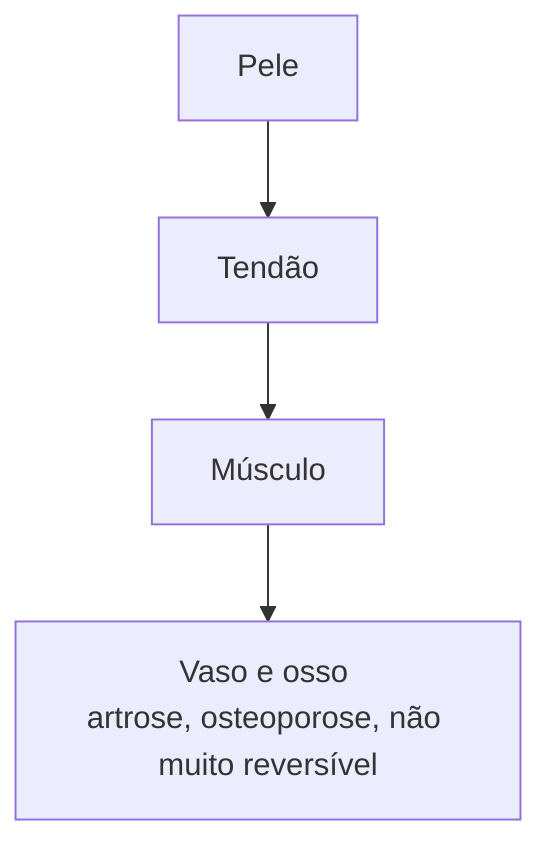

%%[[Doren Sayuri Kato]]]]%%
# Objetivo
Estudar os padrões de desarmonia dos Zang-Fu, baseado nos sinais e sintomas que se originam quando o Qi e/ou o Xue dos sistemas internos estão em desequilíbrio.

*Sempre Qi ou Xue estará em excesso ou deficiência.*

# Importante relembrar

1) Zang-Fu
2) Método dos 8 Princípios

- Sintomas / severidade
- Associação de mais de um padrão de desarmonia

**Profundidade**

Quanto mais profundo, mais aparece na língua

&nbsp;

&nbsp;

## Desarmonia Zang Fu 

1) Sintomas 
2) Patologia 
3) Etiologia 
4) Tratamento 

Ex.: Estagnação do Qi do Fígado, pode haver estagnação de Xue também 

**Sintomas**
Pode apresentar cãibras, amenorréia, raiva, enxaqueca, olhos vermelhos.

**Patologia**
Questionar se bebe, fuma, usa medicamentos. 

**Etiologia**
Dorme bem? Alimenta-se bem? Exercita? Muito tempo sentado? Emocional? 

**Tratamento**

# 1 Oito Princípios 
Permite identificar a localização e a natureza dos desequilíbrios corretamente. Princípio de tratamento

- Exterior e interior
- Cheio e vazio
- Calor e frio
- Yin e yang

## 1.1 Exterior/Interior
### 1.1.1 Exterior 
- Mostra a localização da desarmonia. Pele, músculos, meridianos. 
- Invasão de fatores patogênicos externos X Wei Qi 
- Sintomas : febre, aversão ao frio, dor no corpo, tosse, espirros, cansaço, rigidez no pescoço 

**Pulso:** rápido, superficial e forte 

## 1.1.2 Interior 
- Sistemas internos e ossos 
- Fator patogênico externo que se aprofundou → lesão de Órgãos (ex.: tosse com catarro, catarro já afetou órgão Pulmão)
- fator patogênico interno (stress, má alimentação... ) ou fraqueza hereditária dos órgãos que influenciam a produção e/ou circulação de Qi e Xue 

## 1.2 Cheio/Vazio
### 1.2.1 Cheio, plenitude ou excesso
1. Presença de Fator Patogênico forte (externo ou interno) e/ou Estagnação Qi e Xue.
2. Doença aguda.
3. Manifestações Clínicas: voz alta e forte, sudorese profusa, agitação, irritabilidade, face vermelha, dor agravada pela pressão, zumbido alto, urina escassa, constipação, pulso tipo excesso...

|                           |                          |
| ------------------------- | ------------------------ |
| ![[Excesso de Yang\|100]] | ![[Excesso de Yin\|100]] |
## 1.2.4 vazio (deficiência)
- Deficiência Qi do organismo / Fator Patogênico não muito forte ou ausente.
- Doença crônica.
- Manifestações Clínicas: apatia, voz fraca, dor surda e persistente, face pálida, sudorese leve, zumbido fraco, memória fraca, frequência urinária, perda de fezes, pulso tipo vazio

|                               |                              |
| ----------------------------- | ---------------------------- |
| ![[Deficiência de Yang\|100]] | ![[Deficiência de Yin\|100]] |
## 1.3 frio/calor 
### 1.3.1 Calor
• NATUREZA da desarmonia.
• As manifestações dependem da condição de excesso ou deficiência.
• Tipos:

#### Calor por excesso de Yang
Stress, Calor no Coração ou Fígado, consumo excessivo de alimentos quentes - calor no Estômago ou Fígado, estagnação de Qi, Fator Patogênico Externo se transforma em calor interno).

![[Excesso de Yang|100]]
**Sintomas**
Calor, febre, sede, rubor facial, constipação, urina escassa e escura, pulso rápido e cheio, língua vermelha, ==saburra amarela==. 

#### Calor por deficiência de Yin
Deficiência de yin (Yin do rim - trabalho excessivo, excesso de atividade física ou sexual, stress emocional...)
![[Deficiência de Yin|100]]
**Sintomas:**
Febre baixa, sensação de calor à tarde, ==boca seca a noite==, ==garganta seca à noite==, sudorese noturna, calor nos 5 palmos (mão, pé e cabeça), fezes secas, urina escassa e escura, pulso rápido e flutuante, língua vermelha e ==língua descascada==... 

## 1.3.2 Frio
Natureza da desarmonia 

Manifestações Clínicas: calafrios, sensação de frio, membros frios, ==ausência de sede==, ==desejo de beber liquidos quentes==, face pálida, secreções e excreções pálidas, pulso profundo-cheio-apertado, lingua pálida com saburra espessa branca. (antibiótico)

*pulso cheio porque o Xue está tentando aquecer o corpo*

#### Frio por excesso 
Invasão de Fator Patogênico Externo, consumo excessivo de alimentos frios e crus → estagnação de energia → estagnação de Qi e Xue. 

- Frio no Estômago: vômito, dor epigátrica
- Frio nos Intestinos: diarréia, dor abdominal
- Frio no útero: dismenorréia

#### Frio por deficiência
Baixa energia Yang (trabalho/atividade física excessiva, consumo em excesso de alimentos frios e crus).
![[Deficiência de Yang|150]]
## 1.7 Yin/Yang 

- Yin e Yang são polaridades opostas e complementares que sustentam a vida. Sua separação significa o esgotamento da essência e a morte.

Interior, vazio, frio - YIN
Exterior, plenitude, calor - YANG

# Observações
Deficiência de Yang é uma deficiência de Qi mais intensa.
Deficiência de Yin é uma deficiência de Xue mais intensa.

Mas não são necessariamente uma progressão linear. Por exemplo, uma deficiência de Qi pode levar a uma deficiência de Yin.

*equilíbrio inferior superior de Pulmão, usar baço - tai yin
[[Vb01]] excelente para trabalhar vento do fígado*

