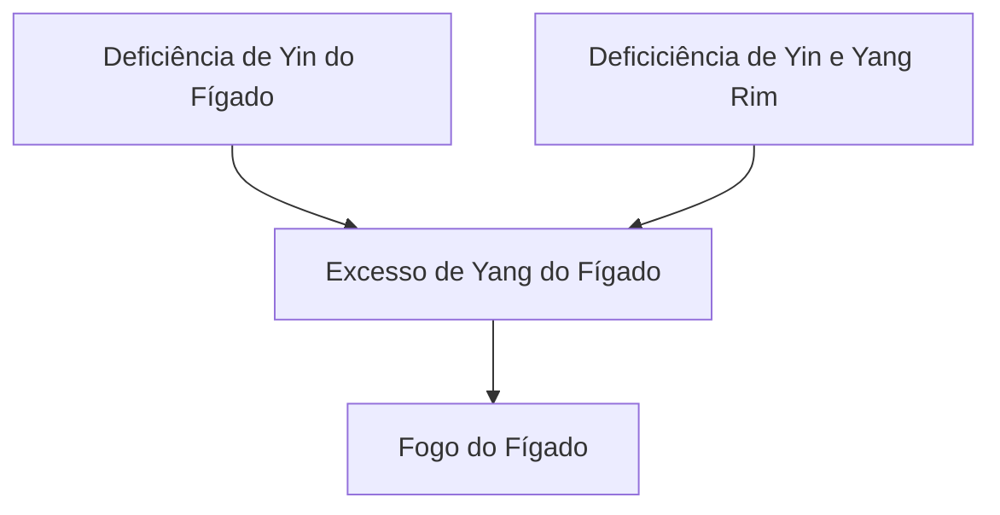

---
{"title":"13 - 3 Síndromes - Fígado (Gan)","tags":["conhecimento/acupuntura/aula"],"autor":"Doren Sayuri Kato","date":"2024-06-22","NivelAcesso":"ibrate","publish":true,"Conteudo":"acupuntura","allDay":false,"DiaSemana":"Sáb","start":{"dateTime":"2024-06-22T08:30-03:00"},"end":{"dateTime":"2024-05-25T18:22-03:00"},"location":"R. Prof. João Cândido, n° 344 - 2° andar - Centro, Londrina - PR, 86010-901","PassFrontmatter":true}
---

# Fígado (Gan)
Funções:

- Assegurar a circulação livre do fluxo do Qi
- Armazenar sangue
- Controla os tendões
- Equilíbrio em todas as emoções
- Manifesta-se nas unhas
- Abre-se nos olhos
- Abriga a alma etérea
- Afetado pela raiva 

## Etiologia 
### Energia perversa: vento

**Sintomas:** torcicolo, cefaleia, coriza, rinite, sinusite, desarmonia no movimento do sangue (acidente vascular cerebral), urticária, câimbras, tremores, etc.
### Emoções:
Fúria ↔ Estagnação do Qi do Fígado (fúria pode estagnar o Qi, Estagnação do Qi pode causar fúria).

**Sintomas:** distensão do hipogástrio, sensação de caroço na garganta com dificuldade para engolir, cefaleia (estagnação do Qi do Fígado → Ascenção do Yang do Fígado). Cefaleia de fundo de olho, topo da cabeça. 
### Dieta:
Consumo excessivo de alimentos "quentes" (álcool, pimenta) e gordurosos aumentam o Fogo do Fígado

&nbsp;

> [!NOTE] Pessoas tipo Fígado
> Atividade física vigorosa no máximo até as 18:00.
> Fígado se agita muito, até ele se acalmar vai demorar muito, atrapalhando sono.
# 1 Estagnação do Qi do Fígado

#conhecimento/acupuntura/sindromes
[[Pessoas/Doren Sayuri Kato\|Doren Sayuri Kato]], [[Referencias/Ibrate/Acupuntura 2023 2024/Aulas/Aula 13.3 Sindromes - Figado\|Aula 13.3 Sindromes - Figado]]

**Manifestações Clínicas Gerais**: [[Conhecimento/Alterações/distensão abdominal\|Sensação de distensão do hipocôndrio]], [[Conhecimento/Alterações/soluço\|soluço]] e [[Conhecimento/Alterações/suspiro\|suspiro]].

[[Conhecimento/Alterações/Melancolia\|Melancolia]], estado mental instável, [[Conhecimento/Alterações/Náusea\|náusea]], [[Conhecimento/Alterações/vômito\|vômito]], [[Conhecimento/Alterações/regurgitação ácida\|regurgitação ácida]], [[Conhecimento/Alterações/eructação\|eructação]], sensação de pulsação no epigástrio, [[Conhecimento/Alterações/distensão abdominal\|distensão abdominal]], [[Conhecimento/Alterações/borborigmo\|borborigmo]] e [[Conhecimento/Alterações/diarreia\|diarreia]].
Sensação de bola na garganta e sensação de dificuldade para engolir. Sensação de pulsação ao palpar o epigástrio.

[[Conhecimento/Alterações/menstruação irregular\|Menstruação irregular]], [[Conhecimento/Alterações/dismenorreia\|dismenorreia]], distensão pré-menstrual das mamas, [[Conhecimento/Alterações/TPM\|tensão]] e irritabilidade pré-menstruais. 

**Língua**: coloração pode ser normal.

**Pulso**: em corda

**Manifestações Clínicas Principais**: dor nо hipocôndrio, distensão torácica, [[Conhecimento/Alterações/depressão\|depressão]], estado temperamental, inflexível, "só eu sei", pulso em corda.

## Etiologia:

Alterações na vida emocional são a causa mais importante (se não for a única) da Estagnação do Qi do Fígado. Assim como a [[Referencias/Ibrate/Acupuntura 2023 2024/Sindromes/Síndrome da Estagnação do Xue do Fígado (Ibrate 2024, D)\|Estagnação de Sangue do Fígado]]

## Tratamento: 
Dispersar o Fígado e regularizar o Qi.

Pontos: [[Conhecimento/Acupuntura/Canais/Vesicula Biliar/VB34\|VB34]], [[Conhecimento/Acupuntura/Canais/Figado/F03\|F03]], [[Conhecimento/Acupuntura/Canais/Figado/F13\|F13]], [[Conhecimento/Acupuntura/Canais/Figado/F14\|F14]], [[Conhecimento/Acupuntura/Canais/Triplo Aquecedor/TA06\|TA06]], [[Conhecimento/Acupuntura/Canais/Pericardio/PC06\|PC06]]
- [[Conhecimento/Acupuntura/Canais/Vesicula Biliar/VB34\|VB34]]: regulariza Qi do Fígado (hipocôndrio)
- [[Conhecimento/Acupuntura/Canais/Figado/F03\|F03]]: regulariza Qi do Fígado (garganta) 
- [[Conhecimento/Acupuntura/Canais/Figado/F13\|F13]]: regulariza Qi do Fígado (aquecedor Médio/Baço)
- [[Conhecimento/Acupuntura/Canais/Figado/F14\|F14]]: regulariza Qi do Fígado (aquecedor Médio/Estômago)
- [[Conhecimento/Acupuntura/Canais/Triplo Aquecedor/TA06\|TA06]]: regulariza Qi do Fígado (laterais do corpo)
- [[Conhecimento/Acupuntura/Canais/Pericardio/PC06\|PC06]]: regulariza Qi do Fígado (alterações emocionais) (Pericárdio e Fígado trabalham juntos)

[[Conhecimento/Acupuntura/Canais/Triplo Aquecedor/TA03\|ta03]] ([[Referencias/Ibrate/Acupuntura 2023 2024/Aulas/Aula 07 Meridianos 3 - 09 Pericardio\|Aula 07 Meridianos 3 - 09 Pericardio]]) remove estagnação do qi do fígado

Grande Circulação 

# 2 Estagnação do Sangue do Fígado

# Síndrome de Estagnação de Sangue do Fígado (Ibrate 2024

#conhecimento/acupuntura/sindromes
[[Pessoas/Doren Sayuri Kato\|Doren Sayuri Kato]], [[Referencias/Ibrate/Acupuntura 2023 2024/Aulas/Aula 13.3 Sindromes - Figado\|Aula 13.3 Sindromes - Figado]]

**Manifestações Clínicas Gerais**: [[Conhecimento/Alterações/vômito\|vômito]] com sangue, [[Conhecimento/Alterações/epistaxe\|epistaxe]], [[Conhecimento/Alterações/menstruação dolorida\|menstruação dolorida]] e [[Conhecimento/Alterações/menstruação irregular\|menstruação irregular]], [[Conhecimento/Alterações/dor abdominal\|dor abdominal]] e "tumores" abdominais.

**Língua**: púrpura, especialmente nas laterais, com pontos púrpura

**Pulso**: em Corda.

**Manifestações Clínicas Principais**: [[Conhecimento/Alterações/sangue menstrual com coágulos escuros\|sangue menstrual com coágulos escuros]] e língua púrpura.

## Etiologia

Alterações na vida emocional são a causa mais importante (se não for a única) da Estagnação do Sangue do Fígado. É a mesma que [[Referencias/Ibrate/Acupuntura 2023 2024/Sindromes/Síndrome da Estagnação do Qi do Fígado (Ibrate 2024)\|Estagnação de Qi do Fígado]].

## Tratamento
Dispersar o Fígado, regularizar o sangue. Pontos: VB34, F03, B18, B17, BP10, VC06

- [[Conhecimento/Acupuntura/Canais/Vesicula Biliar/VB34\|VB34]]: regulariza Qi do Fígado. Também ajuda com calor 
- [[Conhecimento/Acupuntura/Canais/Figado/F03\|F03]]: regulariza Qi do Fígado e o Sangue
- [[Conhecimento/Acupuntura/Canais/Bexiga/B18\|B18]]: regulariza o sangue do Fígado
- [[Conhecimento/Acupuntura/Canais/Bexiga/B17\|B17]]: regulariza o sangue do Fígado
- [[Conhecimento/Acupuntura/Canais/Baço/BP10\|BP10]]: regulariza e refresca o sangue do Fígado
- [[Conhecimento/Acupuntura/Canais/Vaso da Concepção/VC06\|VC06]]: regulariza / tonifica Qi, movimenta o Sangue, nos casos de dor abdominal. Pode fazer [[Conhecimento/Acupuntura/Pontos moxa/VC06 moxa\|moxa]]. 

# 3 Vento do Fígado agitando o Qi do Fígado

O Fígado pode ser acometido pelo vento em 3 condições:

## 3.1 Calor Extremo (principalmente interno) gerando Vento

# 1 Calor Extremo (principalmente interno) gerando Vento

**Manifestações Clínicas Gerais**: [[Conhecimento/Alterações/Rigidez do pescoço\|Rigidez do pescoço]], [[Conhecimento/Alterações/tremor\|tremor]] dos membros, [[Conhecimento/Alterações/opistótono\|opistótono]] e, nos casos severos, [[Conhecimento/Alterações/coma\|coma]].

**Língua**: vermelho quase escura, saburra espessa e de cor amarela 

**Pulso**: em corda rápido e cheio, 

> [!NOTE] Pulso em corda 
> fácil de sentir mas some. 

**Manifestações Clínicas Principais**: temperatura elevada, convulsões e rigidez lingual.

**Etiologia**: decorrente da invasão do calor ou vento-calor externo penetrando no sangue (que é o nível mais profundo) e gerando vento interno.

Tratamento: eliminar o calor, dispersar o Frio e dominar o vento.

Pontos: [[Conhecimento/Acupuntura/Canais/Figado/F03\|F03]], [[Conhecimento/Acupuntura/Canais/Figado/F02\|F02]], [[Conhecimento/Acupuntura/Canais/Intestino Delgado/ID03\|ID03]], [[Conhecimento/Acupuntura/Canais/Vaso Governador/VG20\|VG20]], [[Conhecimento/Acupuntura/Canais/Vaso Governador/VG16\|VG16]], [[Conhecimento/Acupuntura/Canais/Vesicula Biliar/VB20\|VB20]]
- [[Conhecimento/Acupuntura/Canais/Figado/F02\|F02]] dispersa Vento, Frio e Calor (vai incomodar)
- [[Conhecimento/Acupuntura/Canais/Figado/F03\|F03]] dispersa Vento e Frio
- [[Conhecimento/Acupuntura/Canais/Figado/F04\|F04]] dispersa frio
- [[Conhecimento/Acupuntura/Canais - Outros/Pontos extras/Ex-UE11 Shixuan\|Ex-UE11 Shixuan]]: dispersa o Calor, o Vento e restaura a consciência
- [[Conhecimento/Acupuntura/Canais/Intestino Delgado/ID03\|ID03]]: expele o Vento Interno do Vaso Governador
- [[Conhecimento/Acupuntura/Canais/Vaso Governador/VG20\|VG20]] Sedando, [[Conhecimento/Acupuntura/Canais/Vaso Governador/VG16\|VG16]], [[Conhecimento/Acupuntura/Canais/Vesicula Biliar/VB20\|VB20]]: dominam o vento interno.

## 3.2 Aumento do Yang do Fígado causando Vento

#conhecimento/acupuntura/sindromes
[[Pessoas/Doren Sayuri Kato\|Doren Sayuri Kato]], [[Referencias/Ibrate/Acupuntura 2023 2024/Aulas/Aula 13.3 Sindromes - Figado\|Aula 13.3 Sindromes - Figado]]

O Fígado pode ser acometido pelo vento em outras 2 condições: [[Referencias/Ibrate/Acupuntura 2023 2024/Sindromes/Síndrome da Deficiência do Xue do Fígado causando Vento (Ibrate 2024, D)\|Síndrome da Deficiência do Xue do Fígado causando Vento (Ibrate 2024, D)]], [[Referencias/Ibrate/Acupuntura 2023 2024/Sindromes/Síndrome do Calor gerando Vento do Fígado agredindo o Qi do Fígado (Ibrate 2024, D)\|Síndrome do calor gerando Vento do Fígado]]

**Manifestações Clínicas Gerais**: Afasia ou dislalia e tontura.

**Lingua**: vermelho-escura e desviada.

**Pulso**: Vazio-Flutuante ou em Corda-Fino e Rápido

**Manifestações Clínicas Principais**: inconsciência repentina, convulsões, desvio de olhos e boca

## Etiologia
Este padrão necessita de dois fatores: Deficiência Yin do Fígado e ascendência do Yang do Fígado.

## Tratamento
Nutrir o Yin do Fígado, dominar o Yang do Fígado e o vento.

Pontos: F03, [[Conhecimento/Acupuntura/Canais/Vaso Governador/VG16\|VG16]], [[Conhecimento/Acupuntura/Canais/Vesicula Biliar/VB20\|VB20]], [[Conhecimento/Acupuntura/Canais/Figado/F08\|F08]], [[Conhecimento/Acupuntura/Canais/Baço/BP06\|BP06]], [[Conhecimento/Acupuntura/Canais/Rim/R03\|R03]], [[Conhecimento/Acupuntura/Canais/Bexiga/B18\|B18]] 
- [[Conhecimento/Acupuntura/Canais/Figado/F08\|F08]]: tonifica Yin do Fígado
- [[Conhecimento/Acupuntura/Canais/Figado/F03\|F03]]: domina o Yang e o vento do Fígado
- [[Conhecimento/Acupuntura/Canais/Baço/BP06\|BP06]], [[Conhecimento/Acupuntura/Canais/Rim/R03\|R03]]: tonificam o Yin
- [[Conhecimento/Acupuntura/Canais/Bexiga/B18\|B18]] (assentimento do fígado): tonifica Yin do Fígado e domina o Yang do Fígado

- [[Conhecimento/Acupuntura/Canais/Vaso Governador/VG16\|VG16]] administra o vento
- [[Conhecimento/Acupuntura/Canais/Vesicula Biliar/VB20\|VB20]] elimina vento

## 3.3 Deficiência do sangue do Fígado causando Vento

#conhecimento/acupuntura/sindromes
[[Pessoas/Doren Sayuri Kato\|Doren Sayuri Kato]], [[Referencias/Ibrate/Acupuntura 2023 2024/Aulas/Aula 13.3 Sindromes - Figado\|Aula 13.3 Sindromes - Figado]]

**Manifestações Clínicas Gerais**: [[Conhecimento/Alterações/parestesia\|parestesia]] dos membros, [[Conhecimento/Alterações/tique\|tique]].

**Lingua**: desviada.

**Pulso**: Agitado.

**Manifestações Clínicas Principais**: tremor na cabeça, tremores e língua pálida

## Etiologia
É decorrente de uma Deficiência crônica do sangue (Xue) do Fígado (Gan)

## Tratamento
tonificar o sangue do Fígado, dominar o [[Conhecimento/Alterações/fatores patogênicos/vento\|vento]].

Pontos: F03, IG04, VB20, VG16, VG20, BP06, R03, B18, B17, B20, B23.

- [[Conhecimento/Acupuntura/Canais/Figado/F08\|F08]]: tonificar [[Conhecimento/Acupuntura/efeitos de acupuntura/Yin do Fígado\|Yin do Fígado]]
- [[Conhecimento/Acupuntura/Canais/Figado/F03\|F03]]: domina o [[Conhecimento/Acupuntura/efeitos de acupuntura/Yang do Fígado\|Yang do Fígado]]
- [[Conhecimento/Acupuntura/Canais/Baço/BP06\|BP06]] Sedando , [[Conhecimento/Acupuntura/Canais/Rim/R03\|R03]], [[Conhecimento/Acupuntura/Canais/Bexiga/B20\|B20]], [[Conhecimento/Acupuntura/Canais/Bexiga/B23\|B23]]: [[Conhecimento/Acupuntura/efeitos de acupuntura/tonificar o Xue\|tonificar o Xue]]
- [[Conhecimento/Acupuntura/Canais/Bexiga/B17\|B17]]: [[Conhecimento/Acupuntura/efeitos de acupuntura/tonifica o sangue\|tonifica o sangue]] ([[Conhecimento/Acupuntura/Pontos moxa/B17 moxa\|moxa]])
- [[Conhecimento/Acupuntura/Canais/Bexiga/B18\|B18]]: tonifica o sangue do Fígado e domina o vento do Fígado
- [[Conhecimento/Acupuntura/Canais/Vesicula Biliar/VB20\|VB20]], [[Conhecimento/Acupuntura/Canais/Vaso Governador/VG16\|VG16]], [[Conhecimento/Acupuntura/Canais/Vaso Governador/VG20\|VG20]] sedando: dominam o [[Conhecimento/Alterações/fatores patogênicos/vento\|vento]] do [[Conhecimento/Acupuntura/efeitos de acupuntura/vento do Fígado\|Fígado]]
- [[Conhecimento/Acupuntura/Canais/Intestino Grosso/IG04\|IG04]]: em combinação com [[Conhecimento/Acupuntura/Canais/Figado/F03\|F03]] tira o [[Conhecimento/Alterações/fatores patogênicos/vento\|vento]] da face ([[Conhecimento/Alterações/tique\|tique]] facial)

# 4  Estagnação do Frio no Meridiano do Fígado

#conhecimento/acupuntura/sindromes
[[Pessoas/Doren Sayuri Kato\|Doren Sayuri Kato]], [[Referencias/Ibrate/Acupuntura 2023 2024/Aulas/Aula 13.3 Sindromes - Figado\|Aula 13.3 Sindromes - Figado]]

**Manifestações Clínicas Gerais**:  Plenitude abdominal, tensão do testículo ou contração no escroto. Nas mulheres pode haver contração da vagina. A dor é aliviada com o calor.

**Língua**: pálida, úmida e saburra branca.

**Pulso**: em corda-profundo-lento

**Manifestações Clínicas Principais**: dor по hipogástrio com irradiação ao escroto. 

## Etiologia
É decorrente da invasão do Frio exterior.

## Tratamento
sedar o Fígado, eliminar o frio. Pontos: R03, F05, F01
- [[Conhecimento/Acupuntura/Canais/Rim/R03\|R03]]: com [[Conhecimento/Acupuntura/Pontos moxa/R03 moxa\|moxa]], dispersa o frio do Aquecedor Inferior;
- [[Conhecimento/Acupuntura/Canais/Figado/F05\|F05]]: influencia nas genitálias. Pode dispersar o frio;
- [[Conhecimento/Acupuntura/Canais/Figado/F01\|F01]]: limpa o meridiano do Fígado e remove as obstruções do frio do Aquecedor Inferior.

# 5 Deficiência do Xue do Fígado

#conhecimento/acupuntura/sindromes 
[[Pessoas/Doren Sayuri Kato\|Doren Sayuri Kato]], [[Referencias/Ibrate/Acupuntura 2023 2024/Aulas/Aula 13.3 Sindromes - Figado\|Aula 13.3 Sindromes - Figado]]

**Manifestações Clínicas Gerais**: [[Conhecimento/Alterações/tontura\|tontura]], [[Conhecimento/Alterações/parestesia\|parestesia]] dos membros, [[Conhecimento/Alterações/insônia\|insônia]] (xue não chega na cabeça), "flutuação" nos olhos, [[Conhecimento/Alterações/hipomenorreia\|menstruação escassa]] ou [[Conhecimento/Alterações/amenorreia\|amenorreia]], lábios pálidos, debilidade muscular, espasmos musculares, [[Conhecimento/Alterações/Cãibra\|cãibra]] e [[Conhecimento/Alterações/unhas quebradiças\|unhas quebradiças]] e esbranquiçadas.

**Língua**: pálida, principalmente nas laterais, em casos extremos, pode assumir uma coloração alaranjada e seca.

**Pulso**: agitado (estagnação em outro lugar) ou fino  (quadro de deficiência)

**Manifestações Clínicas Principais**: [[Conhecimento/Alterações/visão turva\|visão turva]], períodos menstruais escassos, aspecto pálido, língua pálida.

## Etiologia:

A dieta pobre em nutrientes ou em proteínas pode debilitar o Baço (Pi) que, por sua vez, não poderá produzir Sangue (Xue) suficiente.

A hemorragia severa (tal como ocorre durante parto).

O Rim (Shen) interpreta um papel na formação do Sangue (Xue) e uma Deficiência do Qi ou da Essência do Rim (Shen) pode levar à Deficiência do Sangue (Xue)

## Tratamento:
tonificar o Fígado e nutrir o sangue

Pontos: B18, B20, B23, B17*, F08, E36, BP06, VC04* (\*MOXA)

- [[Conhecimento/Acupuntura/Canais/Bexiga/B18\|B18]] nutre Fígado 
- [[Conhecimento/Acupuntura/Canais/Bexiga/B20\|B20]] assentimento do Baço tonifica Fígado
- [[Conhecimento/Acupuntura/Canais/Bexiga/B23\|B23]] assentimento do Rim 
- [[Conhecimento/Acupuntura/Canais/Bexiga/B17\|B17]] Moxa para nutrir Xue
- [[Conhecimento/Acupuntura/Canais/Vaso da Concepção/VC04\|VC04]] [[Conhecimento/Acupuntura/Pontos moxa/VC04 Moxa\|moxa]] para nutrir Xue
- [[Conhecimento/Acupuntura/Canais/Figado/F08\|F08]] nutre Yin do Fígado 
- [[Conhecimento/Acupuntura/Canais/Estomago/E36\|E36]] e [[Conhecimento/Acupuntura/Canais/Baço/BP06\|BP06]] nutrem Xue

# 6 Síndrome de ascendência do Yang do Fígado - Fogo agitando Fígado

#conhecimento/acupuntura/sindromes
[[Pessoas/Doren Sayuri Kato\|Doren Sayuri Kato]], [[Referencias/Ibrate/Acupuntura 2023 2024/Aulas/Aula 13.3 Sindromes - Figado\|Aula 13.3 Sindromes - Figado]]

**Manifestações Clinicas Gerais**: [[Conhecimento/Alterações/tontura\|tontura]], [[Conhecimento/Alterações/zumbido\|zumbido]], [[Conhecimento/Alterações/surdez\|surdez]], [[Conhecimento/Alterações/boca seca\|boca]] e [[Conhecimento/Alterações/garganta seca\|garganta]] secas, insônia, sensação de exaltação e gritos de fúria.

**Língua**: vermelha, especialmente nas laterais.

**Manifestações Clínicas Principais**: [[Conhecimento/Alterações/cefaleia\|cefaleia]], [[Conhecimento/Alterações/Irritabilidade\|irritabilidade]], [[Conhecimento/Acupuntura/Diagnóstico/Pulsos/pulso em corda\|pulso em corda]].

**Etiologia**: Alterações emocionais, principalmente fúria, frustração e ressentimento por um longo período.

**Tratamento**: dominar o Yang do Fígado, tonificar Yin. Pontos: F03, TA05, BP06, R03, F08, VB43, B02, TAIYANG, VB20, VB09, VB08, VB06

- [[Conhecimento/Acupuntura/Canais/Figado/F03\|F03]] e [[Conhecimento/Acupuntura/Canais/Triplo Aquecedor/TA05\|TA05]]: domina o Yang do Fígado
- [[Conhecimento/Acupuntura/Canais/Baço/BP06\|BP06]] e [[Conhecimento/Acupuntura/Canais/Rim/R03\|R03]]: tonifica Yin do Rim
- [[Conhecimento/Acupuntura/Canais/Figado/F08\|F08]]: tonifica Yin do Fígado
- [[Conhecimento/Acupuntura/Canais/Vesicula Biliar/VB43\|VB43]]: domina o Yang do Fígado - cefaleia no meridiano da Vesícula Biliar
- [[Conhecimento/Acupuntura/Canais/Vesicula Biliar/VB38\|VB38]]: domina o Yang do Fígado e o Fogo do Fígado - usado para cefaleias crônicas e persistentes
- [[Conhecimento/Acupuntura/Canais/Bexiga/B02\|B02]]: domina o Yang do Fígado - cefaleia acima dos olhos. Melhor com sangria 
- [[Conhecimento/Acupuntura/Canais - Outros/Pontos extras/Ex-HN5 Taiyang\|Ex-HN5 Taiyang]] e [[Conhecimento/Acupuntura/Canais/Vesicula Biliar/VB20\|VB20]]: domina o yang do Fígado
- [[Conhecimento/Acupuntura/Canais/Vesicula Biliar/VB09\|VB09]], [[Conhecimento/Acupuntura/Canais/Vesicula Biliar/VB08\|VB08]], [[Conhecimento/Acupuntura/Canais/Vesicula Biliar/VB06\|VB06]]: domina o yang do Fígado (pontos locais para cefaleia na lateral da cabeça).

