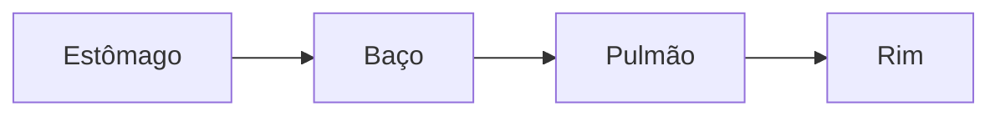
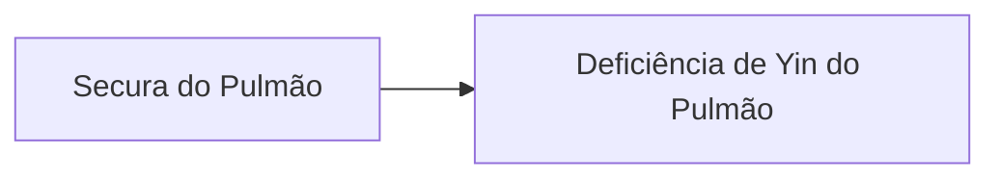

---
{"title":"13 - 4 Síndromes - Pulmão (Fei)","NAula":"Aula 13","tags":["conhecimento/acupuntura/aula"],"autor":"Doren Sayuri Kato","date":"2024-06-22","NivelAcesso":"ibrate","publish":true,"Conteudo":"acupuntura","allDay":false,"DiaSemana":"Sáb","start":{"dateTime":"2024-06-22T08:30-03:00"},"end":{"dateTime":"2024-05-25T18:22-03:00"},"location":"R. Prof. João Cândido, n° 344 - 2° andar - Centro, Londrina - PR, 86010-901","PassFrontmatter":true}
---

# Pulmão (Fei)
Funções:
- Governar o Qi e a respiração
- Governa a voz
- Controlar a dispersão e a descida de Qi e Fluidos corpóreos
- Controlar a pele e espaço entre a pele e músculos
- Manifesta-se nos pelos corpóreos
- Abre-se no nariz e controla o muco nasal
- Agredido pela tristeza 

## Etiologia

**Energias Perversas**: Vento, Calor, Fogo, Frio, Umidade e Secura.

É o mais "exterior" dos sistemas influencia o Qi Defensivo

O Pulmão é, algumas vezes, denominado de sistema "delicado" por causa da sua suscetibilidade em ser invadido pelos fatores patogênicos exteriores.

## Fatores patogênicos X Qi defensivo

Todos estes sintomas e sinais originam-se dos padrões de Excesso (vento-frio / vento-calor) e são um reflexo da dificuldade das funções do Pulmão de dispersar e descender (cefaléia, dores generalizadas, aversão ao frio, secreção nasal, espirro, etc).

## Dieta

Consumo excessivo de alimentos frios e crus, **leite e derivados** → Umidade interna → (afeta o Baço) "estocada" no Pulmão → tosse com expectoração. 

"O Baço (Pi) gera a Fleuma (Tanyin) e o Pulmão (Fei) a estoca".

## Emoções:

Tristeza (com causa, melancolia) - dispersa o Qi Defensivo, gerando deficiência Qi do Pulmão (pode gerar fraca e rouca)

Preocupação - gera estagnação do Qi do tórax (pode apresentar muita inspiração e pouca expiração)

> [!TIP] Pacientes respiratórios
>  Podem ter dificuldade de deitar. Tratar sentado, mesmo que limite os pontos pode ser melhor.
>  Auriculoterapia, P07, verificar sensibilidade de P01 e P02, B13 (assentimento do Pulmão)

## Estilo de vida
Permanecer sentado por um longo período curvado sobre uma escrivaninha para ler ou escrever pode debilitar o Qi do Pulmão (Fei).

# Deficiência do Qi do Pulmão (Fei)

#conhecimento/acupuntura/sindromes
[[Pessoas/Doren Sayuri Kato\|Doren Sayuri Kato]], [[Referencias/Ibrate/Acupuntura 2023 2024/Aulas/Aula 13.4 Sindromes - Pulmao\|Aula 13.4 Sindromes - Pulmao]]
# Deficiência do Qi do Pulmão (Fei)

**Manifestações Clinicas Gerais**
[[Conhecimento/Alterações/tosse\|Tosse]] fraca, [[Conhecimento/Alterações/expectoração aquosa\|expectoração aquosa]], [[Conhecimento/Alterações/sudorese diurna\|sudorese diurna]], [[Conhecimento/Alterações/indisposição para falar\|indisposição para falar]], [[Conhecimento/Alterações/indisposição ao frio\|indisposição ao frio]], [[Conhecimento/Alterações/propensão a gripes\|propensão a gripes]] e [[Conhecimento/Alterações/cansaço\|cansaço]].

**Língua**
[[Conhecimento/Alterações/Língua pálida\|Pálida]] ou de coloração normal.

**Manifestações Clínicas Principais**
[[Conhecimento/Alterações/Dispneia\|Dispneia]], [[Conhecimento/Alterações/debilidade da voz\|debilidade da voz]], compleição branca e brilhante e [[Conhecimento/Acupuntura/Diagnóstico/Pulsos/pulso vazio\|pulso vazio]].

> [!NOTE] Para [[Conhecimento/Alterações/Dispneia\|dispneia]]
> [[Conhecimento/Acupuntura/Canais/Pulmao/P01\|P01]], [[Conhecimento/Acupuntura/Canais/Pulmao/P07\|P07]], [[Conhecimento/Acupuntura/Canais/Rim/R06\|R06]], [[Conhecimento/Acupuntura/Canais/Baço/BP06\|BP06]] ou [[Conhecimento/Acupuntura/Canais/Baço/BP03\|BP03]]

Quando língua de coloração normal e pele brilhante porque o Qi do Coração não foi afetado.

## Água
Secura ataca o Pulmão. Verificar onde esse fluxo está com desequilíbrio.

## Etiologia:
- Debilidade hereditária;
- Inclinação prolongada sobre uma escrivaninha por muitas horas - cifose); Tempo demais em lordose. Ambos precisam de compensação.
- Ataque exterior de Vento-Frio ou Vento-Calor, Tristeza prolongada.
- Tristeza prolongada (com motivo), ressentimento
## Tratamento
Tonificar Qi do Pulmão, aquecer o Yang. Pontos: P09, P07, VC6, B13, VG12, E36

- [[Conhecimento/Acupuntura/Canais/Pulmao/P09\|P09]]: tonifica Qi do Pulmão
- [[Conhecimento/Acupuntura/Canais/Pulmao/P07\|P07]]: tonifica Qi do Pulmão, estimula a descendência do Qi
- [[Conhecimento/Acupuntura/Canais/Vaso da Concepção/VC06\|VC06]]: tonifica Qi
- [[Conhecimento/Acupuntura/Canais/Bexiga/B13\|B13]]: tonifica QI do Pulmão
- [[Conhecimento/Acupuntura/Canais/Bexiga/B42\|B42]]: tristeza prolongada, solidão
- [[Conhecimento/Acupuntura/Canais/Vaso Governador/VG12\|VG12]]: tonifica Qi do Pulmão, especialmente importante nos casos crônicos
- [[Conhecimento/Acupuntura/Canais/Estomago/E36\|E36]]: tonifica Qi do Estômago e Baço

# Deficiência de Yin do Pulmão (Fei)

#conhecimento/acupuntura/sindromes 

[[Pessoas/Doren Sayuri Kato\|Doren Sayuri Kato]], [[Referencias/Ibrate/Acupuntura 2023 2024/Aulas/Aula 13.4 Sindromes - Pulmao\|Aula 13.4 Sindromes - Pulmao]]

(característico de [[Conhecimento/Alterações/tuberculose\|tuberculose]])
**Manifestações Clínicas Gerais**
Pouca [[Conhecimento/Alterações/expectoração pegajosa\|expectoração pegajosa]], [[Conhecimento/Alterações/expectoração com sangue\|expectoração com sangue]], [[Conhecimento/Alterações/febre baixa\|febre baixa]] à tarde, [[Conhecimento/Alterações/rubor malar\|rubor malar]], [[Conhecimento/Alterações/sudorese noturna\|sudorese noturna]], [[calor dos cinco palmos\|calor dos cinco palmos]], [[Conhecimento/Alterações/insônia\|insônia]], [[Conhecimento/Alterações/boca seca\|boca]] e [[Conhecimento/Alterações/garganta seca\|garganta secas]], [[Conhecimento/Alterações/voz rouca\|voz rouca]], [[Conhecimento/Alterações/prurido na garganta\|prurido na garganta]].

**Língua**
Rachada na área do Pulmão (Fei) e seca.

**Pulso**
Flutuante-Vazio e Rápido.

# 100

==⚠  Switch to EXCALIDRAW VIEW in the MORE OPTIONS menu of this document. ⚠==

# Excalidraw Data
## Text Elements
Yang 
Yin 
Equilíbrio  
Calor tipo Xu 

> [!NOTE] E36 em doença autoimune
> Pode prejudicar em doenças autoimunes, mas não é algo tão intenso.
> Estudos demonstram que pode até ser benéfico. Alguns defendem seu uso.
> Evitar só durante a crise mesmo. 

**Manifestações Clínicas Principais**
[[Conhecimento/Alterações/tosse seca\|tosse seca]], [[Conhecimento/Alterações/sensação de calor à tarde\|sensação de calor à tarde]], [[Conhecimento/Acupuntura/Diagnóstico/Lingua/língua vermelha e descascada\|língua vermelha e descascada]] (vermelha por excesso aparente de yang, descascada por falta de yin para gerar saburra)

> [!NOTE] Horário do pulmão
> Das 3:00 as 5:00 horário máximo do pulmão. Horário oposto é o mínimo de energia. Por isso calor das 15:00 as 17:00.

## Etiologia:
Desenvolve-se a partir de uma Deficiência do Qi do Pulmão (Fei) após um longo período de tempo, evoluindo para a deficiência do Yin do Pulmão.
É frequentemente associada à Deficiência do Yin do Estômago e/ou do Rim (Shen).

*Não entra alimento, não produz Xue, não tendo Qi para circular, não vai subir para o Pulmão.
Esse paciente se alimenta pouco.*

## Tratamento
Tonificar Yin do Pulmão, nutrir os fluidos corpóreos e eliminar o calor-vazio.

Pontos: P09, VC17, B43, B13, VG12, VC04, R06, VC12, P10

- [[Conhecimento/Acupuntura/Canais/Pulmao/P09\|P09]]: Tonifica Yin do Pulmão
- [[Conhecimento/Acupuntura/Canais/Vaso da Concepção/VC17\|VC17]], [[Conhecimento/Acupuntura/Canais/Bexiga/B13\|B13]], [[Conhecimento/Acupuntura/Canais/Vaso Governador/VG12\|VG12]]: Tonifica Yin do Pulmão e o Qi
- [[Conhecimento/Acupuntura/Canais/Bexiga/B42\|B42]]: Tonifica Yin do Pulmão (importante nos casos crônicos)
- [[Conhecimento/Acupuntura/Canais/Vaso da Concepção/VC04\|VC04]]: Tonifica Yin do Rim
- [[Conhecimento/Acupuntura/Canais/Rim/R06\|R06]]: Tonifica Yin do Rim (garganta e tosse secas). [[Conhecimento/Acupuntura/Canais/Pulmao/P07\|P07]] + [[Conhecimento/Acupuntura/Canais/Rim/R06\|R06]] tonificam o Qi e o Yin do Pulmão.
- [[Conhecimento/Acupuntura/Canais/Vaso da Concepção/VC12\|VC12]]: Tonifica Yin do Estômago, nutre os fluidos (o Estômago é a origem dos fluidos)
- [[Conhecimento/Acupuntura/Canais/Pulmao/P10\|P10]]: elimina calor-vazio do Pulmão. Melhora padrão respiratório

# Secura do Pulmão

# Sindrome da Secura do Pulmao

#conhecimento/acupuntura/sindromes
[[Pessoas/Doren Sayuri Kato\|Doren Sayuri Kato]], [[Referencias/Ibrate/Acupuntura 2023 2024/Aulas/Aula 13.4 Sindromes - Pulmao\|Aula 13.4 Sindromes - Pulmao]]

**Manifestações Clínicas Gerais**
Pele, garganta e boca secas, sede.

**Pulso**
Vazio, especialmente sobre a posição frontal direita profunda. Superficial pode estar presente. Por faltar Jin Ye no Pulmão, não o sentimos no pulso. 

**Manifestações Clínicas Principais**
Tosse e garganta secas, voz rouca e língua seca, mas não vermelha. Existe Qi e Xue, mas falta umidade.

## Etiologia:
Secura exterior, durante longos períodos de tempo seco e quente.

Pode também ser produzida internamente, normalmente pela Deficiência do Yin do Estômago (Wei) (em pessoas que apresentam dieta irregular com refeições em períodos irregulares, alimentação tarde da noite, preocupação com o trabalho durante as refeições).

> [!NOTE] Estômago e Pulmão
> Terra é mãe do Metal. Umidade vem da Terra. Metal já é seco.
> Por isso a importância da dieta e da forma de se alimentar. Orientar o cliente.

## Tratamento
Umedecer o Pulmão, nutrir os fluidos.
Pontos: P09, VC04, R06, BP06, VC12
- [[Conhecimento/Acupuntura/Canais/Pulmao/P09\|P09]]: umedece o Pulmão
- [[Conhecimento/Acupuntura/Canais/Vaso da Concepção/VC04\|VC04]]: tonifica Yin do Rim e nutre os fluidos
- [[Conhecimento/Acupuntura/Canais/Rim/R06\|R06]]: nutre os fluidos e beneficia a garganta
- [[Conhecimento/Acupuntura/Canais/Baço/BP06\|BP06]]: nutre os fluidos
- [[Conhecimento/Acupuntura/Canais/Vaso da Concepção/VC12\|VC12]]: tonifica o Estômago e nutre os fluidos

> [!NOTE] Secura no pé
> Qual meridiano está mais afetado
> Sola do pé, rim (R01)
> Lateral interna, Baço

# Invasão do Pulmão (Fei) pelo Vento-Frio

#conhecimento/acupuntura/sindromes
[[Pessoas/Doren Sayuri Kato\|Doren Sayuri Kato]], [[Referencias/Ibrate/Acupuntura 2023 2024/Aulas/Aula 13.4 Sindromes - Pulmao\|Aula 13.4 Sindromes - Pulmao]]

**Manifestações Clínicas Gerais**
[[Conhecimento/Alterações/tosse\|Tosse]], [[Conhecimento/Alterações/febre\|febre]], [[Conhecimento/Alterações/prurido na garganta\|prurido na garganta]], secreção nasal com muco claro e aquoso, [[Conhecimento/Alterações/cefaleia occipital\|cefaleia occipital]] (Rim) e [[Conhecimento/Alterações/dor generalizada\|dores generalizadas]]

**Língua**
Saburra branca e fina. (Yin está bom)

**Manifestações Clínicas Principais**
[[Conhecimento/Alterações/aversão ao frio\|Aversão ao frio]], [[Conhecimento/Alterações/fatores patogênicos/espirro\|espirro]] e [[Conhecimento/Acupuntura/Diagnóstico/Pulsos/pulso flutuante\|pulso flutuante]].

## Etiologia:
É devida à exposição ao Vento e ao Frio. Não necessariamente prolongada. Pode ser por roupas inadequadas ao clima.
- O diagnóstico deste padrão não é feito de acordo com a etiologia, mas levando-se em conta a patologia (Fator Patogênico X Fator de Resistência);

## Tratamento
Pontos: P07, B12, VG16
- [[Conhecimento/Acupuntura/Canais/Pulmao/P07\|P07]]: dispersa o vento-frio, estimula o Pulmão nas funções de descendência e dispersão;
- [[Conhecimento/Acupuntura/Canais/Bexiga/B12\|B12]]: expele o vento. Moxa pode ser usada após a inserção da agulha ([[Conhecimento/Acupuntura/Pontos moxa/B12 moxa\|moxa]] e [[Conhecimento/Acupuntura/Pontos ventosa/B12 ventosa\|ventosa]]);
- [[Conhecimento/Acupuntura/Canais/Vaso Governador/VG16\|VG16]]: expele o vento, útil se houver cefaleia.

# Invasão do Pulmão (Fei) pelo Vento-Calor

#conhecimento/acupuntura/sindromes
[[Pessoas/Doren Sayuri Kato\|Doren Sayuri Kato]], [[Referencias/Ibrate/Acupuntura 2023 2024/Aulas/Aula 13.4 Sindromes - Pulmao\|Aula 13.4 Sindromes - Pulmao]]

**Manifestações Clínicas Gerais**
[[Conhecimento/Alterações/tosse\|Tosse]], [[Conhecimento/Alterações/febre\|febre]], secreção nasal com muco de coloração amarela, [[Conhecimento/Alterações/cefaleia\|cefaleia]], [[Conhecimento/Alterações/dor generalizada\|dores generalizadas]], [[Conhecimento/Alterações/sudorese leve\|sudorese leve]], sede e [[Conhecimento/Alterações/amigdalite\|amigdalite]].

**Língua**
Vermelha nas laterais ou na ponta, com saburra fina branca ou amarela.

**Manifestações Clínicas Principais**
[[Conhecimento/Alterações/febre\|Febre]], [[Conhecimento/Alterações/aversão ao frio\|aversão ao frio]], [[dor de garganta\|dor de garganta]], pulso flutuante e rápido.

## Etiologia
É decorrente da exposição ao clima com vento e calor (Energia perversa, aquecimento central, locais de trabalho como cozinha, siderúrgicas...).

## Tratamento
Eliminar o calor, estimular as funções de descendência e dispersoras do Pulmão.

Pontos: IG04, IG11, P11, DU14, B12, VG16, VB20
- [[Conhecimento/Acupuntura/Canais/Intestino Grosso/IG04\|IG04]], [[Conhecimento/Acupuntura/Canais/Intestino Grosso/IG11\|IG11]], [[Conhecimento/Acupuntura/Canais/Vaso Governador/VG14\|VG14]]: eliminam calor
- [[Conhecimento/Acupuntura/Canais/Pulmao/P11\|P11]] ([[Conhecimento/Acupuntura/Pontos sangria/P11 sangria\|sangria]]): para dor de garganta e amigdalite ([[Conhecimento/Acupuntura/Pontos sangria/P11 sangria\|sangria]])
- [[Conhecimento/Acupuntura/Canais/Bexiga/B12\|B12]], [[Conhecimento/Acupuntura/Canais/Vaso Governador/VG16\|VG16]], [[Conhecimento/Acupuntura/Canais/Vesicula Biliar/VB20\|VB20]]: expelem o vento

# Fleugma (Taiyin) fluidos obstruindo o Pulmão (Fei)

#conhecimento/acupuntura/sindromes
[[Pessoas/Doren Sayuri Kato\|Doren Sayuri Kato]], [[Referencias/Ibrate/Acupuntura 2023 2024/Aulas/Aula 13.4 Sindromes - Pulmao\|Aula 13.4 Sindromes - Pulmao]]

# Manifestações Clínicas Gerais
[[Conhecimento/Alterações/Dispneia\|Dispneia]], sons em forma de respingo no tórax, [[Conhecimento/Alterações/calafrio\|calafrios]].

**Língua**
Pálida com saburra branca-espessa-pegajosa.
(pode afetar a alimentação porque sente que a comida gruda na boca)

**Pulso**
Fino e Escorregadio ou Debilitado ou Flutuante.
(Fleugma atrapalha a sentir as batidas do Qi e do Xue. Ele é mais pesado que a água e o Xue)

**Manifestações Clínicas Principais**
[[Conhecimento/Alterações/tosse crônica\|Tosse crônica]] com expectoração branca e profusa, língua com saburra branca, espessa e pegajosa.

## Etiologia
A condição básica para este padrão é uma Deficiência crônica do Yang ou do Qi do Baço (Pi) - consumo excessivo de alimentos gordurosos, leite e derivados e alimentos frios e crus.

## Tratamento
Resolver o fleugma, restaurar a função de descendência do Pulmão.
Pontos: P05, P01, P07, VC17, E40, PC06, VC22, VC12, VC09, B20, B13.

- [[Conhecimento/Acupuntura/Canais/Pulmao/P05\|P05]], [[Conhecimento/Acupuntura/Canais/Pulmao/P01\|P01]]: expele fleugma do Pulmão
- [[Conhecimento/Acupuntura/Canais/Pulmao/P07\|P07]]: estimula função de descendência (tosse)
- [[Conhecimento/Acupuntura/Canais/Estomago/E40\|E40]] Sedando : resolve fleugma
- [[Conhecimento/Acupuntura/Canais/Pericardio/PC06\|PC06]]: abre o tórax e expele fleugma do tórax
- [[Conhecimento/Acupuntura/Canais/Vaso da Concepção/VC22\|VC22]]: expele fleugma da garganta e estimula a função de descendência do Pulmão
- [[Conhecimento/Acupuntura/Canais/Vaso da Concepção/VC12\|VC12]], [[Conhecimento/Acupuntura/Canais/Bexiga/B20\|B20]]: tonifica Baço
- [[Conhecimento/Acupuntura/Canais/Vaso da Concepção/VC09\|VC09]]: estimula funções de transformar e transportar do baço e resolve umidade
- [[Conhecimento/Acupuntura/Canais/Bexiga/B13\|B13]]: estimula a função de descendência do Pulmão

