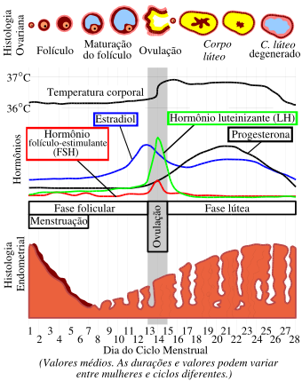
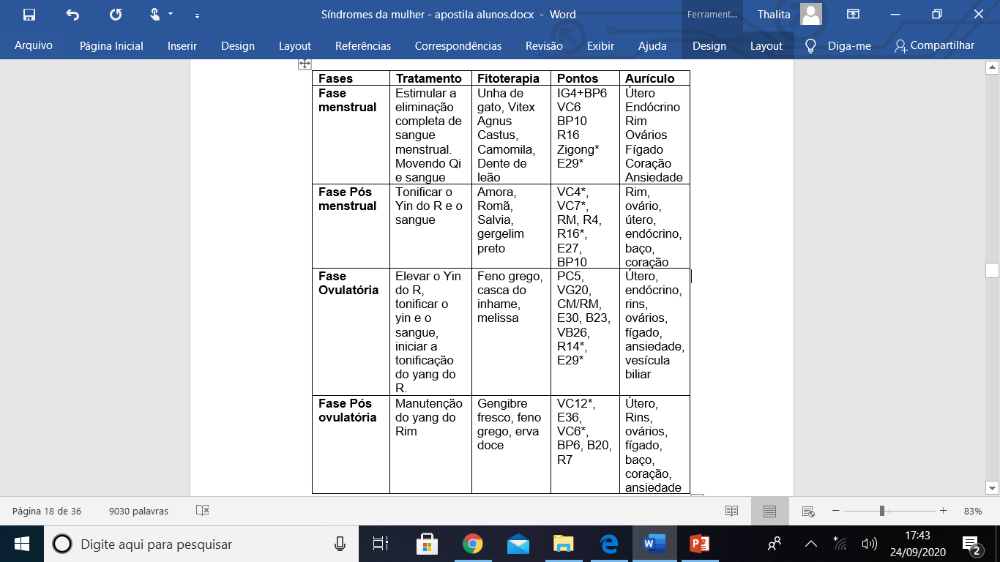

---
{"title":"20 - 2. Sindromes da mulher","SubTitle":"Sindromes da mulher 2","NAula":"Aula 20","tags":["conhecimento/acupuntura/aula"],"autor":"Professora Thalita Leslie","date":"2025-01-18","publish":true,"NivelAcesso":"ibrate","Conteudo":"acupuntura","allDay":false,"DiaSemana":"Sáb","start":{"dateTime":"2025-01-18T08:00-03:00"},"end":{"dateTime":"2025-01-18T17:00-03:00"},"location":"Avenida Higienopolis, 2677 - Bela Suíça, Londrina - PR, 86050-000","PassFrontmatter":true}
---

### Útero e Pulmão 
- Governar o Qi;
- Controla a subida e descida dos fluídos;
- Controla o diafragma;
- Deficiência Qi P associada a Def Qi BP exercendo ação indireta sobre a menorragia por Def Qi ou no prolapso do útero;

- Estagnação Qi P por estresse emocional exerce ação indireta sobre a TPM – região das mamas podendo causar distensão mamária e leve falta de ar;
- P7 – movimento Qi na TPM

---

---
### Útero e vasos maravilhosos 

- Chong Mai (BP4 D e E PC 6 E)

- Ren Mai (P7 D e R6 E)

- Du Mai (ID3 e B62 E)

- Dai Mai (VB41 e TA5 E)

---
#### Vaso da Concepção
- Relacionado ao sistema reprodutor,
- Fornece as substâncias Yin (essência, sangue e fluídos),
 - Usado para mover o Qi e o sangue (estagnações),
 - Problemas relacionados a vulva, vagina e cérvix estão relacionados a esse vaso.
---
#### Vaso da Governador
- Nasce do espaço entre os rins (Ming men),
- Com seu trajeto interno, influencia vagina, cérebro, coração, e os canais do Rim e Bexiga.
- Possui uma função mais yang

---

#### Bao Mai/Bao Luo
Conectam coração, útero e Rins
 - Rins e o coração exercem suas funções sobre os órgãos reprodutores,
- Controlam a abertura e fechamento do útero.

- Para que a concepção ocorra, é necessário que o coração esteja aberto!

---

> [!NOTE] iniciar indução 
> 36 semanas 
> 

---

#### Chong Mai (BP4 lado D e PC6 lado E)
- Mais importante, por ser considerado a origem de todos os outros;
- Mar de sangue,
- Influencia o suprimento e o movimento próprio do sangue no útero e controla a menstruação em todos os aspectos;
- Passa entre os rins e exatamente dentro do útero (no endométrio)
- Responsável pela boa menstruação e gestação. 

---

#### Canal Ren Mai (P7 lado D e R6 lado E);
- Intimamente relacionado ao útero e todo sistema reprodutor feminino, incluindo as genitálias interna e externa;
- Controla o Yin, essência e fluídos;
- Essencial para a alimentação do embrião dentro do útero;
- Responsável pela concepção, fertilidade, menarca, gravidez e menopausa.

> [!NOTE] Title
> estrogenio yin e progesterone yang 
> 

---
#### Canal Du Mai (ID3 lado D e B62 lado E); 
- Se origina no meio da proteção vital;
- Tem forte  relação com os RINS, especialmente no Ming Men ==(Vg4)==; (errado no slide original)
- “Mar de meridianos Yang”;
- Pode ser usado para amenorréia, ciclo atrasado ou infertilidade.
- Gravidez, irregularidade, libido, sexualidade e menstruação;

---

#### Dai Mai (VB41 lado D e TA5 lado E);
- Vaso Horizontal (cintura) – circunda em nível de umbigo os meridianos e mantém as estruturas no lugar;
- Guia e sustenta o Qi do útero e a essência;
- Mantém o livre fluxo de Qi do fígado,
- Faz o equilíbrio entre alto e baixo.

Equilíbrio alto e baixo 
> [!NOTE] escalda pés 
> T1 leva calor bom para o útero 
## substâncias 
### Jing
- Pré natal: herdado
- Pós natal: constituído
	- *estilo de vida*
- Armazenado nos rins
- Relativo a capacidade de produzir nossos próprios descendentes 
- Responsável pelo amadurecimento sexual

- Leve, moderado, grave

---

---
### Sangue
- Nutre!
- Nutre o endométrio
- Estimula a proliferação do endométrio
- Nutre os ovários, e garante que os folículos estejam bem abastecidos.

---

Alimentaçao 

---

### QI
- Movimento, distribuição e circulação
- Produz calor;
- Sustenta os tecidos;
- Nutre todos os órgãos.

---

## Principais desequilíbrios 
- Deficiência do Yin do Rim
- Deficiência do Yang do Rim
- Deficiência de JING
- Deficiência de Sangue
- Estagnação de Qi
- Frio no útero

---

### Deficiência de yin do rim
Causa:
1. Constitucional;
2. Dieta inadequada com alimentação às pressas; 
3. Excesso de trabalho;
4. Sono inadequado;
5. Sedentarismo;
6. Gestações muito próximas;
7. Maior número de menstruações durante a vida;
8. Medicamentos;
9. Doenças venéreas;
10. Desidratação;
11. Poluição ambiental;

---

Sintomas:
1. Secura vaginal;
2. Muco Fértil escasso ou ausente;
3. Endométrio fino;
4. Período menstrual escasso;
5. Ovulação tardia;
6. Ciclos Curtos;
7. Agitação;
8. Ansiedade

---

- Alimentar o yin, diminuir o excesso de yang.

- Sugestão de pontos: R3, R6, BP6, VC4, R9, B23, B52

- Fitoterapia: angélica, cavalinha. iuiuba chinesa

---

- Praticar exercícios moderados que não causem suor excessivo, 
- Evitar chás de natureza quente, de sabor picante ou amargo, como a canela, valeriana.
- Ingerir: maçã, figo, banana, limão, morangos, melão, 
- Geleia real.

---
### Deficiência de yang do rim
Causa:
1. Constitucional;
2. Invasão do frio externo;
3. Aborto de repetição;
4. Excesso de esforço físico;
5. Sono inadequado;
6. Disfunções na tireoide.

---

Sintomas:
1. Lombalgia;
2. Endométrio fino;
3. Incontinência urinária;
4. Letargia;
5. Libido Baixa;
6. Frio ou intolerância ao frio;
7. Fase lútea curta.

---

- Aumentar o yang dos Rins e reforçar o jing. Melhorar a absorção de Qi para ajudar a nutrir o Jing.

- Sugestão de pontos: VG4 + B23 (com moxa), VC4, VC5, VC6, E36, BP6, R7, E29.

- Fitoterapia: astrágalo, canela, erva doce, feno grego.

---

- Manter-se aquecida, principalmente os pés e o abdômen durante a menstruação e ovulação,
- Fazer exercícios físicos que favoreçam a respiração,
- Alimentos cozidos ou assados e de natureza morna ou quente.
- Repolho, salsinha, abóbora, lentilha, feijão azuki. 

---

### Deficiência de jing 
- Causa:
- Sequência de menstruações;
- Estilo de vida ruim;
- Gestações muito próximas;
- Envelhecimento;
- FIV (fertilização in vitro) pode piorar o Jing devido ao excesso de medicações;

---

Sintomas:
1. Puberdade tardia;
2. Alterações no desenvolvimento de útero e ovários;
3. Óvulos de baixa qualidade.

---

- Tonificar o jing, e o yin do Rim.

- Sugestão de pontos: B23 + B52,

- VG4, R3, BP8.

- Fitoterapia: Rosa mosqueta,

- espirulina.

- Geleia real.

- ---

- Atividade Física,
- Beber bastante líquido,
- Tomar banhos regenerativos,
- Cuidar do estilo de vida!!!

---

### Deficiência de Sangue 

Causa:
Baixa quantidade de proteína na dieta.
Ciclo menstrual escasso ou ausência de menstruação;
Doenças crônicas com tendência a anemia;

---

Sintomas:
1. Anemia profunda;
2. Cansaço extremo;
3. Endométrio fino;

---

Alimentar yin e Sangue.

- Sugestão de pontos: B17, B20, BP10, E36, BP6, C7.

- Fitoterapia: angélica, astrágalo, sálvia

---

- Descansar durante a menstruação,
- Não praticar exercícios físicos muito intensos,
- Comer alimentos que contenham ferro, como carnes e folhas verde escura. 
- Ingerir: Alcaçuz e espirulina

---

### Deficiência de Qi do Baço 
Causa:
1. Baixa quantidade de proteína na dieta.
2. Excesso de preocupação;
3. Alimentação rica em doces e carboidratos

---

Sintomas:
1. Pele amarelada
2. Cansaço, prostração, pouca fala, respiração curta
3. Fezes moles, gases, Sensação de pressão na parte inferior do abdômen
4. Má digestão, desconforto abdominal, empachamento, desejo por doces
5. Escapes no meio do ciclo e final de ciclo
6. Prolapso do útero
7. Edema
8. Indecisão, raciocínio lento e preocupação 

---

- Tonificar o baço, fortalecer o Rim, harmonizar a Via das Águas.

- Sugestão de Pontos: BP6 com moxa, B20 com moxa, VC6, VC12, E36, VC17, IG4.

- Fitoterapia: camomila, artemísia, ginseng, angélica, macela.

---

- Não praticar exercícios físicos extenuantes,
- Ocupar a mente de modo criativo e meditar para evitar excesso de pensamentos obsessivos,
- Alimentação é crucial: comer em horários regulares, comer lenta e calmamente, comer mais pela manhã, evitar bebidas geladas.

---
## Estagnação de Qi 
- Causa:
- Raiva;
- Medo;
- Preocupação;
- Tristeza;
- Dor;
- Traumas.

---

Sintomas:
1. Trompas obstruídas; 
2. Cólica menstrual; 
3. TPM; 
4. Flutuação de humor,
5.  Sensibilidade emocional e mamária pré-menstrual 
6. Distensão abdominal 
7. Sensação de plenitude no peito ou no estômago, suspiros 
8. Escape de sangue
9. Extremidades frias 

---

- Drenar o Fígado e desfazer a estagnação.

- Sugestão de pontos: B17, F3, VB34, PC6, BP6, VC17, VB40, P7.

- Fitoterapia: Melissa, camomila, erva doce.

---

- Praticar exercícios físicos regularmente, 
- Respeitar os horários e o ritmo do seu corpo,
- Procurar não guardar mágoa e rancor, 
- Dançar e escutar músicas,
- Evitar o uso de pílulas anticoncepcionais .

---
### Útero frio
Causa:
- Consumo de alimentos frios;
- Bebidas geladas;
- Exposição ao frio;

---

Sintomas:
1. Aversão ao frio;
2. Transpiração escassa;
3. Diminuição da libido;
4. Pés frios;
5. Fezes soltas, principalmente pela manhã;
6. Urina clara, abundante e frequente;
7. Dor lombar;
8. Escapes;
9. Cólica que melhora com o calor;  

---

- Aquecer os meridianos do Rim, do BP, do Fígado, expelir o Frio e aumentar o yang.

- Sugestão de pontos: moxa em BP6, R3, F3 agulha , VC4, VG4, E29.

- Fitoterapia: Artemisia, ginseng, anis- estrelado, canela, angélica, alcaçuz, gengibre.

---

- Escalda pés,
- Usar bolsa térmica durante a menstruação,
- Evitar relação sexual na época da menstruação,
- Cereja, damasco, frutas cítricas, mostarda, salsinha. 

---

## Etiologia das Síndromes da Mulher

Fatores patogênicos externos
- *“Quando o clima é moderado e harmonizado, os períodos menstruais são calmos. O frio congela, o calor produz fluxos excessivos, e o vento faz oscilar. Os patógenos externos entram no útero e esvaziam os canais Ren mai e Chong mai, causando problemas menstruais.”*

- Frio
- Umidade
- Calor

---

### 1. Frio
- Vento frio invade o espaço entre pele e músculos;
- Frio invade o útero diretamente;
- Vulnerabilidade no período menstrual e, principalmente após o trabalho de parto;
- Dores nos joelhos, períodos menstruais dolorosos;

- Orientações quanto a escalda-pés, uso de meias, bolsa de sementes. 

---

### 2. Umidade – maior fator patogênico
- Invade os meridianos das pernas e vai para cima se instalar no sistema reprodutor feminino;
- Leucorreias, dor na ovulação ou dismenorreia;
- Aumento da vulnerabilidade durante as menstruações e após o trabalho de parto;

- Dentro do corpo – fator patogênico interno – combinado com o calor: umidade-calor
- Massas abdominais, dismenorreia, cistos ovarianos, leucorreia, infertilidade ou menorragia.

Orientações quanto a evitar piscina, usar calcinha molhada, absorvente por muito tempo, sentar em lugar úmido.

---

### 3. Calor
- Vento calor ou calor do verão
- Podem penetrar no interior e causar calor no sangue
- Hemorragia menstrual excessiva

---

### Emoções Negativas
- Estresse emocional – profunda influência sobre a menstruação, gravidez, trabalho de parto e menopausa;
- Canal do útero conecta o útero ao coração – estresse emocional sobre a função menstrual;
- Estresse na puberdade;

---

---

### Tristeza e mágoa
- Esvaziam o coração e pulmão;
- Influencia a menstruação de duas formas: 
1. Coração – amenorreia, períodos menstruais escassos, ou atrasados;
2. Pulmão – amenorreia;
Def Qi P e BP: menorragia, ou falhar em subir o Qi, levando a prolapsos

---

### Preocupação
- Coagula o Qi do P, C e BP 
Podenfsrar
- ciclos atrasados ou doloridos

- O Qi do pulmão pode estagnar, como resultado da preocupação, gerando falta de ar, tpm e distensão dos seios;

---

### Raiva (Frustração, rancor, irritação, ódio);
- Estagnação Qi do Fígado;
- Maior causa de problemas menstruais;
- Períodos menstruais irregulares, TPM e dismenorreia ou massas abdominais;
- câncer de mama - mágoa

- Estagnação sangue do Fígado: dismenorreia++ ou massas abdominais;
- Estagnação do Qi: fogo – calor do sangue e menorragia;

---

Medo;
- Susto súbito ou um estado crônico de ansiedade;
- Susto - faz descer o Qi do Rim
- Estado crônico de ansiedade (Coração fraco) - menopausa

---

### Culpa;
- Afeta o Coração e Rim – estagnação ou desmoronamento do Qi;
- Desmoronamento do Qi do Rim – sensação de ser forçada para baixo ou um prolapso;
- Micções frequentes, leve incontinência – culpa de longa data 
- Língua terá ponta vermelha e pulso agitado

---

## Dieta
- “O sangue é a essência refinada do alimento e da água. Se o Estômago e o Baço são lesados, os líquidos não são regulados, o sangue seca, e os períodos menstruais se tornam irregulares.”

Alimentos: 
    Frios 
    Quentes 
    Úmidos 

---
### Alimentos frios 
- Alimentos Frios: Agridem BP, R e E, e podem gerar frio no útero;
- Frutas, vegetais crus e bebidas geladas;
- Puberdade, durante a menstruação, após o trabalho de parto;
- Dismenorreia e infertilidade

---
### Alimentos quentes 
- Alimentos quentes: geram calor no sangue;
- Carnes, pimentas, gorduras saturadas e processadas, industrializados e álcool, café, chá preto;
- Menorragia;
- Dieta emagrecedora;
- Amenorréia, ciclos escassos ou infertilidade

---
### Umidade 
- Alimentos gordurosos podem causar umidade interna 
- Alimentos gordurosos (leite, queijo, sorvete, banana, amendoim, doces, entre outros);
- Descarga vaginal excessiva, dismenorreia ou cistos;
- Vegetarianos!!

---

### Excesso de trabalho e exercícios físicos:
- Enfraquecem o Baço, Fígado e Rim
- Exercício excessivo durante o ciclo: enfraquece Baço e Rim – menorragia 
- Exercício excessivo durante a gravidez: risco de aborto
- Puberdade – enfraquece o Rim, gerando dismenorreia fase posterior
- MTC ênfase importante repouso após o parto!!! 

---

> [!NOTE] Sugestão
> Bruna Kitamura 

---

### Gravidez, parto e puerpério;
- Deficiência de Xue e Rim
- Perda excessiva de sangue (acima 200ml) durante o TP – depressão pós natal;
- Estase sangue após parto – psicose puerperal
- Espaçamento entre uma gestação e outra (min 2 anos);
- Mãe forte – feto fraco : problemas durante a gravidez;
- Mãe fraca – feto forte: problemas após o parto
- Aborto

---

### Atividade sexual excessiva e insuficiente:
- Esgota a essência dos Rins; (óvulos, sangue menstrual e esperma)
- “O excesso de atividade sexual não afeta as mulheres, tanto quanto afeta os homens”; 
- Durante o período menstrual 
- Desejo sexual reprimido = acúmulo de “Fogo Ministerial”.

---

### Cirurgia e Histerectomia; 
- “Mulheres estão sujeitas a estagnação de Qi e/ou do sangue após cirurgia abdominal.”
- O útero armazena sangue, e sua remoção induz a certa deficiência e sangue. 
- Deficiência do Rim (pulso fraco e fundo);
- Estagnação Qi útero – histerectomia – Bexiga – leve retenção
- Cefaleias occipitais;

---

### Pílulas:
- Ligada ao aumentos dos riscos de câncer de mama, câncer cervical, câncer de ovário e o endométrio;
- O uso prolongado parece induzir ao estado tanto de deficiência de sangue ou na estase de sangue. 
- DIU
	- hormonal 
	- não hornonal
- Absorvente interno: 
- Bloqueadores de livre descida de xue antigo;
- Estagnação de sangue 
- Endometriose x absorvente interno de rotina
- Coletores*

---
 

---

Ligamento retouterino - Ponto frequente de endometriose
Relata dor no ciático 

---

 

---

Imagem slide 71

---

---

---

## Do nascimento a menarca

---

### O patrimônio 

- No momento do nascimento até a menarca – eventos chave para determinar a fertilidade ao longo da vida!
- Meninas ainda dentro do útero da mãe, irão criar os folículos nos ovários que vão abrigar os oócitos.
- A saúde folicular será determinada pela interação da mãe com o meio e a saúde da mãe = JING
- Com o passar dos anos iremos perdendo patrimônio folicular. 

---

---

6 a 7 milhões de oócitos
Nascemos com 700.000 de oocitos
Puberdade 300 mil oócitos
E só se ovula aprox. 1% desses oócitos.

Interação com o meio
Alteração do estilo de vida!

---

---

## Menarca 

- Menarca é o nome dado à primeira menstruação da mulher e é uma das últimas fases da puberdade. 

- “Quando a menina atinge a idade de 14 anos, o Gui celestial (menstruação) chega,  o Vaso da Concepção está aberto, o Chong mai está fluindo, e a menstruação chega.”
INSPIRADA EM: MACIOCIA, G, OBSTETRICS AND GYNECOLOGY INCHINESE MEDICINE, 2ªED, 2011

---

- Estudo comprovou que a cada 1 ano de aumento da menarca, o risco de mortalidade cardiovascular foi reduzido. Sendo o menor marcador de risco quando a menarca acontece aos 15 anos.
Link para artigo!

É possível abrandar os sintomas mudando os hábitos de vida da criança;

Acupuntura

---

- 19 crianças
- 6-7 anos foram submetidas a 12 semanas de tratamento com acupuntura (24 sessões)

Resultado:
- Nível de Lh, estágio de Tanner de mama, e escores de sintomas diminuíram significativamente.

- Comprovando a eficácia da acupuntura no tratamento da puberdade precoce.

---

- Padrão de desarmonia mais comum: Deficiência de yin do rim e fogo do fígado. 
- Sinais e sintomas: dor ou sensibilidade nos seios, mau cheiro na boca, calor na palma da mão, sudorese, fezes secas e língua vermelha.
- Sugestão de pontos: bp6+e29
- R1: nutre o r, elimina calor;
- R3+r6: nutre o yin do rim e resfria calor no sangue;
- Vc4: regula o útero;
- Yintang: tranquiliza a mente;

- Geleia real e dente de leão. Evitar açúcar, ultraprocessados, consumir carnes orgânicas e evitar soja. 

---

---

---

## Menstruação 

---

- “Quando a menina atinge a idade de 14 anos, o Gui celestial chega, o Vaso da concepção está aberto, o Chong Mai está fluindo e a menstruação chega.”

- “O Tian Gui chega, e a menina pode conceber.”

- “Tian Gui é o esperma no homem e o sangue menstrual na mulher, que são armazenados na sala do esperma ou no Zi Bao respectivamente.”

---

- A menstruação é o momento em que o mar de sangue (Chong Mai) se esvazia. O QI se dirige para baixo através do meridiano Vaso Concepção(Ren mai), e a eliminação do sangue depende do fluxo do Qi. 

- É contado o primeiro dia do ciclo como o primeiro dia de sangramento, finalizando no último dia antes de começar a próxima menstruação.

---

- Do ponto de vista ocidental, a fisiologia feminina sofreu muitos preconceitos e crenças ao longo da história. Hoje compreende-se que sua natureza é cíclica, e que há uma relação dinâmica entre os ovários, útero e a hipófise, ou seja, há um eixo entre o sistema nervoso central e a parte reprodutiva feminina, o que proporciona uma dança hormonal delicada e complexa. 

---
Sugestão 
- Domínio do yin 

- Da Fertilidade à Maternidade; a Mulher e suas Fases Segundo a Medicina Tradicional Chinesa

- 3ª edição

- Helena Campiglia

- Ícone editora
---

- Um ciclo dito saudável acontece geralmente entre 25 e 33 dias.
- A irregularidade é mais importante do que a sua duração.

- Ciclo sempre adiantado (+ 7 dias) = Deficiência Qi ou calor no sangue
- Ciclo sempre atrasado (+ 7 dias) = Deficiência sangue, estase sangue ou estase de frio.
- Irregularidade (às vezes adiantado, as vezes atrasado): estagnação de Qi do F, estase sangue do F, def de BP ou R.

---

O sangue menstrual é o melhor diagnóstico do que o seu corpo tem a dizer 

---

Segundo a Medicina Ocidental, o ciclo menstrual se divide em:
- Fase Folicular ou proliferativa
- Ovulação
- Fase Lútea ou secretória.

Para a Medicina Tradicional Chinesa, as fases serão divididas em:
- Menstruação
- Pós Menstruação 
- Ovulação
- Pós ovulação

---

- Ponto de Mutação entre Yang e Yin.
- No primeiro dia o Chong Mai começa a esvaziar e o Qi do Ren Mai descende a energia para que seja adequada. Boa parte do endométrio será remodelada. 
- Dentre 2 a 3 dia o Chong Mai começa a se preencher novamente.
- O Jing e o Yin do Rim estabelecem função ainda mais ativa na maturação folicular 
- Recrutamento e Seleção Folicular pelo FSH (Hormônio Folículo Estimulante) e pelo Hormônio Anti Mülleriano (HAM ou AMH

---

- Desde a fase Menstrual, Chong mai volta a se encher, o Yin aumenta pela ação do FSH (conexão entre Rim e Coração através de Bao Luo e Bao Mai)
- Espessa o endométrio, crescem os folículos, produção de muco.

---

### Fase mais importante do ciclo
- Onde o Yin atinge seu máximo e se transforma em Yang. 
- Distúrbios emocionais podem afetar diretamente a ovulação.
- O fluxo de Qi e Sangue no VC e no Chong Mai podem causar distenção abdominal, mudanças de humor e distensão nas mamas.
- Durante esta fase caso o Yin não se tranforme rapidamente em Yang poderemos ter acumulo de umidade no útero. O mesmo pode ocorrer se o Yang não for suficiente.

---

---

### Fase pós-ovulatória
- O Yang aumenta rapidamente, refletindo o aumento da progesterona, temperatura basal e ressecamento do muco.
- O Fígado que influencia o movimento de Qi e Sangue para o Endométrio.
- Este aumento do Yang consistente é importante para expelir os fatores patogênicos que podem ter sido deixados pelo Yin como a Estase de Sangue, Umidade e Frio. 
- Além de claro nutrir e sustentar o endométrio.

---

---
### Ciclo menstrual na Medicina Chinesa – 4 fases da Lua
 
- Fase 1 – Menstrual; Yin – Lua Nova
- Fase 2 – Pós Menstrual; Yin – Lua Crescente
- Fase 3 – Ovulatória; Yin/Yang – Lua Cheia
- Fase 4 – Pós Ovulatória; Yang – Lua Minguante
 

---
#### Fase 1 – Menstrual; Yin – Lua Nova

- Movimento de libertar todas as mágoas e cicatrizes. 
- Momento de descansar, meditar e respeitar o ritmo do corpo;
- Descamação do endométrio uterino;
- Estradiol e progesterona baixos;
- Eliminação completa do sangue menstrual;

---

#### Fase 2 – Pós Menstrual; Yin – Lua Crescente
- Momento de maior energia e criatividade. Libido começa a aumentar, maior tolerância a dor, foco e concentração;
- Fase estrogênica;
- Crescimento de 1 ou mais folículos para a ovulação;
- Reestruturação do endométrio que começa a surgir;

---

#### Fase 3 – Ovulatória; Yin/Yang – Lua Cheia

- Momento de bom humor, libido altíssima, ideal para tomar decisões;
- Rompimento do folículo;
- Aumento do FSH e LH;
- Início da fase yang: aumenta o estrógeno, elevação do muco fértil;

---

#### Fase 4 – Pós Ovulatória; Yang – Lua Minguante
- Momento de entrega, projetos e sonhos;
- Acolhimento e descanso, há oscilação do humor por efeito da progesterona;
- Preferência por alimentos doces;
- Impaciência;
- Vascularização uterina;
- Fase Progesterônica.

---
#### Menstruação e as fases da lua

- Vamos organizar tudo?
- Podemos potencializar cada fase em seu respectivo equilíbrio
- Pontos complementares

 ---

---

## Vamos falar sobre TPM 

---

### Desequilíbrios da menstruação

Tensão Pré Menstrual
- Frequentemente, a TPM começa logo após a ovulação, e piora com a aproximação da menstruação propriamente dita. 

Sintomas;

---

- Por que a energia do Fígado se desequilibra na TPM?

- Na primeira parte do ciclo, o movimento yang é favorecido, a mulher se encontra ativa, cheia de energia e contente consigo pois seu corpo se mostra adequado as necessidades da vida externa. 
- Quando a mulher entra na segunda metade do ciclo (após a ovulação), o movimento de introspecção se faz necessário.
- Nesse momento começa o descompasso/luta interna.
- A energia é retida, o fígado fica estagnado, juntamente com os sintomas e a mulher se sente mal. 

Férias

---

Segundo a Medicina Tradicional Chinesa, a TPM é um distúrbio do funcionamento do fígado e que também pode levar ao desequilíbrio do rim. E existem dois tipos de TPM:
 
---
### Plenitude
Estagnação de Qi e Xue do Fígado 
- Sintomas: Cólica forte, irritabilidade, labilidade emocional, dores nas mamas, coágulos escuros, náuseas e vômitos. 
- Tratamento: F3, VC17, PC6, BP6, BP4, PC6, IG4, B18, B20.
- VC4*
- VB34 + TA6 = desconforto mamário
- Fitoterapia: cavalinha, melissa

---
### Vazio
- Deficiência de YIN do Fígado e do Rim

- Sintomas: Sintomas em deficiência: cansaço excessivo, dor lombar e pélvica, dor nos joelhos, calor noturno.

- Tratamento: R6, R3, VC4, E36, VB34
- Fitoterapia: gergelim preto (ótimo tônico de yin)

---
### Cólicas Menstruais

- Refletem um estado de estagnação de Qi e eventualmente a estagnação do Sangue.
- Tratamento semelhante ao da TPM.

- Acupuntura: BP6, BP4, F3, VB34, PC6, IG4, B18, B20 
+ pontos para mover o sangue: BP10, B17, F8.

- Fitoterapia: anis-estrelado, Artemísia, camomila
- se não tiver muito Calor, bolsa de água quente, escalda pés 

---

### Leucorreias

- Branca – Deficiência de yang Rim e BP
- Amarela – umidade-calor
- Serosanguinolenta – calor tóxico (doenças graves)

Tratamento: Ren Mai (P7-R6) , VB26, BP6, BP9, E36

---

## Estilo de vida saudável 
Os 7 pilares

7. descanso 
6. Hidratação 
5. Redução de Poluentes 
4. Exercício físico 
3. Alimentação saudável 
2. Sono 
1. Desaceleração mental 

> [!NOTE] Orientação 
> Mudanças graduais 

---

> [!NOTE] caldo de ossos
> muito nutritivo 
> - ajuda a engrossar endometrio
> - deficiência de Baço 
> - deficiência de Sangue 

---
## Prática 
Atendimento da Dryelle

- Queixa principal 
	Cólica menstrual antes e durante 
- Idade 
 20 anos 
- Trata com médico 
- Acorda as 6:00, toma banho 
- Come omelete, leite sem lactose 
- Daí 6:30 e come no caminho 
- Aula começa às 7:30
- Atividade física so no sábado 
- Dorme no mínimo às 23:00  às vezes até 01:00
- Já usou anticoncepcional 
- não come carne vermelha 
- pouca carne branca. Mais proteína de soja. 
- estuda o dia todo. 
- normalmente lanche natural a tarde 
- b12  e Ferritina estavam baixas. Está suplementando. Agora ok. 
- intestino irritável, mais para preso. 
- sente estufamento e digestão lenta 
- excesso de preocupação 
- fico ruim concentração boa
- dor lombar e pélvica 
Menstruação 
- menstruou com 11 anos. 
- 4 dias 
- não sabe duração do ciclo 
	- indicado aplicativo Flo 
- escapes 2 a 3 dias antes. Escuro. 
- apresenta coágulo. 2º a 3º dia. Sem dor. 
- muco clara de ovo ao ovular 
- sempre cansada 
- TPM pós ovulatoria. Guarda o sentimento. 
- anemia
- inchaço pós ovulatório

