---
{"title":"20 - 1. Síndromes da mulher","SubTitle":"Sindromes da mulher 2","NAula":"Aula 20","tags":["conhecimento/acupuntura/aula"],"autor":"Professora Thalita Leslie","date":"2025-01-18","publish":true,"NivelAcesso":"ibrate","Conteudo":"acupuntura","allDay":false,"DiaSemana":"Sáb","start":{"dateTime":"2025-01-18T08:00-03:00"},"end":{"dateTime":"2025-01-18T17:00-03:00"},"location":"Avenida Higienopolis, 2677 - Bela Suíça, Londrina - PR, 86050-000","PassFrontmatter":true}
---

## Amenorreia primária e secundária 
- A amenorreia primária se define como uma falta de menstruação a partir de 16 anos; 
- Já a amenorreia secundária como falta de menstruação de três meses ou mais, em uma mulher que já apresentou menstruações. 

---

Vazio
- Deficiência do YIN do Fígado e Rim;
- Deficiência YANG do BP e Rim;

Plenitude
- Qi/xue estagnados
- Mucosidade
 
---

Vazio
- Deficiência do YIN do Fígado e Rim; 
- F8, E36, BP6 nutrem o yin do F;
- VC4 nutre o fígado e os Rins, tonifica o útero e fortalece a essência;

Deficiência YANG do BP e Rim;
- VC12, E36, BP6, B20, B21 (moxa) tonificam e esquentam o BP;
- R3, B23 (moxa) tonificam e esquentam os rins;
- VC4 (moxa) tonifica o yang R e esquenta o útero;

Escalda pés 

---

Plenitude
- Qi/xue estagnados
- VC6, E30 move o qi do abdômen inferior;
- F3 serena o F e move o Qi e o sangue;
- BP6 move o sangue;

Mucosidade
- BP9, BP6, B22 resolvem a umidade;
- E28, E27 resolvem umidade no aquecedor inferior;
- E40 resolve os mucos
- VC9 promove a transformação de fluidos

---
### Síndrome do ovário policístico
- A síndrome dos ovários policísticos consiste principalmente em anovulação, acompanhada de aumentos dos hormônios androgênicos (masculinos). Observa-se a formação de múltiplos pequenos cistos nos ovários. 
- Esses hormônios bloqueiam o desenvolvimento dos folículos que não chegam a ficar maduros e, portanto não ocorre a ovuação. 

- Os ciclos menstruais costumam ser irregulares e até mesmo ausentes.

- Obesidade, aumento de pelos na face e no corpo, acne, diminuição de cabelos, alteração da curva glicêmica e aumento de colesterol e triglicérides, ,aumento de testosterona e de hormônio luteinizante (LH).

---

- Diagnóstico é feito com exame de ultrassom – o aumento dos ovários é, em média, de 2,8 vezes do tamanho normal.
- Exames laboratoriais, que detectam o aumento dos hormônios androgênico. 

- Tratamento é feito por ginecologistas, através de pílulas anticoncepcionais ou medicamentos que induzam a ovulação (Clomifeno).(apenas mascara os sintomas)
- Além de metiformina para reduzir níveis de glicose e insulina.

---

- Segundo a Medicina Chinesa, e junção desses sintomas indicam a presença de Mucosidade. 
- A Mucosidade e uma energia estagnada em forma de Umidade e Calor, impedindo a circulação energética, gerando cistos, massas e outros sintomas, como a obesidade e sensação de peso em diferentes partes do corpo.

---

#### Estagnação de Qi do Fígado

- Disfunção da Hipófise;
- Aumento do LH,
- Folículos imaturos.

---
#### Umidade fleuma

- Aumento da PA
- diabetes mellitus 2
- dor abdominal
- ciclos anovulatórios
- LH alto
- excesso de peso.

---

#### Deficiência do Yang do Baço
- diabetes mellitus 2
- ciclo anovulatórios
- endométrio fino
- Sindromes metabólicas
- folículos imaturos
- excesso de peso.

---

#### Deficiência do Yang do Rim
- Cansaço frequente
- libido baixa
- dor lombar
- ciclos levemente irregulares.

---

#### Deficiência do Yin do Rim
- Testosterona elevada
- esgotada e agitada
- folículos imaturos.

---

#### Tratamento 
##### Estagnação de Qi
Acupuntura:
- R14, VC5, BP15, Zigong, Qimen, F4: aliviar dor e mover estagnação
- VB26, VB27, VB28: aliviar dor abdominal 
- R10, BP9, F5: dispersar calor

- Fitoterapia: Camomila

---

#### Umidade e Fleuma

Acupuntura:
- E28, E29: dispersar estagnação local
- BP9, E40, VC3: dispersar a umidade;
- R5, Chong Mai: promover a ovulação

Fitoterapia: Macela
 

---

#### Deficiência de Yang do Baço
Acupuntura:
- BP6: fortalecer baço e resolver umidade;
- E25: fortalece o qi do estomago e baço, e resolve a umidade;
- E36: tonifica o Qi, e resolve edema;

- Fitoterapia: Macela

---

#### Deficiência Yang Rim 

Acupuntura:
- R7, VG4, B23: tonifica yang do Rim
- B52: tonifica o rim e o jing
- VC4: tonifica o yin e o yang do rim
- R4: fortalece o Qi do rim e acalma a mente.

- Fitoterapia: Erva Doce (tonifica yang)

---

#### Deficiência do Yin do Rim

Acupuntura:
- R3: tonifica o yin e o yang do Rim;
- Ren mai
- R6, VC7: tonifica o yin do rim
- VC3: nutre o jing e fortalece o yin;

- Fitoterapia: amora

----

## Endometriose 

 Março amarelo 

---

- Presença de tecido endometrial (que é o tecido da parede interna do útero), localizado em vários órgãos, como ovários, intestinos, trompas, fundo de saco, ligamentos útero-sacros e, até mesmo dentro do próprio útero, levando a sinais e sintomas, como cólicas menstruais, dor na relação sexual e infertilidade. 
- Algumas mulheres podem ser assintomáticas.

- As causas da endometriose ainda não estão completamente esclarecidas. 

---

Diagnóstico: 
- Clínica: cólicas intensas, infertilidade, dor à evacuação, choques anais.
- Exames laboratoriais: aumento CA-125;
- Exames de imagem: ultrassom transvaginal e RNM.
- Laparoscopia: localização de focos de endometriose através da cirurgia laparoscópica. 

- Prevalência de 3 a 10% em mulheres e 25 a 35% nas mulheres inférteis.
- Tratamento: cirurgia ou uso de agonistas de GnRH, danazol, anticoncepcional oral ou DIU hormonal. 

---

- Acupuntura: irá produzir efeito anti-inflamatório (liberação de hormônio adenocorticotrófico e regulatório de hormônios, como estrógeno e progesterona. 

---

#### Causas, segundo a MTC:
- Deficiência de yang do Rim;
- Deficiência do Qi do Baço;
- Estagnação do Qi do Fígado;
- Estagnação de sangue;

*Paciente pode não apresentar somente uma causa. 

- Perfil Psicológico: Controladoras, perfeccionistas, exigentes, pilares da família e podem ter relação familiar instável.

---

1. Deficiência do Yang do Rim
Sintomas: cólica com dor lombar irradiada para as pernas, intestino solto antes de menstruar e escape de sangue, sensação de frio e coágulos. 
2. Deficiência de Qi do Baço
Sintomas: fezes soltas antes de menstruar, cólicas fracas, cansaço pré menstrual, dor em forma de peso no baixo ventre. 
3. Estagnação de Qi do Fígado
Sintomas: cólica menstrual com dor forte, irritabilidade, nódulos ou massas abdominais, adenomiose, dor de cabeça, obstrução de trompas. 
4. Estagnação de sangue
Sintomas: Dor perfurante e incapacitante no período menstrual, fluxo menstrual com coágulos, dor anal, dor na ovulação e na menstruação, e dor de cabeça. 

---

1. Deficiência do Yang do Rim
Pontos: VC4, BP6, F11, R7, R14
2. Deficiência de Qi do Baço
Pontos: VC12, F11, E29, Zigong, BP12, BP13
3. Estagnação de Qi do Fígado
Pontos: TA5, F3, F11, BP6
4. Estagnação de sangue
Pontos: TA4, TA5, E29, Zigong, PC6, BP6

Auriculoterapia: Útero, endócrino, rins, ovários, fígado

---

A conduta no tratamento deverá manter o foco nas fases do ciclo  menstrual, ao mesmo tempo que se elimina as lesões do endométrio.

 ---
## Mioma 

- É um tipo de tumor benigno que se forma no tecido muscular do útero e que também pode ser chamado de fibroma ou leiomioma uterino. A localização do mioma no útero pode variar, assim como o seu tamanho, que pode ser microscópico ou possuir vários centímetros.

- Na maioria dos casos, não provocam sintomas, no entanto algumas mulheres podem relatar cólica, sangramentos ou dificuldade para engravidar.

---

O mioma pode ser classificado em diferentes tipos de acordo com o local em que se desenvolve no útero, sendo os principais:
- Subseroso, em que o mioma desenvolve-se na parte mais externa do útero;
- Intramural, quando surge dentro das paredes do útero;
- Submucoso, quando desenvolve-se na parte interna, dentro da cavidade do útero.

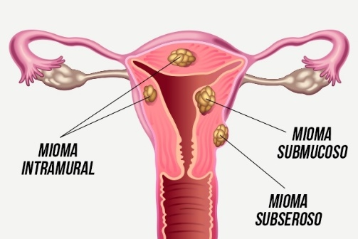

---

- Estagnação de Qi do Fígado; (abdômen inchado e dolorido, cólica menstrual, irritabilidade, massa encontrada durante a palpação e dor não fixa, cólica forte com fluxo abundante).
- Estagnação de sangue (dor atormentada no período menstrual, massa não muito dura que se movimenta na palpação, fluxo menstrual com coágulos, dor anal, menstruação irregular e abundante).
- Umidade fleuma (massa não muito dura, abdômen profuso, sobrepeso ou obesidade, sensação de plenitude no tórax).

---

Estagnação de Qi do Fígado; R13, R14, F2, VC12, F3, PC5, BP12, E29

Estagnação de sangue R14, E30, Zigong, F8, VC4, E29, Qimen

Umidade fleuma E29, BP12, BP9, B20, B22, VC3, Chong mai

---

## Infertilidade 
Tensão extrema para mulher 

---

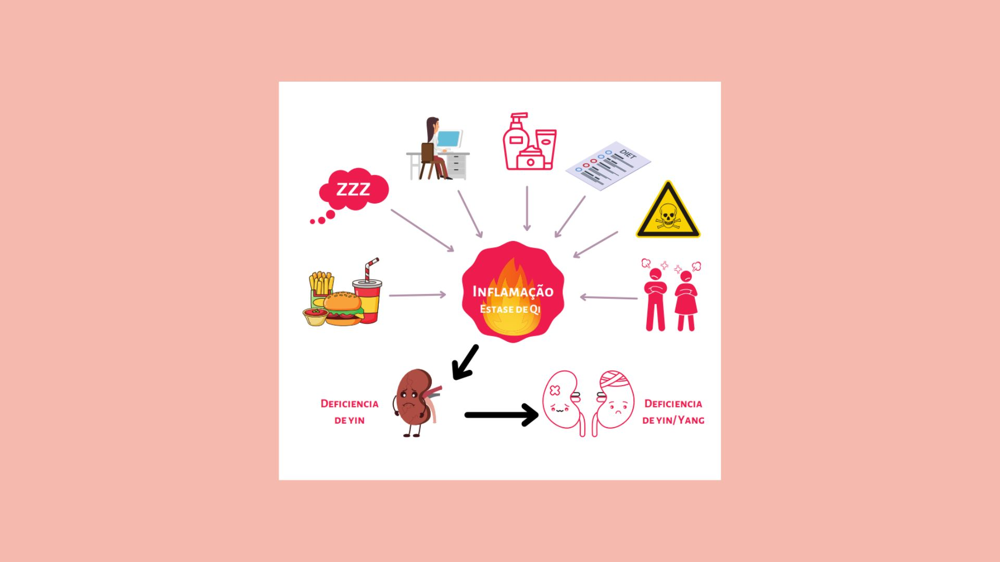

---

- É definida como a incapacidade de uma mulher produzir descendência após ter tentado por dois anos, tendo uma vida sexual normal, e cujo parceiro tem, naturalmente, função reprodutiva normal.
- A acupuntura interfere na liberação imediata de neurotransmissores, os quais, por sua vez, estimulam o hormônio liberador de gonadotrofinas, influenciando assim o ciclo menstrual, a ovulação e, consequentemente a fertilização.

---

- A MTC irá auxiliar pacientes com diagnóstico de ISCA (infertilidade sem causa aparente - conceito inexistente em Medicina Tradicional Chinesa) , restabelecendo o equilíbrio do corpo da mulher ou do casal, a fim de facilitar a gestação. 

- E também no auxílio de técnicas de reprodução assistida, elevando as chances de gravidez de 29% para 50%, em pacientes que se submetem a terapia de reprodução assistida juntamente com a acupuntura. 

---

- Auxiliando no desenvolvimento dos folículos e do endométrio;
- Melhorando a motilidade e quantidade de espermatozoides;
- Ajudando da vascularização uterina;
- Diminuindo os efeitos colaterais das medicações que são administradas nos tratamentos;
- E por último e não menos importante, cuidando da saúde mental desses casais, que costumam estar apreensivos, nervosos, com medo e ansiosos. 

---

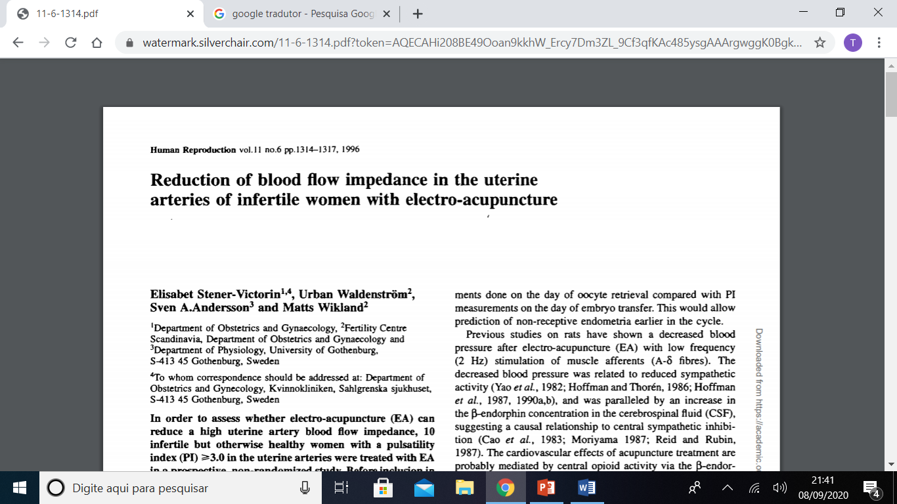

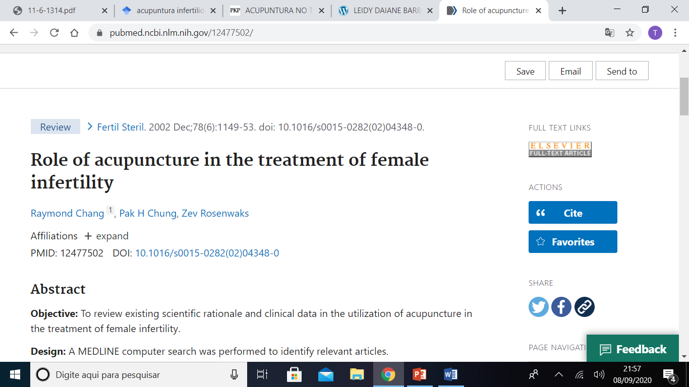

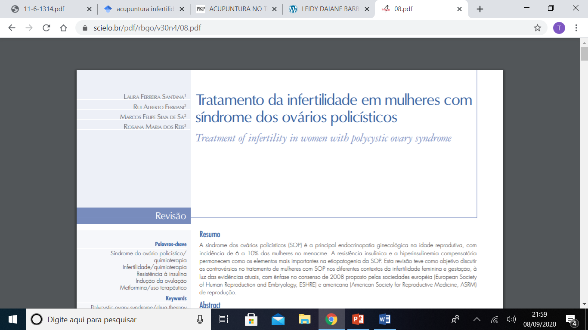

---

É importante focar no Estilo de Vida dessa paciente.

7. Descanso
6. Hidratação
5. Redução de Poluentes
4. Exercício Físico
3. Alimentação Saudável
2. Sono
1. Desaceleração Mental

---

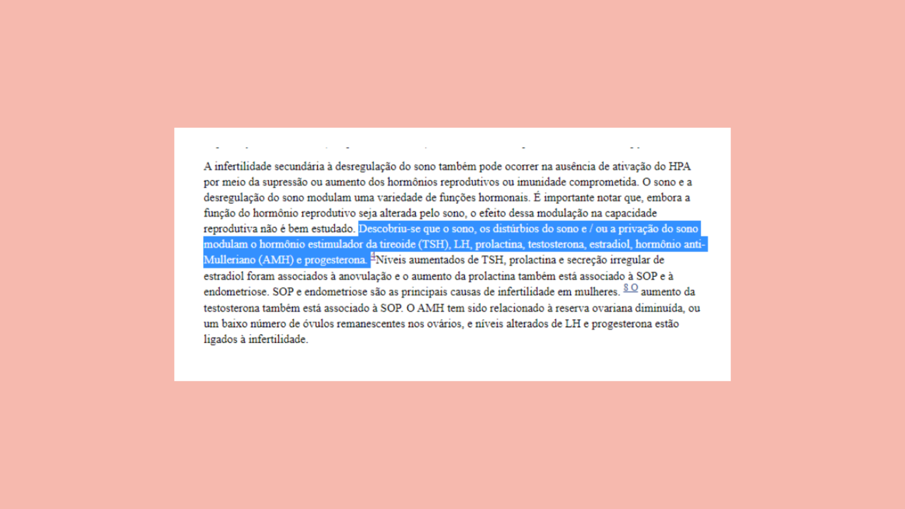

---

- Colha os sinais e sintomas da sua paciente;
- Determine a síndrome base (normalmente ela estará entre aquelas que passei no início da aula) e esse será seu norte;
- Acompanhe a evolução do seu paciente e utilize os mesmos parâmetros que te fizeram determinar a síndrome para perceber sua melhora;
- O tratamento por fases do ciclo, entra em um segundo momento, mesclado ao tratamento de base.

---

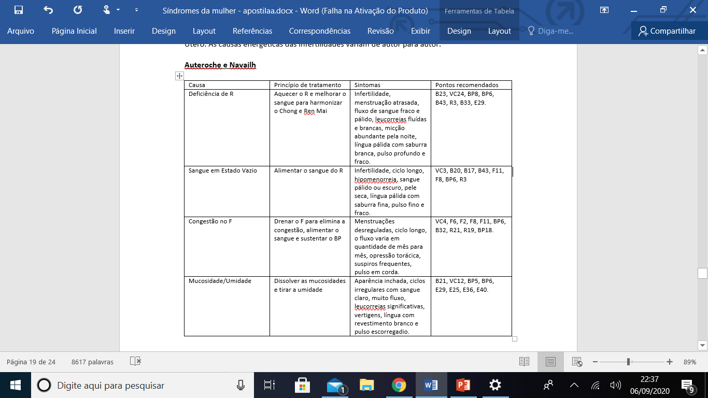
Auteroche

---

| Sindrome | Sintoma | Pontos |
| -------- | ------- | ------ |
|Def  yang dos rins|Friorenta, diminuição libido, medrosa, pés frios, vontade de urinar a noite, medrosa, cólica que melhora com o calor.|VG4*, B23*, VC4, VC5, VC6, E36, BP6, R7, R12, E29, VC2.|
|Def yin dos rins|Ondas de calor, calor em mãos, pés e peito, suor noturno, insônia, diminuição ou ausência de muco cervical, urina escura e em menor quantidade, tontura, zumbido.|R3, R6, BP6, VC4, R9, B23, B52.
|Def Sangue|Pele e mucosas secas, lábios pálidos, unhas quebradiças, tontura e vertigem princ. Após menstruação, insônia, ciclo menstrual atrasado, queda de cabelo.|B17, B20, BP10, E36, F8, BP6, C7.
|Def Qi do Baço|Cansaço, falta de força nos membros, apetite irregular, desejo de comer doces, varizes, preocupação, pés gelados, suor abundante, fezes soltas, escape menstrual, edemas, indigestão ou empachamento. |BP6, B20, VC6, VC12, E36, E29, E30, VC6, IG4, VC17.|
|Estagnação de Qi do Fígado|TPM, depressão e angustia, alivio dos sintomas quando fala ou chora, irritabilidade durante ovulação, nó na garganta, coágulos, cólica menstrual.|B17, B18, F3, F14, VB34, PC6, BP6, VC17, VB40, P7;|
|Calor que agita o sangue|Boca e garganta seca, encalorado, irritação na pele, acne que piora na tpm, sudorese intensa, agitação, insônia, sangramento menstrual abundante. |F2, F3, TA3, TA5, PC6, B18, VG20, VB44, BP10|
|Umidade|Nódulo nas mamas, acne cística, dor de cabeça em peso, catarro, fezes com muco e cheiro intenso, menstruação com muco ou resto de tecido pegajoso, sobrepeso, obesidade, dores articulares.|B17, B20, BP10, E36, F8, BP6, C7.|
|Estagnação de sangue|Varizes, hemangiomas, hemorroidas, dor na ovulação, menstruação com coagulo e sangue escuro, cólicas menstruais intensas.|E29, BP10, F8, F3, VC4, VC6, B23, B32, E36, PC6, Zigong|
|Frio no útero|Aversão ao frio, transpiração escassa, diminuição da libido, pés frios, fezes soltas princ. Pela manhã, abortos de repetição|BP6, R3, F3, VC4, VG4, E29|

---

### Panorama Geral da Reprodução Assistida

- É o conjunto de técnicas médicas que possibilitam a reprodução humana de maneira assistida. Contribui com casos de infertilidade, idade avançada, casais homoafetivos, gestação independente e planejamento familiar para diminuição do risco de doenças genéticas.

---

#### Reprodução assistida

- Entende-se por Reprodução Assistida todos os tipos de tratamento que incluem a manipulação in vitro (no laboratório), em alguma fase do processo, de gametas masculinos (espermatozóides), femininos (oócitos) ou embriões, com o objetivo de se estabelecer uma gravidez.

- Coito programado,
- Inseminação artificial,
- Fertilização in vitro.

---

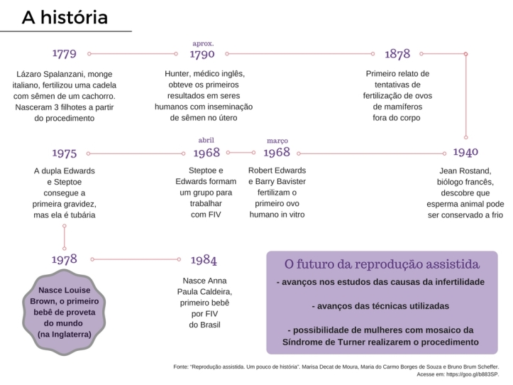

---

#### Quando buscar a RA?
- Depois de um ano sem uso de contracepção hormonal e sem sucesso na gestação,
- >35 anos, depois de 6 meses de tentativas sem uso de contracepção,
- >40 anos, imediatamente,
- Tratamentos médicos que comprometam a fertilidade, imediatamente.

---

Causa mais comum da procura: idade 

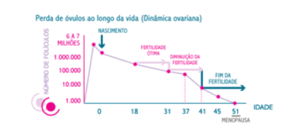

---

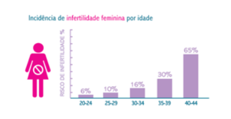

---

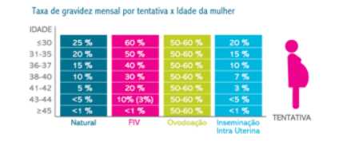

---

Slide 159

---

#### Fases da reprodução assistida 

- Estimulação folicular BP4 + CS6, P7 + R6, Zigong, VC4, E36, BP6, E29, Yintang

- Transferência VC7 + E36 + BP6 + VC4 + E29 + ZIGONG + yintang
- *(caldo de ossos)*

- Manutenção da fase lútea BP3 + E36 + VG20
- *(10 dias tensão por expectativa)*

---

### Na padaria da reprodução assistida a acupuntura é 

Um cupcake 

Cereja é o protocolo de Paulus 
Preparo endometrial  é a cobertura 
Qualidade e coleta dos óvulos  é a massa

---

*Preparo endometrial: Endométrio trilaminar
BP4 + CS6, P7 + R6, Zigong, VC4, E36, BP6, E29, R7, VG20,

---
### Protocolo de Paulus 
Protocolo de Paulus - Criado em 2002 
- Uma sessão de 25 minutos antes e uma sessão 25 minutos depois
- Pré transferência: CS6, BP8, F3, VG20, E29 

- Pós Transferência: IG4, BP10, E36, BP6
 - Auriculoterapia com agulhas: Esquerda: Útero e endócrino Direita: Shenmen e Cérebro Manter 25 minutos

---

Protocolo Modificado
- Uma sessão até 24 horas antes e uma sessão até 72 horas depois
- Pré transferência: BP8, BP10, F3, E29, VC4

- Pós Transferência: BP6, E36, VG20, R3, CS6
- Auriculoterapia com agulhas: 
- Útero e Shenmen

---

## Menopausa 
- Menopausa é o fim da fase reprodutiva feminina, que ocorre quando a mulher não tem menstruação por 12 meses consecutivos. É um processo normal que marca o término da ovulação e da fertilidade. 

- É um momento de “queda do yin”: calores, diminuição do sono, sudorese noturna, diminuição da lubrificação das mucosas, ressecamento da pele, parada da menstruação. 
- Emocionalmente mais inquieta, sendo mais suscetível a mudanças de humor. 

---

“A menopausa é um momento de passagem, e como toda passagem, é intensa, e as vezes dolorosa, mas sempre transformadora.”

Domínio do Yin. Helena Campligia

---

- Ajudar a mulher a reencontrar seu ponto de equilíbrio, mas não suprimir todos os sintomas. Isso porque, justamente esses sintomas obrigam a mulher a tomar consciência das mudanças em seu corpo. 
- Porém é possível fazer com que essa passagem seja leve e transformadora! 
 
---

### Deficiência de Yin:
- Menstruação em quantidade escassa ou cessada completamente); 
- perda de cabelo;
- muco vaginal escasso;
- secura da vagina;
- tontura; zumbido;
- ondas de calor; 
- suor noturno;
- insônia; 
- Pulso: Fino, rápido (se houver calor) e fraco
- Língua: Vermelha, rachada, com pouca ou nenhuma saburra, língua pequena
- Objetivo: Nutrir o Yin do Rim, acalmar o Yang, acalmar a Mente, limpar o Calor Vazio do Coração

---

- P7 + R6
- VC4, R13
- R3, BP6, R10,
- C6, R7
- IG4,
- VC7,
- R12+E27

---

- Sálvia (1 colh. de chá, infusão 5min) 
- Gergelim Preto (decocção 10min.) constipação
- Água de Coco
- Goji Berry
- Maçã, damasco, abacate, banana, limão, manga, amora, Beterraba, Berinjela, batata doce, tomate, inhame, ovos, aveia.

---

### Deficiência de Yang:
- Calorão,
- mãos e pés frios,
- sudorese noturna no início da manhã,
- palidez do rosto,
- depressão,
- calafrios,
- edema, 
- dor e fraqueza da parte inferior das costas e joelhos;
- fezes soltas; 
- Pulso: profundo e fraca 
- Língua: língua pálida com saburra fina
- Objetivo: Tonificar e aquecer os Rins, tonificar o Yang, aquecer o Centro, fortalecer o Baço.

---

- B23+B52
- R3
- P7+R6
- VC4
- VC15
- R7
- R12+E27

---

Gengibre Fresco (Morno, Infusão 10min)
Tomilho seco: (1 colh. de chá, infusão 10min, erva fresca dobra)
Erva-doce: (infusão 10min)
Framboesa, morango, tâmaras, e frutas cozidas com especiarias
Lentilha, ervilha, raízes,
Repolho, rabanete
Manjericão, tomilho, casca de canela, alecrim, cúrcuma.

---

### Ascenção do yang do Fígado
- Irritabilidade; 
- constipação; 
- palpitações; 
- insônia; 
- instabilidade emocional; 
- tontura, 
- zumbido, 
- visão turva,
- ondas de calor,
- dor nas articulações, 
- sudorese noturna,
- dores de cabeça.
- Pulso: pulso em corda
- Língua: sem revestimento, ou com saburra fina e amarelada Objetivo: Nutrir o Yin do Rim e do Fígado, subjugar o Yang do Fígado, acalmar a Mente.

---

- R3
- P7+R6
- VC4
- F8
- F3, VB20
- VB13, VG24

---

- Melissa (Infusão 5min)
- Camomila (Infusão 7 minutos)
- Cereja, coco, lichia, bergamota, mamão, laranja
- Alface, alho poró, vagem, salsinha, coentro,
- Manjericão, alecrim, cardamomo, gengibre fresco, erva doce, orégano, tomilho.

---

> [!NOTE] chá 
> uma garrafa, dividida em 3 vezes ao dia

---

### Candidíase

- Deficiência de BP, levando  umidade no sistema genital
↓
- Padrão emocional está muito envolvido

- Resolver a umidade 

- BP9, BP6 – resolvem a umidade
- VC9, B22 -  drenam a umidade
- VC3, VC2 – drenam a umidade no sistema genital

- *alimentação

---

- Calor no Fígado
 ↓
- Remover calor

- F3, F5, F4
- BP9
- E36

---

### LIBIDO FEMININA

- A falta de desejo sexual, ou a diminuição da libido é relativamente comum no sexo feminino, atingindo tanto mulheres jovens como aquelas em fase pré e pós-menopausa.

- Segundo a MTC, a falta de libido está relacionada a uma disfunção energética do Rim e Coração.

---

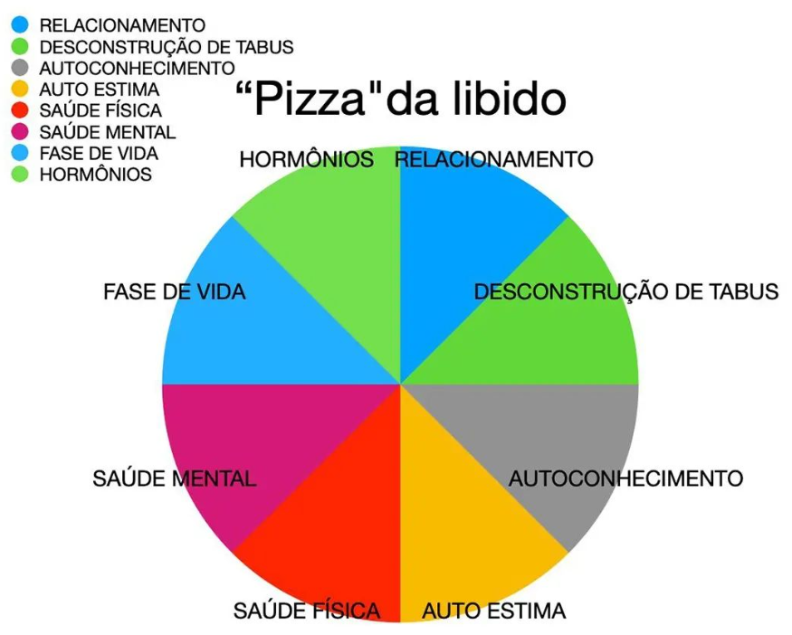

---

- Tratamento:
- Tonificar yin/yang do Rim

- Pontos: R4, R16, B23, R7, VG4 com moxa.

- Gengibre, alho, açafrão, canela.
- escalda pés e bolsa de água quente 

---

## Estudo de caso

Isadora, de 24 anos, vinha sofrendo de tensão pré menstrual por 13 anos. Teve duas gestações e a TPM tornava-se pior a cada parto. Seus principais sintomas eram distensão abdominal, severa irritabilidade, raiva, agressividade. Ela havia tomado pílula de progesterona que não a ajudaram e apenas serviram para ficar com dor nas costas.

Seus períodos menstruais eram regulares, duravam 4 dias e eram intensos; o sangue menstrual era vermelho-brilhante.

Ela também sofria de constipação, e na anamnese, constatou-se que sofria de dor nas costas e tontura. Frequentemente sentia frio, pés gelados e diurese frequente, com urina pálida. Ela não dormia bem. Sua língua era pálida e levemente fina, com marcas de dentes. Seu pulso era em corda.

---

Estagnação de Qi do Fígado, se manifestando com sintomas típicos de TPM, e pulso em corda.

Deficiência de yang do Rim (pés frios, sensação de frio, diurese frequente, dor nas costas, tontura)

Deficiência de sangue (insônia e língua pálida/fina)

Tratamento: Serenar o fígado, movimentar o Qi e acalmar a mente. (Tonificar yang do Rim e nutrir o sangue)

Pontos: IG4, F3, R3, VC15, IG4

Quatro portões para mover o Qi do fígado 

---

Valéria, 53 anos, vinha sofrendo de problemas da menopausa nos 3 anos anteriores após a cessação de seus períodos menstruais. Seus principais problemas eram graves como rubores quentes, sudorese noturna, depressão, ansiedade, alterações de humor e insônia, Sofria de pés frios e diurese frequente. Sua língua era vermelha, revestimento amarelo e seco, e o pulso rápido.

---

Def yin coração 
	Alteração de humor
	Depressão
	Ansiedade

Def yin 
	Insônia 
	Rubor quente 
	Sudorese noturna 
	Língua vermelha, saburra amarela e seca
	Pulso rápido 
	Pés frios
	diurese frequente 

---

- Nutrir o yin do Rim, e o yin do C. Remover o vazio do calor e acalmar a mente

- R3, F8, VC4, P7-R6, VC24