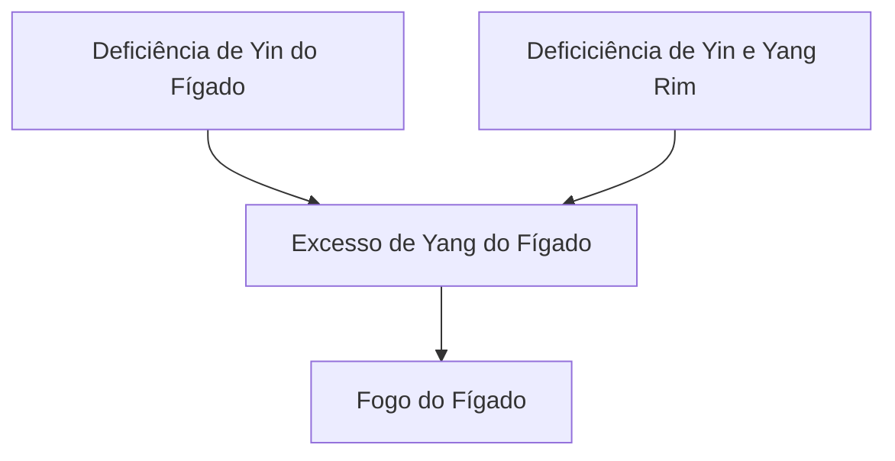

---
{"aliases":"Sindrome da Ascendencia do Yang do Figado, Síndrome de Ascendência do Yang do Fígado, Sindrome de Ascendencia do Yang do Figado","publish":true,"title":"Síndrome da Ascendência do Yang do Fígado - Fogo agitando Fígado","NivelAcesso":"ibrate","tags":["conhecimento/acupuntura/sindromes"],"PassFrontmatter":true}
---

**Manifestações Clinicas Gerais**: [[Conhecimento/Alterações/tontura\|tontura]], [[Conhecimento/Alterações/zumbido\|zumbido]], [[Conhecimento/Alterações/surdez\|surdez]], [[Conhecimento/Alterações/boca seca\|boca]] e [[Conhecimento/Alterações/garganta seca\|garganta]] secas, insônia, sensação de exaltação e gritos de fúria.

**Língua**: vermelha, especialmente nas laterais.

**Manifestações Clínicas Principais**: [[Conhecimento/Alterações/cefaleia\|cefaleia]], [[Conhecimento/Alterações/Irritabilidade\|irritabilidade]], [[Conhecimento/Acupuntura/Diagnóstico/Pulsos/pulso em corda\|pulso em corda]].

**Etiologia**: Alterações emocionais, principalmente fúria, frustração e ressentimento por um longo período.

## Tratamento
Dominar o Yang do Fígado, tonificar Yin. Pontos: F03, TA05, BP06, R03, F08, VB43, B02, TAIYANG, VB20, VB09, VB08, VB06

- [[Conhecimento/Acupuntura/Canais/Figado/F03\|F03]] e [[Conhecimento/Acupuntura/Canais/Triplo Aquecedor/TA05\|TA05]]: domina o Yang do Fígado
- [[Conhecimento/Acupuntura/Canais/Baço/BP06\|BP06]] e [[Conhecimento/Acupuntura/Canais/Rim/R03\|R03]]: tonifica Yin do Rim
- [[Conhecimento/Acupuntura/Canais/Figado/F08\|F08]]: tonifica Yin do Fígado
- [[Conhecimento/Acupuntura/Canais/Vesicula Biliar/VB43\|VB43]]: domina o Yang do Fígado - cefaleia no meridiano da Vesícula Biliar
- [[Conhecimento/Acupuntura/Canais/Vesicula Biliar/VB38\|VB38]]: domina o Yang do Fígado e o Fogo do Fígado - usado para cefaleias crônicas e persistentes
- [[Conhecimento/Acupuntura/Canais/Bexiga/B02\|B02]]: domina o Yang do Fígado - cefaleia acima dos olhos. Melhor com sangria 
- [[Conhecimento/Acupuntura/Canais - Outros/Pontos extras/Ex-HN5 Taiyang\|Ex-HN5 Taiyang]] e [[Conhecimento/Acupuntura/Canais/Vesicula Biliar/VB20\|VB20]]: domina o yang do Fígado
- [[Conhecimento/Acupuntura/Canais/Vesicula Biliar/VB09\|VB09]], [[Conhecimento/Acupuntura/Canais/Vesicula Biliar/VB08\|VB08]], [[Conhecimento/Acupuntura/Canais/Vesicula Biliar/VB06\|VB06]]: domina o yang do Fígado (pontos locais para cefaleia na lateral da cabeça).
